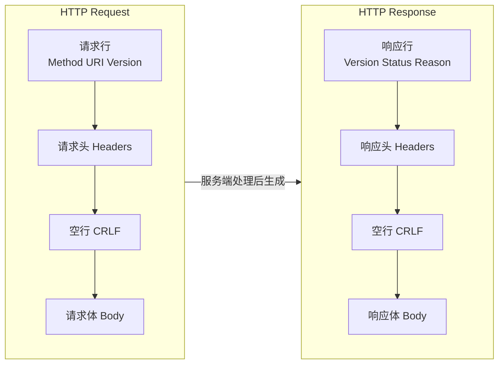
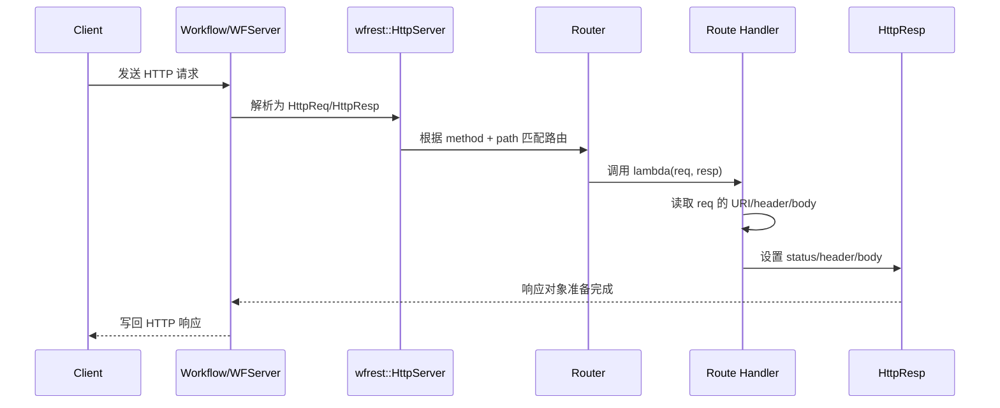
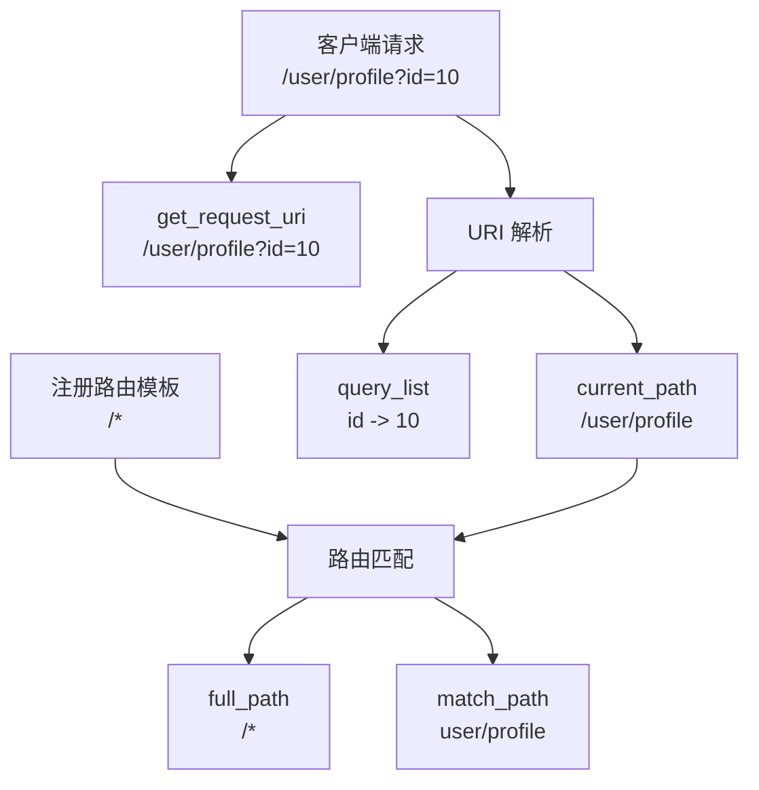
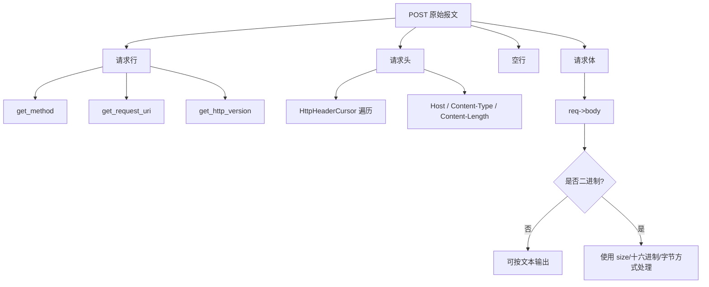
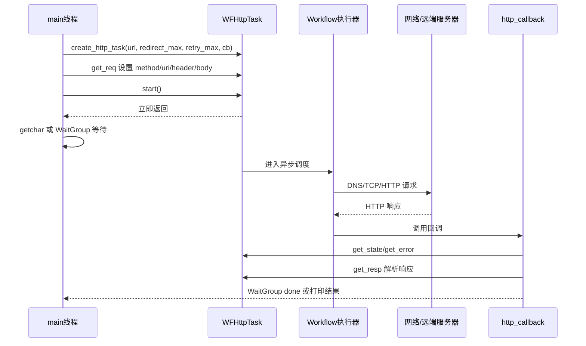
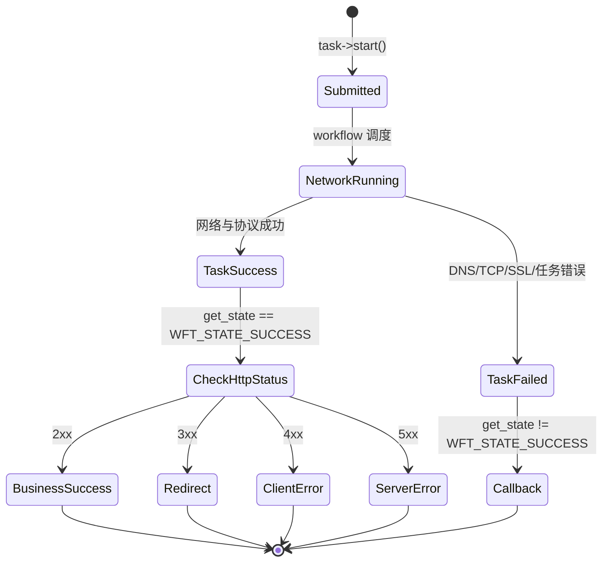
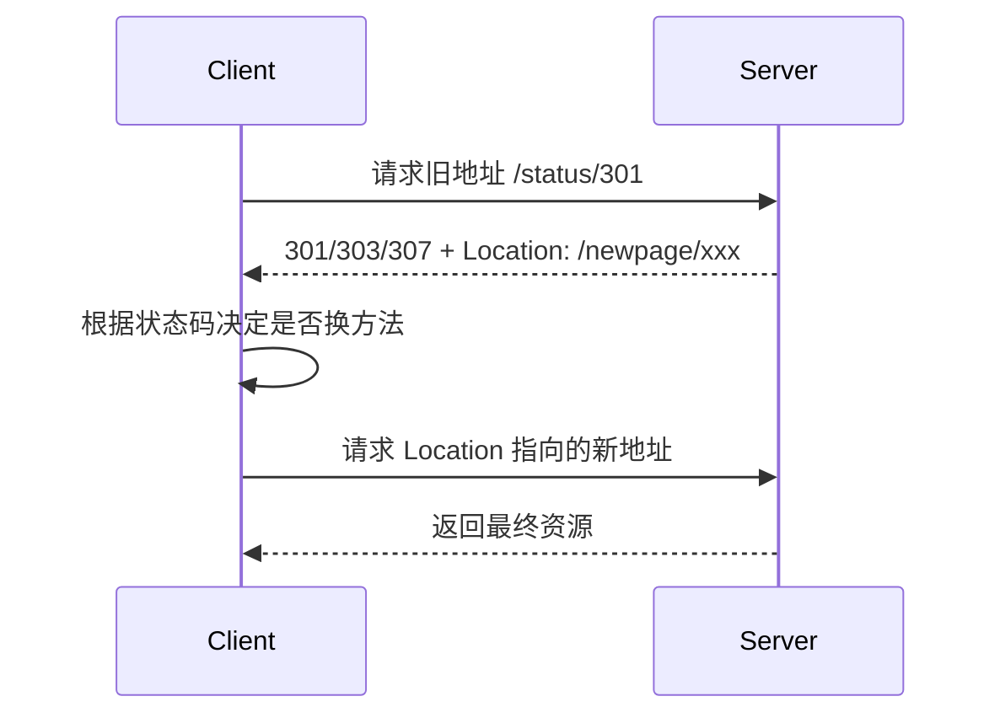
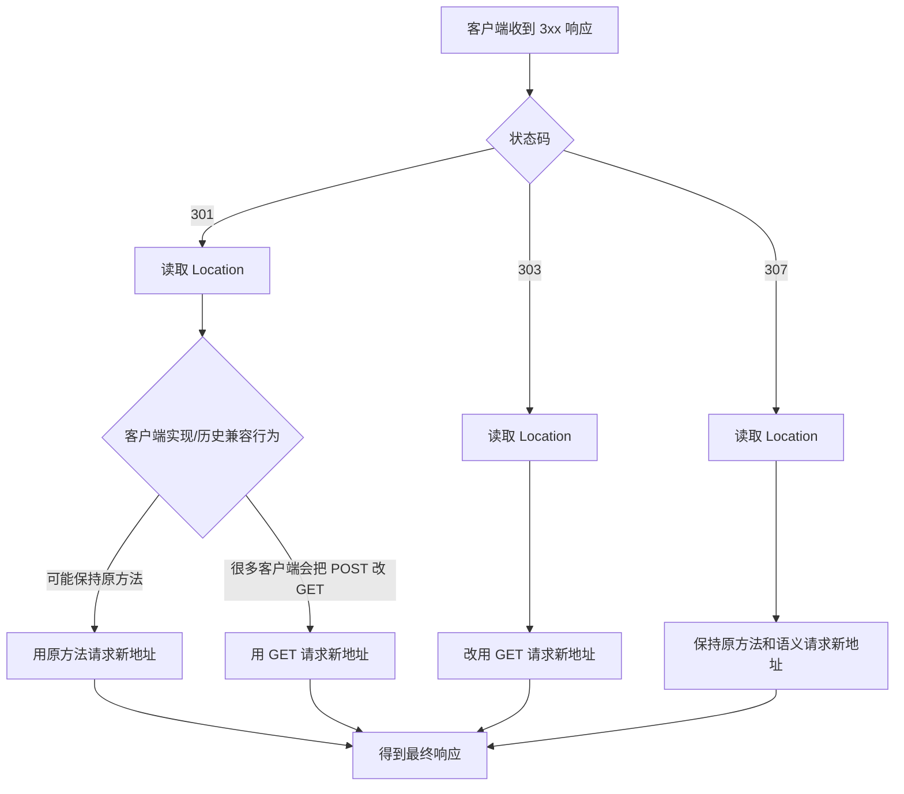

# 01_http 知识点整理

本章代码围绕 HTTP 基础通信展开，使用了两个第三方库：

- `wfrest`：基于 workflow 封装的 REST/HTTP 服务端框架，示例中主要使用 `wfrest::HttpServer`、`wfrest::HttpReq`、`wfrest::HttpResp`。
- `workflow`：异步网络任务框架，示例中主要使用 `WFTaskFactory::create_http_task`、`WFHttpTask`、`HttpRequest`、`HttpResponse`、`HttpHeaderCursor`、`WFGlobal`、`WFFacilities::WaitGroup`。

对应源码：

- `01_parse_uri.cc`：服务端解析 URI、路径、查询参数。
- `02_parse_request.cc`：服务端解析 HTTP 请求报文。
- `03_parse_response.cc`：客户端发送 HTTP 请求并解析响应报文。
- `04_redirect.cc`：服务端构造 HTTP 重定向响应，观察 301、303、307 的行为差异。

> [!NOTE]
> `wfrest` 的 `HttpReq` 继承自 `protocol::HttpRequest`，`HttpResp` 继承自 `protocol::HttpResponse`。因此服务端代码既能使用 wfrest 提供的便捷接口，例如 `body()`、`query_list()`、`current_path()`、`String()`、`set_status()`，也能使用 workflow 底层 HTTP 消息接口，例如 `get_method()`、`get_request_uri()`、`get_http_version()`、`set_header_pair()`。

## 1. HTTP 与 URI 基础

### 1.1 URI 的结构

URI 的完整格式通常写作：

```text
<scheme>://<authority><path>?<query>#<fragment>
```

例如：

```text
http://localhost:8888/user/profile?id=10&name=tom#title
```

可以拆成：

| 组成部分 | 示例 | 含义 |
| --- | --- | --- |
| `scheme` | `http` | 协议方案，例如 `http`、`https`。 |
| `authority` | `localhost:8888` | 主机、端口、可选用户信息。 |
| `path` | `/user/profile` | 资源路径。 |
| `query` | `id=10&name=tom` | 查询字符串，常见形式为 `key=value&key=value`。 |
| `fragment` | `title` | 片段标识，常用于浏览器页面内定位。 |

在 HTTP 服务端收到请求时，请求行中的 URI 通常不是完整 URL，而是：

```text
/user/profile?id=10&name=tom
```

也就是主要包含 `path` 和 `query`。

> [!IMPORTANT]
> 浏览器不会把 `#fragment` 发送给 HTTP 服务器。`#title` 只在浏览器端使用，服务端一般无法通过 `req->get_request_uri()` 拿到它。

### 1.2 HTTP 请求报文格式

HTTP 请求由三部分组成：

```text
<请求方法> <URI> <HTTP版本号>\r\n
<请求头1>: <值1>\r\n
<请求头2>: <值2>\r\n
...
\r\n
<请求体>
```

示例：

```http
POST /user/profile?id=10&name=tom HTTP/1.1
Host: localhost:8888
Content-Type: application/json
Content-Length: 25

{"age":20,"city":"BJ"}
```

三部分含义：

- 请求行：方法、URI、HTTP 版本。
- 请求头：描述请求元信息，例如 `Host`、`Content-Type`、`Content-Length`。
- 请求体：客户端提交的数据，例如 JSON、表单、文件、二进制数据。

### 1.3 HTTP 响应报文格式

HTTP 响应也由三部分组成：

```text
<HTTP版本号> <状态码> <原因短语>\r\n
<响应头1>: <值1>\r\n
<响应头2>: <值2>\r\n
...
\r\n
<响应体>
```

示例：

```http
HTTP/1.1 200 OK
Content-Type: text/html
Content-Length: 1024

<html>...</html>
```

三部分含义：

- 响应行：HTTP 版本、状态码、原因短语。
- 响应头：描述响应体类型、长度、缓存、服务器信息、重定向目标等。
- 响应体：服务器真正返回的数据，例如 HTML、JSON、图片、文件。

HTTP 请求和响应都可以理解为“起始行 + headers + 空行 + body”的文本协议结构：



## 2. wfrest 服务端模型

### 2.1 创建 HTTP 服务端

示例代码：

```cpp
HttpServer server;
```

`HttpServer` 是 `wfrest` 提供的服务端类型，定义在：

```cpp
#include <wfrest/HttpServer.h>
```

它提供了按 HTTP 方法注册路由的接口：

```cpp
server.GET(path, handler);
server.POST(path, handler);
server.PUT(path, handler);
server.DELETE(path, handler);
server.PATCH(path, handler);
server.HEAD(path, handler);
server.ROUTE(path, handler, verb);
```

示例中用到：

```cpp
server.GET("/*", [](const HttpReq *req, HttpResp *resp) {
    // 处理 GET 请求
});

server.POST("/*", [](const HttpReq *req, HttpResp *resp) {
    // 处理 POST 请求
});
```

### 2.2 路由回调函数

路由处理函数的形态是：

```cpp
[](const HttpReq *req, HttpResp *resp) {
    // 读取请求 req
    // 设置响应 resp
}
```

参数含义：

- `const HttpReq *req`：客户端发来的请求对象。通常只读，所以是 `const`。
- `HttpResp *resp`：准备返回给客户端的响应对象，需要修改状态码、响应头、响应体，所以不是 `const`。

> [!IMPORTANT]
> `req` 和 `resp` 的生命周期由框架管理。回调函数内可以读取和设置它们，但不要把裸指针保存到异步回调之外长期使用，除非明确了解 workflow/wfrest 的任务生命周期。

wfrest 服务端一次请求的处理路径可以概括为：



### 2.3 启动与停止服务

示例代码：

```cpp
if (server.start(8888) == 0) {
    getchar();
    server.stop();
} else {
    cerr << "Error: server start FAILED!" << endl;
    exit(1);
}
```

知识点：

- `server.start(8888)` 在端口 `8888` 上启动 HTTP 服务。
- 返回 `0` 表示启动成功。
- 启动成功后不会阻塞主线程，因此示例使用 `getchar()` 阻塞 `main`，避免程序立即退出。
- `server.stop()` 用于停止服务，使程序有序退出。
- 启动失败常见原因是端口被占用、权限不足、防火墙或网络配置问题。

> [!CAUTION]
> 如果没有 `getchar()`、`WaitGroup` 或其他阻塞机制，`main` 函数可能很快结束，进程退出后服务器也随之停止。

## 3. `01_parse_uri.cc`：解析 URI、路径与查询参数

### 3.1 注册通配路由

```cpp
server.GET("/*", [](const HttpReq *req, HttpResp *resp) {
    // ...
});
```

`"/*"` 表示匹配所有以 `/` 开头的 GET 请求路径，例如：

```text
/
/user
/user/profile
/search?keyword=http&page=1
```

这里的 `*` 是通配符，会把匹配到的剩余路径记录到 `match_path()`。

### 3.2 获取原始请求 URI

```cpp
cout << req->get_request_uri() << endl;
```

`get_request_uri()` 来自 workflow 的 `HttpRequest`，返回请求行中的 URI 字符串。

例如客户端请求：

```text
GET /search?keyword=http&page=1 HTTP/1.1
```

则：

```text
req->get_request_uri() == "/search?keyword=http&page=1"
```

### 3.3 路径相关接口

示例中用到：

```cpp
req->full_path();
req->match_path();
req->current_path();
```

含义如下：

| 接口 | 来源 | 含义 | 示例 |
| --- | --- | --- | --- |
| `get_request_uri()` | workflow `HttpRequest` | 原始请求 URI，通常包含 path 和 query。 | `/user/profile?id=10` |
| `full_path()` | wfrest `HttpReq` | 当前命中的路由模板。 | `/*` |
| `match_path()` | wfrest `HttpReq` | 通配符匹配到的部分。 | `user/profile` |
| `current_path()` | wfrest `HttpReq` | 当前请求 path，不包含 query。 | `/user/profile` |

例如：

```cpp
server.GET("/*", handler);
```

客户端请求：

```text
/user/profile?id=10
```

可能输出：

```text
request_uri: /user/profile?id=10
full_path: /*
match_path: user/profile
current_path: /user/profile
```

> [!NOTE]
> `match_path()` 常用于通配路由，例如 `/*`。如果注册的是精确路由，例如 `/login`，它的意义就不如通配路由明显。

通配路由下，原始 URI 到各个路径接口的关系如下：



### 3.4 查询参数 `query_list()`

示例代码：

```cpp
const map<string, string> querys = req->query_list();

for (const auto& [key, value] : querys) {
    cout << key << ": " << value << endl;
}
```

`query_list()` 来自 wfrest 的 `HttpReq`，返回：

```cpp
const std::map<std::string, std::string>&
```

查询字符串：

```text
?keyword=http&page=1
```

会被解析成：

```text
keyword -> http
page    -> 1
```

因为底层是 `std::map`：

- key 有序存储。
- 同名 key 不能保存多份值，后出现的值可能覆盖先出现的值，具体行为取决于框架解析逻辑。
- 如果业务需要支持 `tag=c&tag=cpp` 这种多值参数，应使用更适合的容器或检查框架是否提供多值接口。

> [!CAUTION]
> URL 查询参数可能经过百分号编码，例如 `%E4%B8%AD%E6%96%87` 或 `name=Tom%20Lee`。使用时需要确认框架是否已经解码，以及是否需要处理 `+` 表示空格等表单编码规则。

### 3.5 手动拆分 URI 的思路

注释版本代码中演示了用 `std::string::find()` 查找：

```cpp
size_t query_pos = uri.find('?');
size_t fragment_pos = uri.find('#');
```

关键点：

- `find('?')` 返回 `?` 第一次出现的位置。
- `find('#')` 返回 `#` 第一次出现的位置。
- 找不到时返回 `std::string::npos`。
- 可以用 `substr()` 根据下标切分 `path`、`query`、`fragment`。

典型情况：

| URI | path | query | fragment |
| --- | --- | --- | --- |
| `/user/profile` | `/user/profile` | 空 | 空 |
| `/user/profile?id=10` | `/user/profile` | `id=10` | 空 |
| `/user/profile#title` | `/user/profile` | 空 | `title` |
| `/user/profile?id=10#title` | `/user/profile` | `id=10` | `title` |

> [!IMPORTANT]
> 真实项目不建议长期手写复杂 URI 解析器。URI 涉及编码、保留字符、IPv6 host、空 query、多值参数等细节。能使用框架或成熟库时，优先使用框架解析结果。

## 4. `02_parse_request.cc`：解析 HTTP 请求报文

### 4.1 POST 路由

```cpp
server.POST("/*", [](const HttpReq *req, HttpResp *resp) {
    // ...
});
```

`POST` 常用于提交数据，因此本示例重点解析：

- 请求行。
- 请求头。
- URI 与查询参数。
- 请求体。

### 4.2 解析请求行

示例代码：

```cpp
cout << req->get_method() << " "
     << req->get_request_uri() << " "
     << req->get_http_version() << "\r\n";
```

相关接口：

| 接口 | 含义 | 示例 |
| --- | --- | --- |
| `get_method()` | 请求方法。 | `GET`、`POST` |
| `get_request_uri()` | 请求 URI。 | `/login?debug=1` |
| `get_http_version()` | HTTP 版本。 | `HTTP/1.1` |

请求行：

```http
POST /login?debug=1 HTTP/1.1
```

解析结果：

```text
method       = POST
request_uri  = /login?debug=1
http_version = HTTP/1.1
```

### 4.3 常见 HTTP 方法

| 方法 | 常见用途 | 是否通常带 body |
| --- | --- | --- |
| `GET` | 获取资源。 | 通常不带。 |
| `POST` | 创建资源、提交表单、提交 JSON。 | 通常带。 |
| `PUT` | 整体更新资源。 | 通常带。 |
| `PATCH` | 局部更新资源。 | 通常带。 |
| `DELETE` | 删除资源。 | 通常不带，也可以带。 |
| `HEAD` | 只获取响应头，不获取响应体。 | 不带。 |

> [!NOTE]
> HTTP 方法名是协议层语义，真正是否允许 body、如何解释 body，取决于服务端业务设计和客户端约定。

### 4.4 遍历请求头 `HttpHeaderCursor`

示例代码：

```cpp
HttpHeaderCursor cursor(req);
string name;
string value;

while (cursor.next(name, value)) {
    cout << name << ": " << value << "\r\n";
}
```

`HttpHeaderCursor` 定义在：

```cpp
#include <workflow/HttpUtil.h>
```

作用：

- 对 `HttpMessage` 中的 header 进行游标遍历。
- `next(name, value)` 成功时返回 `true`，并把头字段名和值写入两个 `std::string`。
- 遍历结束返回 `false`。

还存在的常用能力：

- `find(name, value)`：查找指定 header。
- `erase()`：删除当前游标位置的 header。
- `find_and_erase(name)`：查找并删除。
- `rewind()`：游标回到开头。

常见请求头：

| Header | 含义 |
| --- | --- |
| `Host` | 目标主机和端口，HTTP/1.1 中很重要。 |
| `Content-Type` | 请求体格式，例如 `application/json`、`application/x-www-form-urlencoded`。 |
| `Content-Length` | 请求体字节数。 |
| `User-Agent` | 客户端信息。 |
| `Connection` | 连接复用策略，例如 `keep-alive`。 |
| `Cookie` | 浏览器携带的 cookie。 |

> [!IMPORTANT]
> HTTP header 名大小写不敏感，`Content-Type` 和 `content-type` 在协议语义上相同。业务代码不要依赖 header 名的大小写形式。

### 4.5 请求头与请求体之间的空行

示例中打印：

```cpp
cout << "\r\n";
```

HTTP 报文中，请求头结束后必须有一个空行：

```text
Header: value\r\n
\r\n
body
```

这个空行是头部和 body 的分隔符。

### 4.6 解析请求体 `req->body()`

示例代码：

```cpp
cout << req->body() << endl;
```

`body()` 来自 wfrest 的 `HttpReq`，返回请求体内容，类型可视为 `std::string&`。

要点：

- `std::string` 可以保存文本，也可以保存二进制数据。
- 打印 JSON、普通文本时可以直接 `cout`。
- 打印图片、压缩包、含 `'\0'` 的数据时，直接 `cout` 不可靠。
- 处理二进制时应该使用 `body.size()` 获取真实字节数。

注释版本中使用十六进制打印二进制 body：

```cpp
for (unsigned char ch : body) {
    cout << hex
         << setw(2)
         << setfill('0')
         << static_cast<int>(ch)
         << " ";
}
cout << dec << endl;
```

这里涉及的 C++ IO 操纵符：

| 操纵符 | 作用 |
| --- | --- |
| `hex` | 后续整数按十六进制输出。 |
| `dec` | 后续整数恢复十进制输出。 |
| `setw(2)` | 当前字段至少占 2 个字符宽度。 |
| `setfill('0')` | 宽度不足时用 `0` 填充。 |

> [!CAUTION]
> 不要用 `strlen(body.c_str())` 计算 HTTP body 长度。二进制 body 中可能包含 `'\0'`，`strlen` 遇到第一个 `'\0'` 会提前停止，得到错误长度。

POST 请求解析时，示例代码实际是在把 HTTP 字节流拆成 C++ 对象接口：



### 4.7 服务端响应可以为空，但不推荐

前几个服务端示例主要在服务端打印解析结果，没有显式设置响应体。

```cpp
// 当前示例仅在服务端打印信息，未向客户端返回响应内容
```

真实服务中通常应该设置明确响应，例如：

```cpp
resp->String("ok");
```

或者设置状态码：

```cpp
resp->set_status(204); // No Content
```

> [!NOTE]
> 教学示例可以只关注解析动作。真实接口应尽量返回明确状态码和响应体，方便客户端判断请求是否成功。

## 5. `03_parse_response.cc`：客户端异步请求与响应解析

### 5.1 workflow HTTP 客户端任务

示例代码：

```cpp
WFHttpTask* task = WFTaskFactory::create_http_task(
    "http://stu.cskaoyan.com/",
    3,
    3,
    http_callback);
```

头文件：

```cpp
#include <workflow/WFTaskFactory.h>
```

参数含义：

| 参数 | 含义 |
| --- | --- |
| `url` | 请求目标 URL。 |
| `redirect_max` | 最大自动重定向次数。 |
| `retry_max` | 请求失败后的最大重试次数。 |
| `callback` | 任务完成后的回调函数。 |

`create_http_task()` 返回 `WFHttpTask*`。这个任务是异步任务。

> [!IMPORTANT]
> `task->start()` 只是提交任务，不会同步等待 HTTP 响应完成。主线程必须通过 `getchar()`、`WaitGroup` 或其他同步机制保持进程存活。

### 5.2 设置请求对象

示例代码：

```cpp
HttpRequest* req = task->get_req();

req->set_method("GET");
req->set_request_uri("/");
```

相关接口来自 workflow 的 `HttpRequest`：

| 接口 | 含义 |
| --- | --- |
| `set_method("GET")` | 设置请求方法。 |
| `set_request_uri("/")` | 设置请求 URI。 |
| `add_header_pair(name, value)` | 添加请求头。 |
| `set_header_pair(name, value)` | 设置或覆盖请求头。 |
| `append_output_body(buf, size)` | 添加请求体。 |

本示例请求的是根路径：

```http
GET / HTTP/1.1
```

如果要发送 JSON POST，可以扩展为：

```cpp
req->set_method("POST");
req->set_request_uri("/api/login");
req->set_header_pair("Content-Type", "application/json");
req->append_output_body("{\"user\":\"tom\"}");
```

### 5.3 提交任务

```cpp
task->start();
cout << "任务已提交！" << endl;
```

调用 `start()` 后，任务交给 workflow 框架执行：

- DNS 解析。
- TCP 连接。
- 可选 TLS 握手。
- 发送 HTTP 请求。
- 接收 HTTP 响应。
- 解析响应。
- 调用回调函数。

这些过程不会阻塞当前线程等待完成。

workflow HTTP 客户端任务的关键点是“提交后异步执行，完成后回调”：



### 5.4 回调函数

示例代码：

```cpp
void http_callback(WFHttpTask* task)
{
    int state = task->get_state();
    if (state != WFT_STATE_SUCCESS) {
        cout << WFGlobal::get_error_string(state, task->get_error()) << endl;
        return;
    }

    HttpResponse* resp = task->get_resp();
    // 解析响应
}
```

回调参数就是完成的 HTTP 任务本身，通过它可以获得：

- `get_state()`：任务状态。
- `get_error()`：错误码。
- `get_req()`：请求对象。
- `get_resp()`：响应对象。

常见任务状态：

| 状态 | 含义 |
| --- | --- |
| `WFT_STATE_SUCCESS` | 任务成功。 |
| `WFT_STATE_SYS_ERROR` | 系统错误。 |
| `WFT_STATE_SSL_ERROR` | SSL/TLS 错误。 |
| `WFT_STATE_DNS_ERROR` | DNS 解析错误。 |
| `WFT_STATE_TASK_ERROR` | 任务层错误。 |
| `WFT_STATE_ABORTED` | 任务被中止。 |

`WFGlobal::get_error_string(state, error)` 可以把状态和错误码转换成可读错误信息。

> [!CAUTION]
> HTTP 状态码 `404`、`500` 不一定导致 workflow 任务失败。只要网络请求和协议解析成功，任务状态仍可能是 `WFT_STATE_SUCCESS`。业务上是否成功还要继续检查 `resp->get_status_code()`。

任务状态和 HTTP 状态码属于两个不同层次，可以用下面的状态图区分：



### 5.5 解析响应行

示例代码：

```cpp
cout << resp->get_http_version() << " "
     << resp->get_status_code() << " "
     << resp->get_reason_phrase() << "\r\n";
```

相关接口来自 workflow 的 `HttpResponse`：

| 接口 | 含义 | 示例 |
| --- | --- | --- |
| `get_http_version()` | HTTP 版本。 | `HTTP/1.1` |
| `get_status_code()` | 状态码。 | `200` |
| `get_reason_phrase()` | 原因短语。 | `OK` |

响应行：

```http
HTTP/1.1 200 OK
```

解析结果：

```text
http_version   = HTTP/1.1
status_code    = 200
reason_phrase  = OK
```

### 5.6 常见 HTTP 状态码

| 分类 | 范围 | 含义 |
| --- | --- | --- |
| 1xx | `100`-`199` | 信息性状态。 |
| 2xx | `200`-`299` | 成功。 |
| 3xx | `300`-`399` | 重定向。 |
| 4xx | `400`-`499` | 客户端错误。 |
| 5xx | `500`-`599` | 服务端错误。 |

示例中重点涉及：

| 状态码 | 名称 | 含义 |
| --- | --- | --- |
| `200` | `OK` | 请求成功。 |
| `301` | `Moved Permanently` | 永久重定向。 |
| `303` | `See Other` | 跳转到另一个资源，常让客户端改用 GET。 |
| `307` | `Temporary Redirect` | 临时重定向，保持原请求方法。 |
| `404` | `Not Found` | 资源不存在。 |
| `500` | `Internal Server Error` | 服务端内部错误。 |

### 5.7 遍历响应头

响应头遍历与请求头相同：

```cpp
HttpHeaderCursor cursor(resp);
string name;
string value;

while (cursor.next(name, value)) {
    cout << name << ": " << value << "\r\n";
}
```

常见响应头：

| Header | 含义 |
| --- | --- |
| `Content-Type` | 响应体类型。 |
| `Content-Length` | 响应体字节数。 |
| `Date` | 响应生成时间。 |
| `Server` | 服务器软件信息。 |
| `Location` | 重定向目标地址。 |
| `Set-Cookie` | 服务端设置 cookie。 |
| `Cache-Control` | 缓存策略。 |

### 5.8 获取响应体 `get_parsed_body()`

示例代码：

```cpp
const void* body;
size_t size;
resp->get_parsed_body(&body, &size);

cout << static_cast<const char*>(body) << endl;
```

`get_parsed_body()` 来自 workflow 的 `HttpMessage`：

```cpp
bool get_parsed_body(const void **body, size_t *size) const;
```

它输出两个信息：

- `body`：响应体起始地址。
- `size`：响应体字节数。

因为返回的是 `const void*`，如果要按字节处理，需要转换：

```cpp
const unsigned char *p = static_cast<const unsigned char *>(body);
```

如果要按文本输出，更稳妥的写法是：

```cpp
cout.write(static_cast<const char *>(body), size);
cout << endl;
```

> [!IMPORTANT]
> 示例中的 `cout << static_cast<const char*>(body)` 假设响应体是以 `'\0'` 结尾的文本。但 HTTP body 本质是一段字节序列，不保证以 `'\0'` 结尾，也可能是二进制数据。生产代码中应使用 `size` 限定输出长度。

### 5.9 `getchar()` 与 `WaitGroup`

根目录简版使用：

```cpp
task->start();
getchar();
```

这是一种教学场景下的简单阻塞方式，需要手动按 Enter。

注释版本使用：

```cpp
static WFFacilities::WaitGroup wait_group(1);

task->start();
wait_group.wait();
```

并在回调中：

```cpp
wait_group.done();
```

`WaitGroup` 的语义：

- 构造时传入需要等待的任务数量。
- 每个任务完成后调用一次 `done()`。
- 主线程调用 `wait()` 阻塞，直到计数归零。

> [!CAUTION]
> 如果使用 `WaitGroup`，无论任务成功还是失败，回调中都必须调用 `done()`。否则主线程会一直阻塞在 `wait()`。

## 6. `04_redirect.cc`：HTTP 重定向

### 6.1 重定向的本质

重定向响应通常包含两个关键部分：

```http
HTTP/1.1 301 Moved Permanently
Location: /newpage/301
```

服务端通过状态码告诉客户端“资源在别处”，再通过 `Location` 头告诉客户端新地址。

示例代码：

```cpp
resp->set_status(301);
resp->set_header_pair("Location", "/newpage/301");
```

相关接口：

| 接口 | 含义 |
| --- | --- |
| `resp->set_status(301)` | wfrest 便捷接口，设置响应状态码。 |
| `resp->set_header_pair("Location", "...")` | workflow `HttpMessage` 接口，设置响应头。 |
| `resp->String("...")` | wfrest 便捷接口，设置字符串响应体。 |

> [!IMPORTANT]
> 重定向必须设置 `Location` 响应头，否则客户端知道发生了 3xx，但不知道应该跳转到哪里。

一次重定向交互通常不是一个请求，而是“原请求 + 后续请求”的组合：



### 6.2 301 Moved Permanently

示例：

```cpp
server.GET("/status/301", [](const HttpReq* req, HttpResp* resp) {
    resp->set_status(301);
    resp->set_header_pair("Location", "/newpage/301");
});

server.GET("/newpage/301", [](const HttpReq* req, HttpResp* resp) {
    resp->String("GET /newpage/301");
});
```

语义：

- 永久重定向。
- 表示旧地址长期迁移到新地址。
- 浏览器、搜索引擎、代理可能缓存 301。
- 适合资源永久改名、域名迁移、路径规范化。

> [!CAUTION]
> 调试 301 时要注意浏览器缓存。浏览器缓存永久重定向后，即使服务器代码改了，浏览器仍可能自动跳到旧缓存的新地址。调试时可以用 curl 或清理浏览器缓存。

### 6.3 303 See Other

示例：

```cpp
server.POST("/status/303", [](const HttpReq* req, HttpResp* resp) {
    resp->set_status(303);
    resp->set_header_pair("Location", "/newpage/303");
});

server.GET("/newpage/303", [](const HttpReq* req, HttpResp* resp) {
    resp->String("GET /newpage/303");
});

server.POST("/newpage/303", [](const HttpReq* req, HttpResp* resp) {
    resp->String("POST /newpage/303");
});
```

语义：

- 常用于 POST 提交后跳转到结果页。
- 客户端收到 303 后，后续请求应使用 GET 访问 `Location`。
- 典型场景是“表单提交成功后跳转到详情页或结果页”。

观察点：

- 原请求：`POST /status/303`
- 重定向后：通常变成 `GET /newpage/303`

### 6.4 307 Temporary Redirect

示例：

```cpp
server.GET("/status/307", [](const HttpReq* req, HttpResp* resp) {
    resp->set_status(307);
    resp->set_header_pair("Location", "/newpage/307");
});

server.POST("/status/307", [](const HttpReq* req, HttpResp* resp) {
    resp->set_status(307);
    resp->set_header_pair("Location", "/newpage/307");
});
```

语义：

- 临时重定向。
- 客户端访问 `Location` 时应保持原请求方法不变。
- 如果原请求是 GET，重定向后仍是 GET。
- 如果原请求是 POST，重定向后仍是 POST。

观察点：

- 原请求：`GET /status/307`，重定向后：`GET /newpage/307`。
- 原请求：`POST /status/307`，重定向后：`POST /newpage/307`。

> [!IMPORTANT]
> 303 和 307 的核心差异是请求方法是否改变：303 会引导客户端改用 GET，307 要求保持原方法。

### 6.5 301、303、307 对比

| 状态码 | 名称 | 是否永久 | 重定向后方法 |
| --- | --- | --- | --- |
| `301` | `Moved Permanently` | 是 | 历史上不同客户端行为不完全一致，现代语义更建议保持，但很多客户端会把 POST 改成 GET。 |
| `303` | `See Other` | 否 | 改为 GET。 |
| `307` | `Temporary Redirect` | 否 | 保持原方法。 |

如果需要更明确地区分永久且保持方法的重定向，可以了解 `308 Permanent Redirect`。

301、303、307 在客户端后续请求方法上的差异可以画成活动图：



## 7. C++ 语法与工程知识点

### 7.1 命名空间

示例使用：

```cpp
using namespace std;
using namespace wfrest;
using namespace protocol;
```

含义：

- `std`：标准库命名空间，例如 `cout`、`string`、`map`。
- `wfrest`：wfrest 服务端类型，例如 `HttpServer`、`HttpReq`、`HttpResp`。
- `protocol`：workflow 协议消息类型，例如 `HttpRequest`、`HttpResponse`、`HttpHeaderCursor`。

> [!NOTE]
> 教学代码中使用 `using namespace` 可以减少书写量。真实项目头文件中应避免全局 `using namespace`，源文件中也可以按团队规范选择更明确的命名空间限定。

### 7.2 Lambda 表达式

路由回调使用 lambda：

```cpp
[](const HttpReq *req, HttpResp *resp) {
    // ...
}
```

结构：

```cpp
[捕获列表](参数列表) {
    函数体
}
```

本示例捕获列表为空 `[]`，表示不捕获外部局部变量。

如果需要访问外部变量：

```cpp
int count = 0;
server.GET("/", [&count](const HttpReq *req, HttpResp *resp) {
    ++count;
    resp->String("ok");
});
```

> [!CAUTION]
> 服务端回调可能被多个请求并发调用。捕获并修改共享变量时要考虑线程安全，例如使用互斥锁、原子变量或避免共享可变状态。

### 7.3 结构化绑定

示例：

```cpp
for (const auto& [key, value] : querys) {
    cout << key << ": " << value << endl;
}
```

这是 C++17 语法，用于拆解 pair、tuple、结构体等。

等价传统写法：

```cpp
for (const auto& p : querys) {
    const string& key = p.first;
    const string& value = p.second;
    cout << key << ": " << value << endl;
}
```

优点：

- 代码更短。
- 语义更直接。
- 遍历 `map` 时尤其清晰。

### 7.4 `std::map`

`query_list()` 返回的查询参数使用 `std::map<std::string, std::string>`。

特点：

- 基于 key 排序。
- 查找复杂度通常是 `O(log n)`。
- key 唯一。
- 遍历顺序是按 key 排序，不一定是 URL 中原始出现顺序。

> [!NOTE]
> 如果需要保留查询参数原始顺序，`std::map` 不是合适容器，应考虑 `vector<pair<string,string>>` 等结构。

### 7.5 `const` 与指针

```cpp
const HttpReq *req
HttpResp *resp
```

含义：

- `const HttpReq *req`：不能通过 `req` 修改请求对象。
- `HttpResp *resp`：可以通过 `resp` 修改响应对象。

这是典型的服务端处理模型：

- 请求是输入。
- 响应是输出。

### 7.6 `exit(1)`

示例：

```cpp
cerr << "Error: server start FAILED!" << endl;
exit(1);
```

含义：

- `exit(1)` 结束进程。
- `1` 表示非正常退出状态。
- `cerr` 是标准错误输出，适合打印错误信息。

### 7.7 `cout`、`cerr`、`endl`、`\r\n`

- `cout`：标准输出。
- `cerr`：标准错误输出，通常不缓冲或少缓冲。
- `endl`：输出换行并刷新流。
- `\n`：换行。
- `\r\n`：HTTP 报文标准行结束符，CRLF。

> [!IMPORTANT]
> HTTP 协议文本行使用 CRLF，也就是 `\r\n`。教学打印时用 `endl` 通常也能看懂，但构造原始 HTTP 报文时应使用协议规定的 `\r\n`。

## 8. 第三方库接口速查

### 8.1 `wfrest::HttpServer`

常用接口：

| 接口 | 作用 |
| --- | --- |
| `GET(route, handler)` | 注册 GET 路由。 |
| `POST(route, handler)` | 注册 POST 路由。 |
| `ROUTE(route, handler, verb)` | 注册指定方法路由。 |
| `start(port)` | 启动服务，监听端口。 |
| `stop()` | 停止服务。 |
| `set_default_route(route)` | 设置默认路由。 |

### 8.2 `wfrest::HttpReq`

示例涉及接口：

| 接口 | 作用 |
| --- | --- |
| `get_method()` | 获取请求方法。 |
| `get_request_uri()` | 获取请求 URI。 |
| `get_http_version()` | 获取 HTTP 版本。 |
| `body()` | 获取请求体。 |
| `query_list()` | 获取查询参数 map。 |
| `query(key)` | 获取指定 query 参数。 |
| `has_query(key)` | 判断 query 参数是否存在。 |
| `full_path()` | 当前命中的路由模板。 |
| `match_path()` | 通配符匹配部分。 |
| `current_path()` | 当前请求 path。 |
| `header(key)` | 获取指定 header。 |
| `has_header(key)` | 判断 header 是否存在。 |

### 8.3 `wfrest::HttpResp`

示例涉及接口：

| 接口 | 作用 |
| --- | --- |
| `set_status(code)` | 设置响应状态码。 |
| `set_header_pair(name, value)` | 设置响应头。 |
| `String(str)` | 设置字符串响应体。 |
| `Json(json)` | 设置 JSON 响应体。 |
| `File(path)` | 返回文件内容。 |

### 8.4 `protocol::HttpRequest`

常用接口：

| 接口 | 作用 |
| --- | --- |
| `get_method()` | 获取请求方法。 |
| `get_request_uri()` | 获取请求 URI。 |
| `set_method(method)` | 设置请求方法。 |
| `set_request_uri(uri)` | 设置请求 URI。 |
| `add_header_pair(name, value)` | 添加 header。 |
| `set_header_pair(name, value)` | 设置 header。 |
| `append_output_body(data)` | 添加输出 body。 |

### 8.5 `protocol::HttpResponse`

常用接口：

| 接口 | 作用 |
| --- | --- |
| `get_http_version()` | 获取 HTTP 版本。 |
| `get_status_code()` | 获取状态码。 |
| `get_reason_phrase()` | 获取原因短语。 |
| `get_parsed_body(&body, &size)` | 获取解析后的响应体地址和长度。 |
| `set_status_code(code)` | 设置状态码字符串。 |
| `set_reason_phrase(phrase)` | 设置原因短语。 |

### 8.6 `protocol::HttpHeaderCursor`

常用接口：

| 接口 | 作用 |
| --- | --- |
| `next(name, value)` | 遍历下一个 header。 |
| `find(name, value)` | 查找指定 header。 |
| `erase()` | 删除当前 header。 |
| `find_and_erase(name)` | 查找并删除 header。 |
| `rewind()` | 游标回到起点。 |

### 8.7 `WFTaskFactory` 与 `WFHttpTask`

示例涉及：

```cpp
WFHttpTask* task = WFTaskFactory::create_http_task(
    url,
    redirect_max,
    retry_max,
    callback);
```

`WFHttpTask` 常用接口：

| 接口 | 作用 |
| --- | --- |
| `get_req()` | 获取请求对象。 |
| `get_resp()` | 获取响应对象。 |
| `start()` | 提交异步任务。 |
| `get_state()` | 获取任务状态。 |
| `get_error()` | 获取错误码。 |

## 9. 调试与验证命令

### 9.1 测试 URI 解析

启动 `01_parse_uri.cc` 后，可以用：

```bash
curl 'http://127.0.0.1:8888/user/profile?id=10&name=tom'
```

服务端预期看到：

```text
request_uri: /user/profile?id=10&name=tom
full_path: /*
match_path: user/profile
current_path: /user/profile
id: 10
name: tom
```

### 9.2 测试请求报文解析

启动 `02_parse_request.cc` 后，可以用：

```bash
curl -X POST 'http://127.0.0.1:8888/login?debug=1' \
  -H 'Content-Type: application/json' \
  -d '{"user":"tom","password":"123456"}'
```

可以观察：

- 请求方法是 `POST`。
- URI 是 `/login?debug=1`。
- header 中有 `Content-Type`、`Content-Length`。
- body 是提交的 JSON 字符串。

### 9.3 测试重定向

查看 301，不自动跟随：

```bash
curl -i 'http://127.0.0.1:8888/status/301'
```

查看并自动跟随重定向：

```bash
curl -i -L 'http://127.0.0.1:8888/status/301'
```

测试 303：

```bash
curl -i -L -X POST 'http://127.0.0.1:8888/status/303'
```

测试 307 保持 POST：

```bash
curl -i -L -X POST 'http://127.0.0.1:8888/status/307'
```

> [!NOTE]
> `curl -i` 会显示响应头，适合观察状态码和 `Location`。`curl -L` 会自动跟随重定向。

## 10. 易错点总结

- 服务端启动后要阻塞主线程，否则进程会退出。
- 客户端 `task->start()` 是异步提交，不是同步等待。
- workflow 任务成功不等于业务状态码是 2xx。
- HTTP body 是字节序列，不一定是字符串。
- 使用 `get_parsed_body()` 时必须同时使用 `size`。
- `strlen()` 不适合计算二进制 body 长度。
- header 名大小写不敏感。
- 查询参数可能经过 URL 编码。
- `std::map` 不保留 query 参数原始顺序，也不适合表达同名多值参数。
- 重定向响应要设置 `Location`。
- 303 会让后续请求使用 GET，307 会保持原请求方法。
- 301 可能被客户端缓存，调试时要注意缓存影响。

> [!IMPORTANT]
> 本章的核心不是“打印 HTTP 报文”，而是理解 HTTP 报文在 C++ 对象中的映射：请求行/响应行对应 getter，headers 用 `HttpHeaderCursor` 遍历，body 用 `body()` 或 `get_parsed_body()` 读取，服务端响应通过 `HttpResp` 设置状态码、响应头和响应体。
