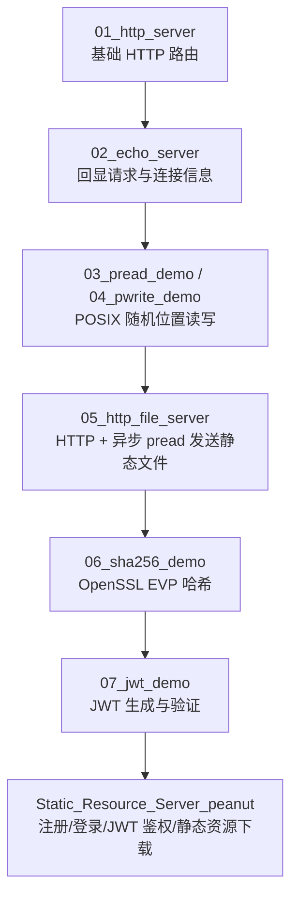
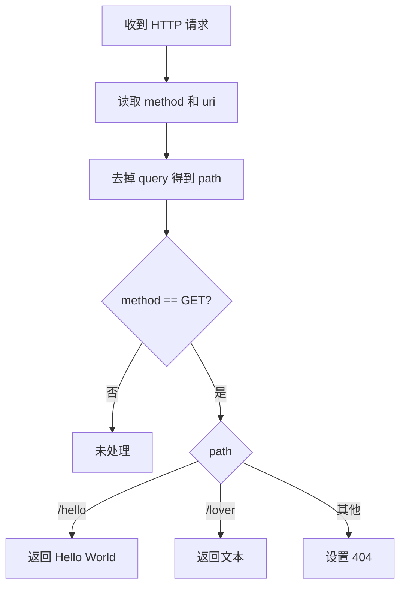
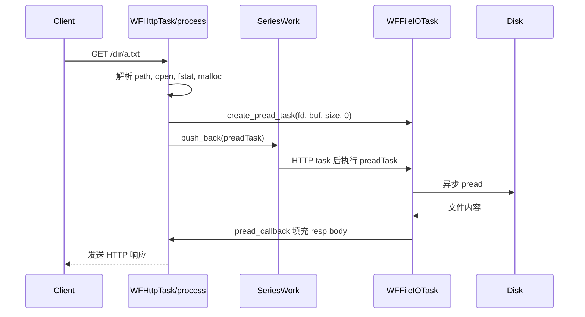
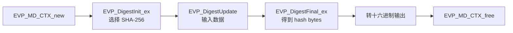
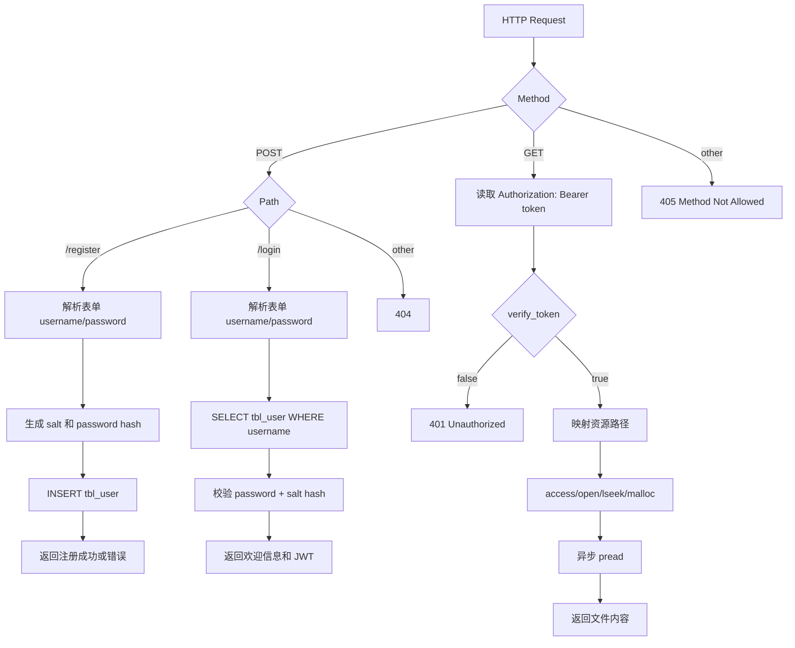
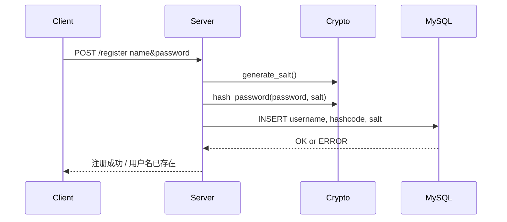
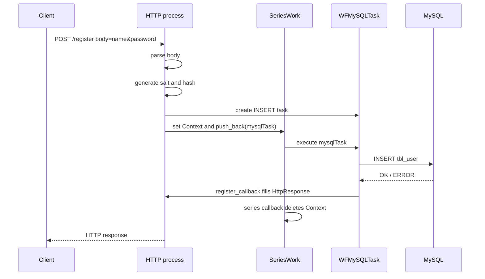
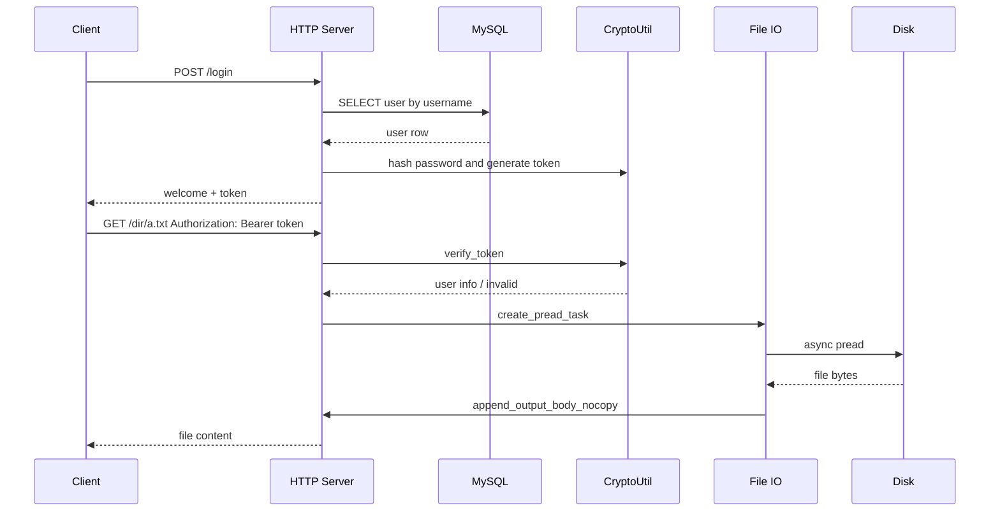

# 04_HttpServer_DiskIO 知识点整理

本目录围绕 workflow 原生 HTTP Server、Linux 磁盘 IO、静态资源发送、OpenSSL 哈希、JWT 认证以及一个带注册/登录/鉴权下载的静态资源服务器展开。

整理范围：

- `01_http_server.cc`
- `02_echo_server.cc`
- `03_pread_demo.cc`
- `04_pwrite_demo.cc`
- `05_http_file_server.cc`
- `06_sha256_demo.cc`
- `07_jwt_demo.cc`
- `CryptoUtil.h`
- `CryptoUtil.cc`
- `Static_Resource_Server_peanut/server.cc`
- `Static_Resource_Server_peanut/CryptoUtil.h`
- `Static_Resource_Server_peanut/CryptoUtil.cc`
- `Static_Resource_Server_peanut/Makefile`

按要求忽略：

- `04_HttpServer_DiskIO/Static_Resource_Server`

> [!NOTE]
> 本目录中多个文件包含 `common.h`，但当前项目里没有找到该文件。结合源码使用情况，它大概率是课程环境中的公共头文件，可能集中包含 `assert.h`、`sys/stat.h`、`string.h`、常用宏或工具函数。本文会按代码实际使用到的系统接口补充说明。

## 1. 本章主线

本章从最小 HTTP Server 逐步扩展到磁盘文件服务和认证资源服务：



涉及的核心能力：

- `WFHttpServer`：原生 workflow HTTP 服务器。
- `WFHttpTask`：每个 HTTP 请求对应的任务。
- `HttpRequest` / `HttpResponse`：解析请求、构造响应。
- `HttpHeaderCursor`：遍历或查找 HTTP 头。
- `WFFileIOTask`：异步文件 IO 任务。
- `Workflow::SeriesWork`：把 HTTP 任务、MySQL 任务、文件 IO 任务串成顺序流程。
- POSIX 文件接口：`open`、`close`、`lseek`、`pread`、`pwrite`、`fstat`、`access`。
- 套接字地址接口：`sockaddr_storage`、`sockaddr_in`、`sockaddr_in6`、`inet_ntop`、`ntohs`。
- OpenSSL EVP：计算 SHA-256 或其他摘要。
- libjwt：生成和验证 JWT。
- 密码安全：随机盐、密码哈希、token 鉴权。

> [!IMPORTANT]
> 本章最重要的工程模式是：HTTP 请求到来后不阻塞当前线程做耗时文件读取，而是把 `WFFileIOTask` 追加到 HTTP 任务所在的 `SeriesWork` 中，等异步读文件完成后再填充响应体。

## 2. workflow HTTP Server 基础

### 2.1 `WFHttpServer`

示例：

```cpp
WFHttpServer server(process);

if (server.start(8888) == 0) {
    waitGroup.wait();
    server.stop();
}
```

`WFHttpServer` 是 workflow 原生 HTTP Server 类型，处理函数签名是：

```cpp
void process(WFHttpTask* task);
```

每次收到 HTTP 请求，workflow 会创建一个 `WFHttpTask`，并调用 `process`。

在处理函数中：

```cpp
HttpRequest* req = task->get_req();
HttpResponse* resp = task->get_resp();
```

- `req`：客户端请求。
- `resp`：服务器响应。

### 2.2 主线程等待与优雅退出

多个示例使用：

```cpp
static WFFacilities::WaitGroup waitGroup(1);

void sig_handler(int signo)
{
    waitGroup.done();
}

signal(SIGINT, sig_handler);
```

含义：

- `SIGINT` 通常由 Ctrl-C 触发。
- 信号处理函数调用 `waitGroup.done()`。
- 主线程阻塞在 `waitGroup.wait()`。
- Ctrl-C 后 `waitGroup.wait()` 返回，随后调用 `server.stop()`。

> [!CAUTION]
> 严格来说，信号处理函数中能安全调用的函数有限。课程示例这样写便于演示优雅退出；真实服务建议使用更可靠的退出机制，例如事件 fd、专门的信号处理线程或框架提供的停止接口。

### 2.3 HTTP 处理函数的基本结构

`01_http_server.cc` 的处理逻辑：

```cpp
void process(WFHttpTask* task)
{
    HttpRequest* req = task->get_req();
    HttpResponse* resp = task->get_resp();

    string method = req->get_method();
    string uri = req->get_request_uri();

    auto pos = uri.find('?');
    string path = uri.substr(0, pos);

    if (method == "GET") {
        if (path == "/hello") {
            resp->append_output_body("Hello, World!\n");
        } else if (path == "/lover") {
            resp->append_output_body("Peanut loves jingtian\n");
        } else {
            resp->set_status_code("404");
            resp->append_output_body("404 NOT FOUND\n");
        }
    }
}
```

流程：



> [!NOTE]
> `uri.substr(0, pos)` 在 `pos == string::npos` 时仍然可用，会返回整个字符串。这是 `std::string::substr` 的常见用法。

## 3. `01_http_server.cc`：基础路由分发

### 3.1 请求行解析

代码：

```cpp
string method = req->get_method();
string uri = req->get_request_uri();
string version = req->get_http_version();
```

接口含义：

| 接口 | 含义 | 示例 |
| --- | --- | --- |
| `get_method()` | HTTP 方法。 | `GET` |
| `get_request_uri()` | 请求 URI。 | `/hello?x=1` |
| `get_http_version()` | HTTP 版本。 | `HTTP/1.1` |

### 3.2 从 URI 中提取 path

代码：

```cpp
auto pos = uri.find('?');
string path = uri.substr(0, pos);
```

示例：

| URI | path |
| --- | --- |
| `/hello` | `/hello` |
| `/hello?name=tom` | `/hello` |
| `/lover?debug=1` | `/lover` |

> [!IMPORTANT]
> HTTP 路由分发通常应基于 path，而不是完整 URI。query 参数是业务参数，不应该影响基础路径匹配。

### 3.3 设置状态码与响应体

返回成功响应：

```cpp
resp->append_output_body("Hello, World!\n");
```

返回 404：

```cpp
resp->set_status_code("404");
resp->append_output_body("404 NOT FOUND\n");
```

`set_status_code()` 接收字符串形式状态码。workflow 会编码成 HTTP 响应行。

> [!NOTE]
> 示例只设置了 `404` 状态码，没有设置 reason phrase，例如 `Not Found`。真实项目可以同时设置 `set_reason_phrase("Not Found")` 或使用框架默认行为。

## 4. `02_echo_server.cc`：回声服务器与连接信息

这个示例把客户端请求以 HTML 格式返回给客户端，同时打印客户端地址和当前 TCP 连接上的请求序号。

### 4.1 获取客户端地址

代码：

```cpp
struct sockaddr_storage addr;
socklen_t length = sizeof(addr);
task->get_peer_addr((struct sockaddr*)&addr, &length);
```

`sockaddr_storage` 是通用地址存储类型，足够容纳 IPv4 或 IPv6 地址。

相关类型：

| 类型 | 含义 |
| --- | --- |
| `sockaddr` | 通用套接字地址。 |
| `sockaddr_in` | IPv4 地址结构。 |
| `sockaddr_in6` | IPv6 地址结构。 |
| `sockaddr_storage` | 足够容纳各种地址族的通用存储结构。 |

`get_peer_addr()` 来自 `WFNetworkTask`，用于获取对端地址。

> [!CAUTION]
> 示例没有检查 `get_peer_addr()` 的返回值。真实项目应检查返回值是否为 `0`，失败时根据 `errno` 处理。

### 4.2 IPv4 / IPv6 地址解析

代码：

```cpp
char ipstr[INET6_ADDRSTRLEN];
unsigned short port;

if (addr.ss_family == AF_INET) {
    struct sockaddr_in* sin = (struct sockaddr_in*)&addr;
    inet_ntop(AF_INET, &sin->sin_addr, ipstr, INET6_ADDRSTRLEN);
    port = ntohs(sin->sin_port);
} else if (addr.ss_family == AF_INET6) {
    struct sockaddr_in6* sin6 = (struct sockaddr_in6*)&addr;
    inet_ntop(AF_INET6, &sin6->sin6_addr, ipstr, INET6_ADDRSTRLEN);
    port = ntohs(sin6->sin6_port);
}
```

知识点：

- `ss_family` 表示地址族。
- `AF_INET` 表示 IPv4。
- `AF_INET6` 表示 IPv6。
- `inet_ntop` 把网络二进制地址转换成人类可读字符串。
- `ntohs` 把 16 位端口号从网络字节序转换为主机字节序。
- `INET6_ADDRSTRLEN` 足够容纳 IPv6 字符串，因此也能容纳 IPv4 字符串。

> [!IMPORTANT]
> 网络协议中整数常使用网络字节序，即大端序。读取端口号时要用 `ntohs()` 转成主机字节序，否则在小端机器上会得到错误端口。

### 4.3 请求序号 `get_task_seq()`

代码：

```cpp
long long seq = task->get_task_seq();
cout << "请求序号：" << seq << endl;
```

`get_task_seq()` 返回当前连接上的任务序号。示例注释说明从 `0` 开始编号。

用途：

- 观察 HTTP keep-alive 连接上的多次请求。
- 根据请求次数主动关闭连接。
- 调试连接复用。

示例：

```cpp
if (seq == 9) {
    resp->set_header_pair("Connection", "close");
}
```

第 10 次请求时，服务端设置 `Connection: close`，提示本次响应后关闭 TCP 连接。

> [!NOTE]
> `seq == 9` 表示第 10 次请求，因为序号从 0 开始。

### 4.4 构造响应行、响应头、响应体

代码：

```cpp
resp->set_http_version("HTTP/1.1");
resp->set_status_code("200");
resp->set_reason_phrase("OK");

resp->add_header_pair("Content-Type", "text/html");
resp->add_header_pair("Server", "My WFHttpServer");
```

响应行：

```http
HTTP/1.1 200 OK
```

响应头：

```http
Content-Type: text/html
Server: My WFHttpServer
```

### 4.5 `append_output_body()` 与 `append_output_body_nocopy()`

示例同时使用：

```cpp
resp->append_output_body_nocopy("<html>");
resp->append_output_body(line);
resp->append_output_body_nocopy("</html>");
```

区别：

| 接口 | 是否拷贝数据 | 对数据生命周期要求 |
| --- | --- | --- |
| `append_output_body()` | 拷贝到响应体内部。 | 原始数据之后可以销毁。 |
| `append_output_body_nocopy()` | 不拷贝，只保存指针和长度。 | 原始数据必须活到 HTTP 响应发送完成。 |

代码中特意说明：

```cpp
resp->append_output_body_nocopy("<html>");
```

字符串字面量 `"<html>"` 具有静态存储期，整个程序运行期间都有效，所以可以 nocopy。

但下面这样是错误的：

```cpp
string line = "...";
resp->append_output_body_nocopy(line); // ERROR
```

`line` 是局部变量，函数返回后会被销毁，响应发送时可能访问悬空指针。

> [!IMPORTANT]
> `append_output_body_nocopy()` 是性能优化接口，不是默认安全接口。只有在能保证缓冲区生命周期长于响应发送过程时才使用；否则使用 `append_output_body()`。

### 4.6 遍历请求头

代码：

```cpp
HttpHeaderCursor cursor(req);
string name;
string value;
while (cursor.next(name, value)) {
    string header = "<p>" + name + ": " + value + "</p>";
    resp->append_output_body(header);
}
```

作用：

- 遍历客户端请求头。
- 把每个头字段拼成 HTML 段落。
- 返回给浏览器。

这就是“回声服务器”的核心：把请求信息原样或格式化后返回。

## 5. `03_pread_demo.cc`：随机位置读取

### 5.1 `open`

代码：

```cpp
int fd = open("a.txt", O_RDWR);
assert(fd != -1 && "open failed");
```

`open` 打开文件，返回文件描述符：

- 成功：返回非负整数。
- 失败：返回 `-1`，错误原因保存在 `errno`。

`O_RDWR` 表示以读写方式打开。

### 5.2 文件偏移量 `lseek`

代码：

```cpp
printf("pos: %ld\n", lseek(fd, 0, SEEK_CUR));
```

`lseek(fd, 0, SEEK_CUR)` 获取当前文件偏移量。

常用 `whence`：

| 值 | 含义 |
| --- | --- |
| `SEEK_SET` | 从文件开头计算。 |
| `SEEK_CUR` | 从当前偏移计算。 |
| `SEEK_END` | 从文件末尾计算。 |

### 5.3 `pread`

代码：

```cpp
pread(fd, buf, 5, 6);
```

含义：

- 从文件描述符 `fd` 指向的文件中读取。
- 从偏移量 `6` 开始。
- 最多读取 `5` 字节。
- 写入 `buf`。

与 `read` 的区别：

| 接口 | 是否使用显式 offset | 是否改变文件当前位置 |
| --- | --- | --- |
| `read(fd, buf, count)` | 否 | 会改变。 |
| `pread(fd, buf, count, offset)` | 是 | 不改变。 |

> [!IMPORTANT]
> `pread()` 非常适合并发读同一个文件：每次读操作都显式指定 offset，不共享和修改文件描述符的当前偏移量，减少并发读时的位置竞争。

### 5.4 关闭文件

代码：

```cpp
close(fd);
```

文件描述符是系统资源，使用完必须关闭。

> [!CAUTION]
> 示例使用 `assert` 检查 `open`，适合教学。真实服务中不要因为一个文件打开失败就让进程崩溃，应返回合适的 HTTP 错误响应。

## 6. `04_pwrite_demo.cc`：随机位置写入

### 6.1 `pwrite`

代码：

```cpp
pwrite(fd, "kitty", 5, 6);
```

含义：

- 从偏移量 `6` 开始写入。
- 写入 `"kitty"` 的 5 个字节。
- 不改变文件描述符当前偏移量。

与 `write` 的区别：

| 接口 | 是否使用显式 offset | 是否改变文件当前位置 |
| --- | --- | --- |
| `write(fd, buf, count)` | 否 | 会改变。 |
| `pwrite(fd, buf, count, offset)` | 是 | 不改变。 |

> [!NOTE]
> `pread/pwrite` 都属于 POSIX 接口，常用于需要指定偏移的文件 IO。workflow 的 `create_pread_task/create_pwrite_task` 正是围绕类似语义封装异步文件任务。

## 7. workflow 异步文件 IO

### 7.1 `WFFileIOTask`

workflow 头文件中定义：

```cpp
struct FileIOArgs
{
    int fd;
    void *buf;
    size_t count;
    off_t offset;
};

using WFFileIOTask = WFFileTask<struct FileIOArgs>;
```

创建异步读任务：

```cpp
WFFileIOTask *task = WFTaskFactory::create_pread_task(
    fd,
    buf,
    count,
    offset,
    callback);
```

创建异步写任务：

```cpp
WFFileIOTask *task = WFTaskFactory::create_pwrite_task(
    fd,
    buf,
    count,
    offset,
    callback);
```

### 7.2 文件 IO 回调中读取结果

代码：

```cpp
FileIOArgs* args = task->get_args();
long bytes_read = task->get_retval();

int state = task->get_state();
if (state != WFT_STATE_SUCCESS) {
    // 处理错误
}
```

接口含义：

| 接口 | 含义 |
| --- | --- |
| `get_args()` | 获取文件 IO 参数，包括 fd、buf、count、offset。 |
| `get_retval()` | 获取底层 IO 返回值，例如实际读取字节数。 |
| `get_state()` | 获取任务状态。 |
| `get_error()` | 获取错误码。 |

> [!IMPORTANT]
> 文件 IO 任务成功时也要检查 `get_retval()`。例如读取到文件末尾可能返回 0；部分读取时返回值可能小于请求读取的字节数。

### 7.3 文件 IO 任务与 HTTP 任务串联

`05_http_file_server.cc` 中没有直接启动 `preadTask`：

```cpp
// preadTask->start(); // ERROR
series_of(httpTask)->push_back(preadTask);
```

原因：

- HTTP 请求本身已经在一个 `SeriesWork` 中。
- 如果直接 `preadTask->start()`，它会另起一个新序列，可能与 HTTP 任务并发执行。
- 正确方式是把文件读取任务追加到 HTTP 任务所在序列后面。

流程：



## 8. `05_http_file_server.cc`：静态文件服务器

### 8.1 请求路径映射到磁盘路径

代码：

```cpp
string uri = req->get_request_uri();
auto pos = uri.find('?');
string path = uri.substr(0, pos);

if (path == "/") {
    path += "index.html";
}
path = "resources" + path;
```

映射示例：

| 请求 path | 磁盘 path |
| --- | --- |
| `/` | `resources/index.html` |
| `/dir/a.txt` | `resources/dir/a.txt` |
| `/dir/b.txt?download=1` | `resources/dir/b.txt` |

> [!CAUTION]
> 这个路径拼接示例没有防目录穿越攻击。用户如果请求 `/../xxx`，可能访问 `resources` 之外的文件。真实静态资源服务器必须规范化路径并禁止逃逸资源根目录。

### 8.2 获取文件名

代码：

```cpp
pos = path.find_last_of('/');
string filename = path.substr(pos + 1);
```

用途是设置响应头：

```cpp
resp->add_header_pair("Content-Disposition",
                      "attachment; filename=" + filename);
```

`Content-Disposition: attachment` 通常提示浏览器以附件下载方式处理响应。

### 8.3 打开文件与 404

代码：

```cpp
int fd = open(path.c_str(), O_RDONLY);
if (fd == -1) {
    resp->set_status_code("404");
    resp->append_output_body("<html>404 Not Found.</html>");
    return;
}
```

这里把所有 `open` 失败都映射成 404。严格来说：

- 文件不存在：404。
- 权限不足：403。
- 路径是目录：可能 403 或 404。
- 其他系统错误：500。

> [!NOTE]
> 教学示例简化为 404 可以理解；真实服务应根据 `errno` 区分错误类型。

### 8.4 `fstat` 获取文件大小

代码：

```cpp
struct stat statbuf;
fstat(fd, &statbuf);
size_t size = statbuf.st_size;
```

`fstat` 根据文件描述符获取文件元信息。`st_size` 是文件大小。

> [!CAUTION]
> 示例没有检查 `fstat` 返回值。真实代码应检查 `fstat(fd, &statbuf) == 0`，失败时关闭 fd 并返回 500。

### 8.5 堆内存 buffer 与释放时机

代码：

```cpp
char* buf = (char*)malloc(size);
assert(buf != NULL && "malloc failed");

httpTask->set_callback([buf](WFHttpTask* task){
    free(buf);
});
```

为什么使用堆内存：

- 文件读取任务是异步执行。
- `pread_callback` 中使用 `append_output_body_nocopy(args->buf, bytes_read)`。
- 响应发送前必须保证 `buf` 仍然有效。
- 局部数组或局部 `std::string` 会在函数返回后销毁，不能用于 nocopy。

为什么在 `httpTask` callback 中释放：

- `pread_callback` 填充响应体后，HTTP 响应还没完全发送。
- `append_output_body_nocopy` 不拷贝数据，仍依赖 `buf`。
- HTTP task 的 callback 是更靠后的收尾时机，适合释放响应依赖的 buffer。

> [!IMPORTANT]
> 本章文件服务器中 `buf` 的生命周期必须覆盖：异步 pread 执行、pread callback 填充响应、HTTP 响应编码发送。过早 `free(buf)` 会导致响应体访问已释放内存。

### 8.6 lambda 捕获指针变量

代码注释强调：

```cpp
httpTask->set_callback([buf](WFHttpTask* task){
    free(buf);
});
```

这里必须值捕获 `buf`，而不是引用捕获。

原因：

- `buf` 是 `process` 函数里的局部指针变量。
- 引用捕获 `[&buf]` 捕获的是这个局部变量本身。
- `process` 返回后，局部变量 `buf` 已经不存在。
- 值捕获 `[buf]` 会把指针值复制进 lambda 对象，仍指向堆内存。

> [!IMPORTANT]
> “指针变量值捕获”复制的是地址值，不复制指向的堆内存。这里正是想保存堆内存地址，所以应该 `[buf]`。

### 8.7 `std::bind` 绑定额外参数

文件 IO 回调签名要求：

```cpp
void callback(WFFileIOTask* task);
```

但业务函数需要额外参数：

```cpp
void pread_callback(WFFileIOTask* task,
                    HttpResponse* resp,
                    string filename);
```

因此使用：

```cpp
std::bind(pread_callback,
          std::placeholders::_1,
          resp,
          filename)
```

含义：

- `_1` 表示保留文件 IO 任务参数。
- `resp` 按值复制指针值。
- `filename` 按值复制字符串。

> [!CAUTION]
> `resp` 是裸指针。这里能使用，是因为 `preadTask` 被追加到 HTTP task 的 series 中，文件 IO 回调发生在同一个 HTTP 处理流程内。如果脱离这个生命周期保存 `resp`，就可能悬空。

## 9. OpenSSL EVP 与 SHA-256

### 9.1 `06_sha256_demo.cc`

代码：

```cpp
EVP_MD_CTX *ctx = EVP_MD_CTX_new();
unsigned char hash[EVP_MAX_MD_SIZE];
unsigned int hash_len;

EVP_DigestInit_ex(ctx, EVP_sha256(), NULL);
EVP_DigestUpdate(ctx, data, strlen(data));
EVP_DigestFinal_ex(ctx, hash, &hash_len);

EVP_MD_CTX_free(ctx);
```

流程：



### 9.2 EVP 接口含义

| 接口/常量 | 含义 |
| --- | --- |
| `EVP_MD_CTX_new()` | 创建摘要上下文。 |
| `EVP_sha256()` | 获取 SHA-256 摘要算法。 |
| `EVP_DigestInit_ex()` | 初始化上下文和算法。 |
| `EVP_DigestUpdate()` | 输入待哈希数据，可调用多次。 |
| `EVP_DigestFinal_ex()` | 计算最终哈希值。 |
| `EVP_MAX_MD_SIZE` | OpenSSL 支持摘要算法的最大输出长度。 |
| `EVP_MD_CTX_free()` | 释放上下文。 |

> [!IMPORTANT]
> EVP 是 OpenSSL 推荐的高级抽象接口。相比直接使用某个具体算法接口，EVP 更容易切换摘要算法，例如 SHA-256、SHA-512。

### 9.3 字节转十六进制

代码：

```cpp
for (int i = 0; i < hash_len; i++) {
    printf("%02x", hash[i]);
}
```

`%02x` 含义：

- `x`：按十六进制输出。
- `2`：至少两位宽度。
- `0`：不足两位用 0 填充。

例如字节值 `10` 输出为：

```text
0a
```

## 10. `CryptoUtil`：盐值、密码哈希、JWT

### 10.1 `User` 结构体

根目录 `CryptoUtil.h`：

```cpp
struct User {
    int id;
    std::string username;
    std::string hashcode;
    std::string salt;
    std::string createdAt;
};
```

peanut 子目录 `CryptoUtil.h`：

```cpp
struct User {
    int id;
    std::string username;
    std::string password;
    std::string salt;
    std::string createdAt;
};
```

两个版本字段名略有差异：

- 根目录用 `hashcode` 表示密码哈希。
- peanut 目录用 `password` 存数据库中的密码哈希。

> [!NOTE]
> 实际业务中字段名建议明确使用 `password_hash`，避免误解为明文密码。

### 10.2 静态工具类

代码：

```cpp
class CryptoUtil {
public:
    static std::string generate_salt(int length = 8);
    static std::string hash_password(...);
    static std::string generate_token(...);
    static bool verify_token(...);

private:
    CryptoUtil() = delete;
};
```

特点：

- 所有函数都是 `static`，不需要创建对象。
- 构造函数 `delete`，禁止实例化。
- 适合无状态工具函数集合。

### 10.3 生成盐值

代码：

```cpp
const char* alpha = "0123456789"
                    "abcdefghijklmnopqrstuvwxyz"
                    "ABCDEFGHIJKLMNOPQRSTUVWXYZ";

string result;
for (int i = 0; i < length; ++i) {
    result += alpha[rand() % 62];
}
```

用途：

- 为每个用户生成随机 salt。
- 同一个密码加不同 salt 后哈希结果不同。
- 降低彩虹表攻击效果。

> [!CAUTION]
> `rand()` 不适合真实密码学安全场景。生产环境应使用密码学安全随机数，例如 OpenSSL `RAND_bytes()` 或系统安全随机源。

### 10.4 密码哈希

代码：

```cpp
EVP_DigestUpdate(ctx, password.c_str(), password.size());
EVP_DigestUpdate(ctx, salt.c_str(), salt.size());
```

本实现计算：

```text
hash = SHA256(password + salt)
```

然后转成十六进制字符串保存到数据库。

> [!IMPORTANT]
> 直接 `SHA256(password + salt)` 比明文存储好，但仍不是现代密码存储的最佳实践。生产环境建议使用专门的慢哈希算法，例如 Argon2、bcrypt、scrypt、PBKDF2。

### 10.5 `SECRET_KEY` 与内部链接

代码：

```cpp
static const char* SECRET_KEY = "$^Hk16NV";
```

文件作用域的 `static` 表示内部链接：

- 该符号只在当前 `.cc` 编译单元可见。
- 其他 `.cc` 文件不能直接引用这个 `SECRET_KEY`。

> [!CAUTION]
> 即使使用 `static`，密钥仍然硬编码在程序二进制中，不安全。真实项目应从配置、环境变量或密钥管理服务读取。

## 11. JWT 基础与 `07_jwt_demo.cc`

### 11.1 JWT 结构

JWT 通常由三段组成：

```text
header.payload.signature
```

每段使用 Base64URL 编码。

- Header：算法和 token 类型。
- Payload：声明信息，例如用户 ID、用户名、角色、过期时间。
- Signature：用密钥对前两段签名，防止篡改。

> [!IMPORTANT]
> JWT 的 payload 默认只是编码，不是加密。不要把密码、盐值、身份证号等敏感信息放进 JWT payload。

### 11.2 生成 JWT

代码：

```cpp
jwt_t* jwt;
jwt_new(&jwt);

jwt_set_alg(jwt, JWT_ALG_HS256,
            (unsigned char*)secret_key,
            strlen(secret_key));

jwt_add_grant(jwt, "sub", "subject");
jwt_add_grant(jwt, "username", "peanutixx");
jwt_add_grant(jwt, "role", "admin");
jwt_add_grant_int(jwt, "exp", time(NULL) + 3600);

char* token = jwt_encode_str(jwt);
```

接口：

| 接口 | 含义 |
| --- | --- |
| `jwt_new()` | 创建 JWT 对象。 |
| `jwt_set_alg()` | 设置签名算法和密钥。 |
| `jwt_add_grant()` | 添加字符串 claim。 |
| `jwt_add_grant_int()` | 添加整数 claim。 |
| `jwt_encode_str()` | 编码并签名，生成 token 字符串。 |
| `jwt_free()` | 释放 JWT 对象。 |
| `free(token)` | 释放 `jwt_encode_str()` 返回的 C 字符串。 |

### 11.3 验证 JWT

代码：

```cpp
jwt_t* jwt;
int err = jwt_decode(&jwt, token,
                     (unsigned char*)secret_key,
                     strlen(secret_key));
if (err) {
    printf("Invalid JWT!\n");
    return;
}
```

`jwt_decode()` 会解析 token 并验证签名。成功后可读取 payload：

```cpp
jwt_get_grant(jwt, "sub");
jwt_get_grant(jwt, "username");
jwt_get_grant(jwt, "role");
jwt_get_grant_int(jwt, "exp");
```

> [!CAUTION]
> `07_jwt_demo.cc` 中 `verify_jwt()` 在 `jwt_decode()` 失败时直接 `return`，没有 `jwt_free()` 是合理的，因为失败时 JWT 对象未成功创建。但实际使用时要注意所有成功创建的 `jwt_t*` 都要释放。

## 12. `Static_Resource_Server_peanut` 总体设计

这个子目录实现了更完整的服务器：

- `POST /register`：注册用户，密码加盐哈希后写入 MySQL。
- `POST /login`：验证用户名密码，成功后返回 JWT。
- `GET <path>`：读取静态资源，但要求请求头带合法 JWT。

总体流程：



> [!NOTE]
> 这个服务器把 HTTP、MySQL、磁盘 IO、密码哈希、JWT 串在一起，是本章知识点的综合练习。

## 13. 注册流程：`do_register`

### 13.1 解析表单 body

代码：

```cpp
const void* body;
size_t size;
req->get_parsed_body(&body, &size);

string content = static_cast<const char*>(body);
auto eq1 = content.find_first_of('=');
auto eq2 = content.find_last_of('=');
auto amp = content.find('&');
string username = content.substr(eq1 + 1, amp - eq1 - 1);
string password = content.substr(eq2 + 1);
```

期望 body 格式：

```text
name=<name>&password=<password>
```

> [!CAUTION]
> 这种手写解析非常脆弱：没有检查 `find` 是否返回 `npos`，没有 URL decode，不支持字段顺序变化，也不能正确处理值里包含 `&` 或 `=` 的情况。真实项目应使用成熟的表单解析器。

### 13.2 密码入库流程

代码：

```cpp
string salt = CryptoUtil::generate_salt();
string hashcode = CryptoUtil::hash_password(password, salt);

string sql = "INSERT INTO tbl_user (username, password, salt) VALUES ('"
    + username + "', '"
    + hashcode + "', '"
    + salt + "');";
```

流程：



> [!IMPORTANT]
> 数据库中保存的是哈希值和盐值，不应保存明文密码。登录时重新用用户输入密码和数据库盐值计算哈希，再与数据库哈希比较。

### 13.3 注册 MySQL 回调

代码：

```cpp
if (task->get_state() != WFT_STATE_SUCCESS) {
    ctx->httpResp->set_status_code("500");
    ctx->httpResp->append_output_body_nocopy("<html>Internal Server Error</html>");
    return;
}

if (task->get_resp()->get_packet_type() == MYSQL_PACKET_ERROR) {
    ctx->httpResp->set_status_code("400");
    ctx->httpResp->append_output_body_nocopy("<html>用户名已存在</html>");
    return;
}

ctx->httpResp->append_output_body_nocopy("恭喜您，注册成功！");
```

这里区分：

- workflow 任务失败：MySQL 服务不可用、网络失败等，返回 500。
- SQL 执行失败：示例认为可能是用户名已存在，返回 400。
- SQL 成功：返回注册成功。

## 14. 登录流程：`do_login` / `login_callback`

### 14.1 查询用户

代码：

```cpp
string sql = "SELECT * from tbl_user WHERE username='" + username + "'";

WFMySQLTask* mysqlTask =
    WFTaskFactory::create_mysql_task(url, 3, login_callback);
mysqlTask->get_req()->set_query(sql);
```

> [!CAUTION]
> 这里同样存在 SQL 注入风险。用户名来自用户输入，不能直接拼接 SQL。真实项目必须使用参数化查询或严格转义。

### 14.2 解析用户记录

代码：

```cpp
vector<MySQLCell> record;
if (cursor.fetch_row(record)) {
    User user;
    user.id = record[0].as_int();
    user.username = record[1].as_string();
    user.password = record[2].as_string();
    user.salt = record[3].as_string();
    user.createdAt = record[4].as_datetime();
}
```

这里假设 `SELECT *` 的字段顺序是：

```text
id, username, password, salt, createdAt
```

> [!CAUTION]
> 依赖 `SELECT *` 的列顺序比较脆弱。表结构变化后下标可能错位。真实项目建议显式写字段名，例如 `SELECT id, username, password, salt, created_at FROM tbl_user ...`。

### 14.3 校验密码

代码：

```cpp
string hashcode = CryptoUtil::hash_password(ctx->password, user.salt);
if (hashcode == user.password) {
    string body = user.username + "，欢迎您\n";
    ctx->httpResp->append_output_body(body);
    ctx->httpResp->append_output_body(CryptoUtil::generate_token(user));
    return;
}
```

校验流程：

1. 用户输入明文密码。
2. 从数据库取出该用户 salt。
3. 计算 `SHA256(input_password + salt)`。
4. 与数据库中的 password hash 比较。
5. 相等则登录成功，生成 JWT。

## 15. JWT 鉴权下载：`do_send`

### 15.1 从 Authorization 头取 token

代码：

```cpp
HttpHeaderCursor cursor(req);
string value;
cursor.find("Authorization", value);

string token = value.substr(value.find(' ') + 1);
```

期望头格式：

```http
Authorization: Bearer <token>
```

`Bearer` 是 HTTP 认证方案之一，常用于携带 token。

> [!CAUTION]
> 示例没有检查 `Authorization` 是否存在，也没有检查是否包含空格。如果 header 缺失，`value.find(' ')` 会返回 `npos`，后续 `substr` 结果不可控。真实项目必须完整校验格式。

### 15.2 验证 token

代码：

```cpp
User user;
if (!CryptoUtil::verify_token(token, user)) {
    resp->set_status_code("401");
    resp->append_output_body_nocopy("<html>401 Unauthorized</html>");
    return;
}
```

`verify_token()` 做了三件事：

1. 使用密钥解码并验证 JWT 签名。
2. 检查 `sub == "login"`。
3. 检查 `expire >= time(NULL)`。
4. 提取用户 id 和 username。

认证通过后才允许读取静态资源。

### 15.3 资源路径与权限检查

代码：

```cpp
string uri = req->get_request_uri();
string path = uri.substr(0, uri.find('?'));
if (path == "/") {
    path += "index.html";
}
path = "resources" + path;

if (access(path.c_str(), R_OK) == -1) {
    resp->set_status_code("404");
    resp->append_output_body_nocopy("<html>404 Not Found!</html>");
    return;
}
```

`access(path, R_OK)` 检查当前进程是否有读权限。

常见 mode：

| mode | 含义 |
| --- | --- |
| `F_OK` | 文件是否存在。 |
| `R_OK` | 是否可读。 |
| `W_OK` | 是否可写。 |
| `X_OK` | 是否可执行。 |

### 15.4 `lseek(fd, 0, SEEK_END)` 获取大小

peanut 版本使用：

```cpp
size_t size = lseek(fd, 0, SEEK_END);
```

这会把文件偏移移动到文件末尾，并返回末尾偏移，即文件大小。

随后 `pread` 从 offset 0 读取：

```cpp
create_pread_task(fd, buf, size, 0, ...);
```

由于 `pread` 显式指定 offset，不依赖当前文件偏移，所以即使 `lseek` 把偏移移到末尾，也不影响读取。

> [!NOTE]
> 根目录版本用 `fstat(fd, &statbuf)` 获取大小；peanut 版本用 `lseek(fd, 0, SEEK_END)` 获取大小。两种都能得到普通文件大小，但 `fstat` 不改变文件偏移。

## 16. `Context` 与 series callback

peanut 服务器定义：

```cpp
struct Context {
    HttpResponse* httpResp;
    string username;
    string password;
};
```

用于在 HTTP 任务和 MySQL 任务之间共享：

- 当前 HTTP 响应对象指针。
- 用户名。
- 用户输入密码。

设置上下文：

```cpp
Context* ctx = new Context { httpTask->get_resp(), username, password };
SeriesWork* series = series_of(httpTask);
series->set_context(ctx);

series->set_callback([ctx](const SeriesWork*) {
    delete ctx;
});

series->push_back(mysqlTask);
```

> [!IMPORTANT]
> 这里用 series callback 释放 `Context` 是正确的：MySQL callback 需要使用 ctx，等整个 series 结束后再释放，避免提前释放导致悬空指针。

## 17. 请求分发：`process`

peanut 服务器的总分发：

```cpp
if (method == "POST") {
    if (path == "/login") {
        do_login(httpTask);
    } else if (path == "/register") {
        do_register(httpTask);
    } else {
        resp->set_status_code("404");
    }
} else if (method == "GET") {
    do_send(httpTask);
} else {
    resp->set_status_code("405");
}
```

状态码：

| 状态码 | 场景 |
| --- | --- |
| `400` | 注册 SQL 失败、登录用户名或密码错误。 |
| `401` | token 缺失、无效或过期。 |
| `404` | 路由不存在或文件不可读。 |
| `405` | 不允许的 HTTP 方法。 |
| `500` | MySQL 服务异常、文件打开失败等服务端错误。 |

> [!NOTE]
> `405 Method Not Allowed` 正常还应返回 `Allow` 响应头，列出允许的方法。示例只设置状态码，便于聚焦主流程。

## 18. Makefile

`Static_Resource_Server_peanut/Makefile`：

```makefile
CXX := g++
CXXFLAGS := -std=c++11 -g -Wall -I..
LDFLAGS := -lworkflow -ljwt -lssl -lcrypto -lpthread

TARGET := server
SRCS := server.cc CryptoUtil.cc
```

知识点：

- `-std=c++11`：使用 C++11。
- `-g`：生成调试信息。
- `-Wall`：开启常见编译警告。
- `-I..`：把上级目录加入头文件搜索路径。
- `-lworkflow`：链接 workflow。
- `-ljwt`：链接 libjwt。
- `-lssl -lcrypto`：链接 OpenSSL。
- `-lpthread`：链接 pthread。

> [!IMPORTANT]
> 链接顺序在某些环境下会影响成功与否。通常把源文件/目标文件放前面，库放后面。

## 19. 安全问题集中说明

本目录是教学代码，多个地方为了突出主流程做了简化。真实项目必须注意：

### 19.1 路径穿越

风险代码：

```cpp
path = "resources" + path;
```

攻击示例：

```text
GET /../secret.txt
```

应对：

- URL decode 后再规范化路径。
- 使用 `realpath` 得到绝对路径。
- 确认最终路径仍在资源根目录内。
- 拒绝包含 `..`、空字节等危险路径。

### 19.2 SQL 注入

风险代码：

```cpp
"WHERE username='" + username + "'"
```

应对：

- 使用参数化查询或预处理语句。
- 至少使用数据库提供的 escape 函数。
- 对用户名格式做白名单校验。

### 19.3 密码存储

当前：

```text
SHA256(password + salt)
```

改进：

- 使用 Argon2、bcrypt、scrypt、PBKDF2。
- 每个用户独立随机 salt。
- 增加 pepper 时应保存在服务端安全配置中。

### 19.4 Token 密钥

当前：

```cpp
static const char* SECRET_KEY = "$^Hk16NV";
```

改进：

- 使用强随机密钥。
- 从环境变量或密钥管理服务读取。
- 支持密钥轮换。
- 区分开发、测试、生产环境密钥。

### 19.5 请求体解析

当前手动解析：

```cpp
name=<name>&password=<password>
```

改进：

- 检查 `Content-Type`。
- 使用 URL encoded 表单解析器。
- 限制 body 大小。
- 对字段缺失、重复字段、非法编码做错误处理。

## 20. Mermaid：综合服务器时序图

### 20.1 注册



### 20.2 登录并下载资源



## 21. 调试与运行参考

### 21.1 基础 HTTP Server

```bash
g++ 01_http_server.cc -o http_server -lworkflow -lpthread
./http_server
curl -i http://127.0.0.1:8888/hello
curl -i http://127.0.0.1:8888/lover
curl -i http://127.0.0.1:8888/notfound
```

### 21.2 回声服务器

```bash
g++ 02_echo_server.cc -o echo_server -lworkflow -lpthread
./echo_server
curl -i http://127.0.0.1:8888/test -H 'X-Demo: hello'
```

### 21.3 静态文件服务器

```bash
g++ 05_http_file_server.cc -o file_server -lworkflow -lpthread
./file_server
curl -i http://127.0.0.1:8888/
curl -i http://127.0.0.1:8888/dir/a.txt
```

### 21.4 SHA256 与 JWT

```bash
g++ 06_sha256_demo.cc -o sha256_demo -lcrypto
./sha256_demo

g++ 07_jwt_demo.cc -o jwt_demo -ljwt
./jwt_demo
```

具体链接参数可能因本机库安装方式不同而调整。

### 21.5 peanut 服务器

在 `Static_Resource_Server_peanut` 目录：

```bash
make
./server
```

注册：

```bash
curl -i -X POST http://127.0.0.1:8888/register \
  -H 'Content-Type: application/x-www-form-urlencoded' \
  -d 'name=alice&password=123456'
```

登录：

```bash
curl -i -X POST http://127.0.0.1:8888/login \
  -H 'Content-Type: application/x-www-form-urlencoded' \
  -d 'name=alice&password=123456'
```

携带 token 访问资源：

```bash
curl -i http://127.0.0.1:8888/dir/a.txt \
  -H 'Authorization: Bearer <token>'
```

## 22. 数据库表参考

根据代码推断，用户表可参考：

```sql
CREATE DATABASE IF NOT EXISTS demo;

USE demo;

CREATE TABLE IF NOT EXISTS tbl_user (
    id INT PRIMARY KEY AUTO_INCREMENT,
    username VARCHAR(64) NOT NULL UNIQUE,
    password VARCHAR(128) NOT NULL,
    salt VARCHAR(32) NOT NULL,
    createdAt DATETIME DEFAULT CURRENT_TIMESTAMP
);
```

> [!NOTE]
> 这是根据源码字段访问顺序推断的学习用表结构。真实项目应统一字段命名，例如使用 `created_at`，并避免 `SELECT *` 依赖列顺序。

## 23. 易错点总结

- `append_output_body_nocopy()` 不拷贝数据，必须保证原始 buffer 生命周期足够长。
- 局部 `std::string` 不能传给 `append_output_body_nocopy()` 后就返回。
- 堆上 `buf` 要等 HTTP 响应发送流程结束后再释放。
- lambda 捕获局部指针变量时，应按值捕获指针值 `[buf]`，不要引用捕获 `[&buf]`。
- `pread/pwrite` 不改变文件描述符当前偏移，适合并发随机位置 IO。
- 文件描述符使用完必须 `close()`。
- `fstat`、`open`、`access`、`malloc` 都应检查失败。
- HTTP 文件服务应防路径穿越。
- 直接拼接 SQL 有注入风险。
- 直接 `SHA256(password + salt)` 不是生产级密码存储方案。
- JWT payload 不是加密，不要放敏感信息。
- 硬编码 JWT 密钥不安全。
- `Authorization` 头必须检查是否存在、格式是否正确。
- `get_peer_addr()`、`get_task_seq()` 只应在服务端处理流程或 callback 中使用。
- `signal` 示例适合教学，生产服务应使用更可靠的停止机制。

> [!IMPORTANT]
> 本目录的核心能力是把 HTTP 服务、异步磁盘 IO、数据库任务和认证逻辑串起来。理解每个对象的生命周期是关键：HTTP task 管理响应，File IO task 填充响应体，SeriesWork 保证执行顺序，用户自己分配的 context/buffer 必须在正确的回调阶段释放。
