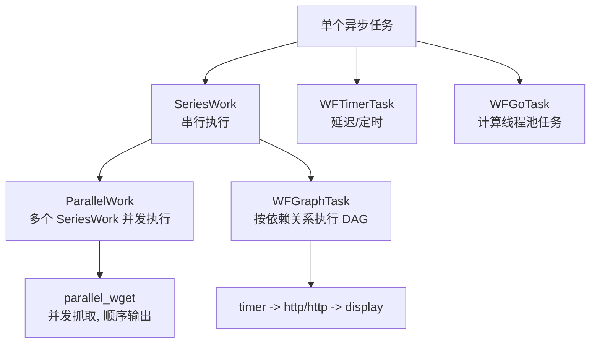
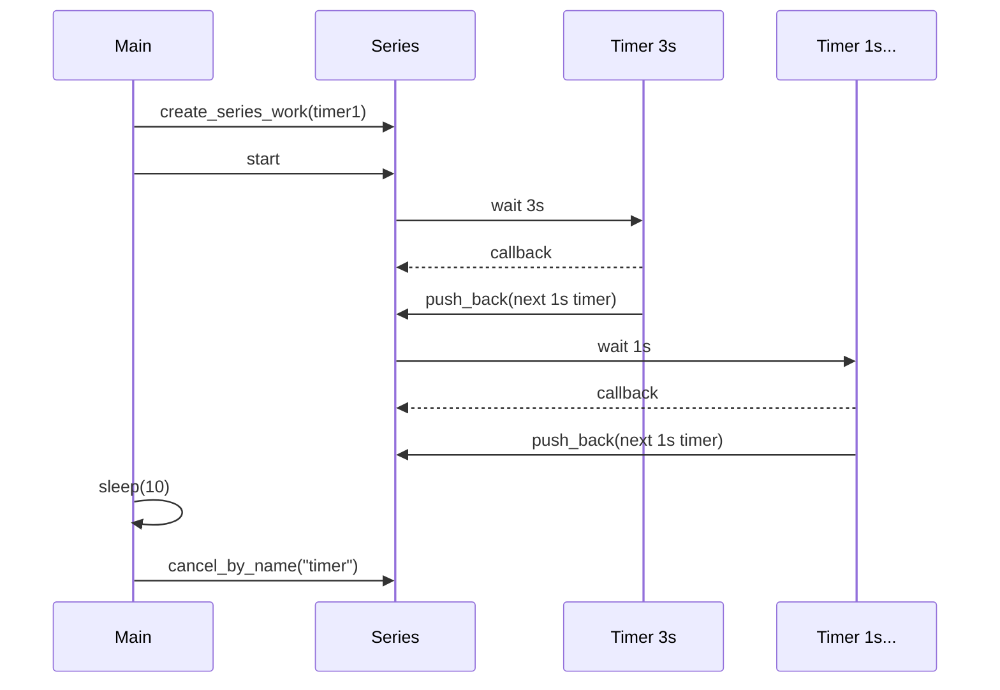
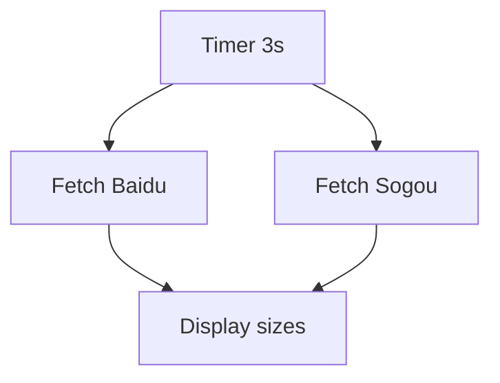
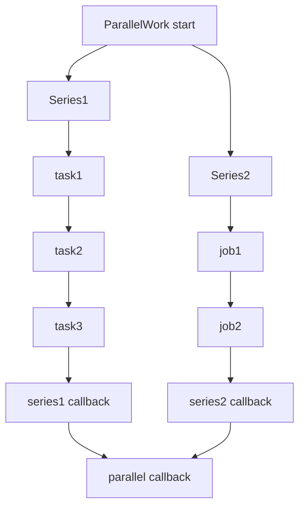
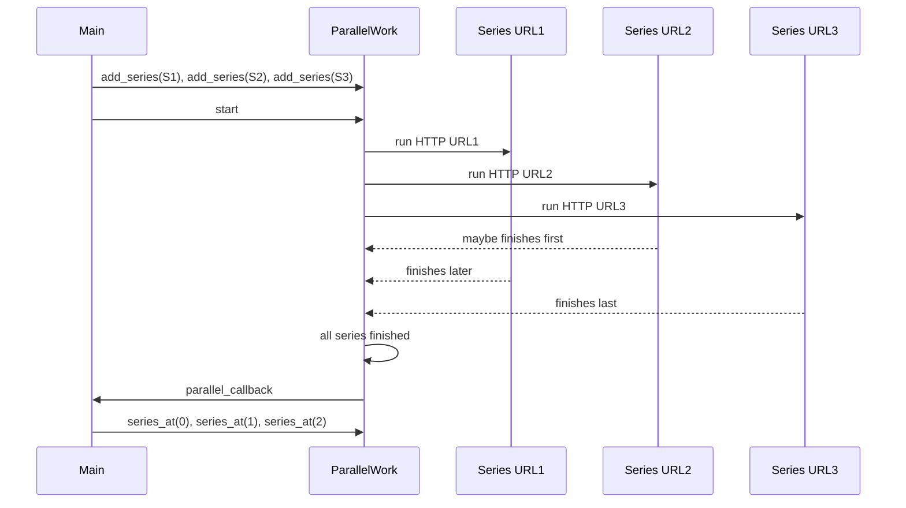
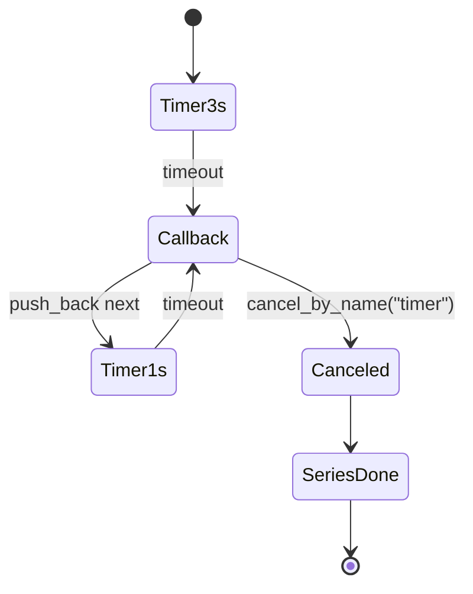
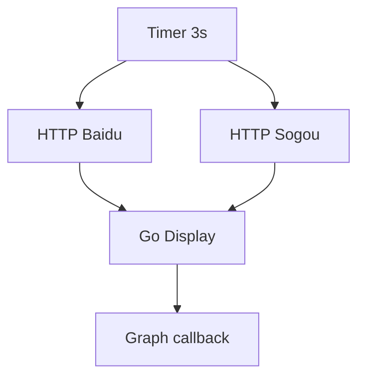
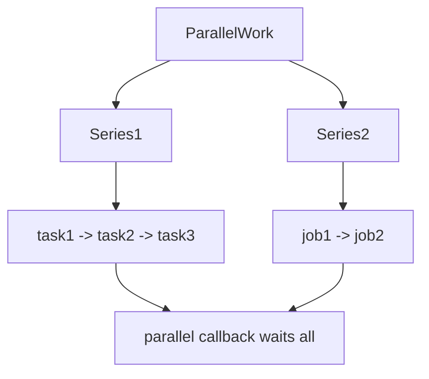

# 05_Tasks_ParallelWork 知识点整理

本目录学习 workflow 中更丰富的任务类型与组合方式：定时器任务、计算任务、DAG 图任务、并行任务流 `ParallelWork`，以及一个并发抓取多个网页但按输入顺序输出结果的 `parallel_wget`。

涉及源码：

- `01_time_task.cc`：有名定时器、周期性定时器模拟、按名称取消 timer。
- `02_go_task.cc`：`WFGoTask` 计算任务、参数绑定、引用传参、任务回调。
- `03_get_nprocs.cc`：获取系统可用处理器数量。
- `04_graph_task.cc`：`WFGraphTask` DAG 任务，任务依赖和拓扑执行。
- `05_parallel_work.cc`：多个 `SeriesWork` 放入 `ParallelWork` 并发执行。
- `06_parallel_wget.cc`：并行抓取多个 URL，并按用户输入顺序输出。
- `practice/01_graph_task.cc`：DAG 图任务练习。
- `practice/02_parallel_wget.cc`：并行 wget 练习。

## 1. 本章主线

前面章节已经学习了 workflow 的 HTTP、MySQL、File IO、`SeriesWork`。本章重点是任务组合：



本章核心对象：

| 类型 | 作用 |
| --- | --- |
| `WFTimerTask` | 定时器任务，到时间后触发 callback。 |
| `WFGoTask` | 把普通函数放到 workflow 计算执行器中执行。 |
| `WFGraphTask` | 按 DAG 依赖关系调度多个任务。 |
| `WFGraphNode` | 图任务中的一个节点，包装一个 `SubTask`。 |
| `ParallelWork` | 并发执行多个 `SeriesWork`。 |
| `SeriesWork` | 串行任务流，是 `ParallelWork` 的基本组成单元。 |

> [!IMPORTANT]
> workflow 的组合模型可以理解为：单个任务是最小执行单元，`SeriesWork` 表示顺序，`ParallelWork` 表示并发，`WFGraphTask` 表示带依赖约束的并发。

## 2. workflow 任务组合模型

### 2.1 `SubTask`

workflow 中很多任务最终都可以被当作 `SubTask` 放入任务流，例如：

- `WFHttpTask`
- `WFMySQLTask`
- `WFFileIOTask`
- `WFTimerTask`
- `WFGoTask`
- `WFGraphTask`
- `ParallelWork`

因此它们可以被组织进：

- `SeriesWork`
- `ParallelWork`
- `WFGraphTask`

### 2.2 `SeriesWork`

`SeriesWork` 表示串行执行：

```text
task1 -> task2 -> task3 -> series callback
```

本章中用到：

```cpp
SeriesWork* series = Workflow::create_series_work(task, callback);
series->push_back(nextTask);
series->start();
```

以及便捷运算符：

```cpp
*series1 << task2 << task3;
```

`operator<<` 在 `Workflow.h` 中定义，本质等价于：

```cpp
series.push_back(task);
```

### 2.3 `ParallelWork`

`ParallelWork` 表示多个 `SeriesWork` 并发执行：

```text
series1: task1 -> task2 -> task3
series2: job1  -> job2

parallel callback waits until both series finish
```

核心接口：

```cpp
ParallelWork* parallel = Workflow::create_parallel_work(callback);
parallel->add_series(series1);
parallel->add_series(series2);
parallel->start();
```

从本地 workflow 头文件可见：

```cpp
void add_series(SeriesWork *series);
SeriesWork *series_at(size_t index);
size_t size() const;
```

> [!NOTE]
> `ParallelWork` 不是直接添加普通任务，而是添加 `SeriesWork`。如果只有一个任务，也需要先把这个任务包装成一个 `SeriesWork`。

### 2.4 `WFGraphTask`

`WFGraphTask` 表示有依赖关系的 DAG：

```text
a -> b -> d
a -> c -> d
```

只有当前置节点完成后，后继节点才能执行。没有依赖关系的节点可以并发执行。

## 3. `01_time_task.cc`：定时器任务

### 3.1 创建定时器任务

代码：

```cpp
WFTimerTask* task =
    WFTaskFactory::create_timer_task("timer", 3, 0, timer_callback);
```

有名定时器接口：

```cpp
static WFTimerTask *create_timer_task(
    const std::string& timer_name,
    time_t seconds,
    long nanoseconds,
    timer_callback_t callback);
```

参数：

| 参数 | 含义 |
| --- | --- |
| `timer_name` | 定时器名字，用于按名称取消。 |
| `seconds` | 秒。 |
| `nanoseconds` | 纳秒。 |
| `callback` | 定时器触发后的回调。 |

也有无名版本：

```cpp
create_timer_task(time_t seconds, long nanoseconds, callback);
```

### 3.2 定时器 callback

代码：

```cpp
void timer_callback(WFTimerTask* task)
{
    int state = task->get_state();
    if (state != WFT_STATE_SUCCESS) {
        cout << "Task cancelled, state: " << state << endl;
        return;
    }

    cout << "Timer Triggered!" << endl;

    WFTimerTask* next_task =
        WFTaskFactory::create_timer_task("timer", 1, 0, timer_callback);
    series_of(task)->push_back(next_task);
}
```

关键点：

- 定时器正常到期时，`state == WFT_STATE_SUCCESS`。
- 被取消时，状态不是 `WFT_STATE_SUCCESS`。
- callback 中创建新的 timer 并 `push_back` 到当前 series，可以模拟周期性定时器。

执行关系：



> [!IMPORTANT]
> workflow 的 timer 是一次性任务。示例通过“callback 中创建下一个 timer 并追加到同一个 series”来模拟周期性定时器。

### 3.3 取消有名定时器

代码：

```cpp
sleep(10);
WFTaskFactory::cancel_by_name("timer");
waitGroup.wait();
```

workflow 提供：

```cpp
static int cancel_by_name(const std::string& timer_name);
static int cancel_by_name(const std::string& timer_name, size_t max);
```

含义：

- 取消指定名字下的 timer。
- 不传 `max` 时取消所有同名 timer。
- 传 `max` 时最多取消 `max` 个。

示例中所有 timer 名字都是 `"timer"`，所以可以统一取消。

### 3.4 为什么不推荐直接 `series->cancel()`

源码中注释：

```cpp
// series->cancel(); // 取消整个任务系列, 使用这种方式取消周期性定时器任务不太好
```

原因：

- `series->cancel()` 是取消整个串行流程。
- 这里真正想取消的是“未来继续触发的 timer”。
- 有名 timer 用 `cancel_by_name()` 表达更准确。

> [!NOTE]
> 如果你的业务是取消整个流程，用 `SeriesWork::cancel()`；如果你的业务是取消某类有名 timer，用 `cancel_by_name()`。

## 4. `02_go_task.cc`：计算任务 `WFGoTask`

### 4.1 `WFGoTask` 的用途

`WFGoTask` 用于把普通函数或 lambda 放入 workflow 的计算执行器中执行，适合：

- CPU 计算。
- 不适合放在网络回调里直接执行的耗时逻辑。
- 需要与 workflow 任务流集成的普通函数。

示例函数：

```cpp
void add(int a, int b, int& c)
{
    sleep(3);
    c = a + b;
    cout << "add: c = " << c << endl;
}
```

### 4.2 创建 Go 任务

代码：

```cpp
int a = 3, b = 3, c = 0;
WFGoTask* task =
    WFTaskFactory::create_go_task("q1", add, a, b, std::ref(c));
```

本地 workflow 头文件显示，`create_go_task` 内部会使用 `std::bind`：

```cpp
auto&& tmp = std::bind(std::forward<FUNC>(func),
                       std::forward<ARGS>(args)...);
```

参数：

| 参数 | 含义 |
| --- | --- |
| `"q1"` | 执行队列名称。 |
| `add` | 要执行的函数。 |
| `a, b` | 普通值参数。 |
| `std::ref(c)` | 引用包装，让 `c` 按引用传入。 |

> [!IMPORTANT]
> 因为 `create_go_task` 会把函数和参数绑定起来，普通参数默认会被复制。如果希望任务修改外部变量，必须使用 `std::ref()` 或其他明确的共享机制。

### 4.3 引用类型复习

源码注释提到：

```cpp
int&          // 左值引用，只能绑定左值
const int&    // const 左值引用，可绑定左值和右值，不能修改
int&&         // 右值引用，只能绑定右值
T&&           // 通用引用，取决于模板推导
```

本例中 `add` 第三个参数是：

```cpp
int& c
```

因此必须传一个可修改左值引用。`std::ref(c)` 会生成 `reference_wrapper<int>`，让 `std::bind` 最终以引用方式调用。

### 4.4 Go 任务回调

代码：

```cpp
task->set_callback([&c](WFGoTask*) {
    cout << "callback: c = " << c << endl;
});
```

`WFGoTask` 可以通过 `set_callback()` 设置回调。执行顺序是：

```text
add() 执行完成 -> go task callback -> series callback -> main wait 返回
```

> [!CAUTION]
> `c` 被 Go 任务修改，并在 callback/main 中读取。本例通过 `WaitGroup` 保证 main 最后读取；如果多个 Go 任务并发修改同一变量，需要互斥锁、原子变量或更清晰的数据隔离。

## 5. `03_get_nprocs.cc`：处理器数量

代码：

```cpp
#include <sys/sysinfo.h>

printf("processors: %d\n", get_nprocs());
```

`get_nprocs()` 返回当前系统可用处理器数量。

用途：

- 了解 CPU 核心数量。
- 估算计算任务并发度。
- 为线程池、执行队列设计提供参考。

> [!NOTE]
> `get_nprocs()` 是 GNU/Linux 接口，不是标准 C/C++ 接口。跨平台代码需要使用其他方式，例如 C++ 标准库 `std::thread::hardware_concurrency()`。

## 6. `04_graph_task.cc`：DAG 图任务

### 6.1 示例任务

代码创建了 4 个任务：

```cpp
WFTimerTask* timer = create_timer_task(3, 0, ...);
WFHttpTask* fetch_baidu = create_http_task("http://www.baidu.com", ...);
WFHttpTask* fetch_sogou = create_http_task("http://www.sogou.com", ...);
WFGoTask* display = create_go_task("display", [&]() { ... });
```

业务含义：

- 先等待 3 秒。
- 然后并发抓取百度和搜狗首页。
- 两个 HTTP 都完成后，执行 `display` 输出两个网页大小。

### 6.2 HTTP callback 中保存结果

代码：

```cpp
void http_callback(WFHttpTask* task)
{
    int state = task->get_state();
    if (state != WFT_STATE_SUCCESS) {
        return;
    }
    size_t* size = static_cast<size_t*>(task->user_data);
    const void* body;
    task->get_resp()->get_parsed_body(&body, size);
}
```

使用 `task->user_data` 保存 `size_t*`，让两个 HTTP 任务分别写入不同变量：

```cpp
size_t size1 = 0;
fetch_baidu->user_data = &size1;

size_t size2 = 0;
fetch_sogou->user_data = &size2;
```

> [!CAUTION]
> `user_data` 是裸 `void*`，没有类型检查和生命周期管理。这里 `size1/size2` 是 `main` 的局部变量，`main` 会等待图任务完成，所以生命周期足够。

### 6.3 创建图任务

代码：

```cpp
WFGraphTask* graph = WFTaskFactory::create_graph_task([](WFGraphTask*) {
   cout << "DAG graph task finished" << endl;
});
```

`WFGraphTask` 表示一个 DAG 图任务。callback 在整个图任务完成后调用。

### 6.4 创建图节点

代码：

```cpp
WFGraphNode& a = graph->create_graph_node(timer);
WFGraphNode& b = graph->create_graph_node(fetch_baidu);
WFGraphNode& c = graph->create_graph_node(fetch_sogou);
WFGraphNode& d = graph->create_graph_node(display);
```

`create_graph_node(task)` 的作用：

- 把一个 workflow 任务包装成图中的节点。
- 返回 `WFGraphNode&`，后续用它建立依赖关系。

### 6.5 建立依赖关系

代码：

```cpp
a --> b;
b --> d;
a --> c;
c --> d;
```

这个写法依赖两个运算符：

- 后缀 `--`：`operator--(WFGraphNode&, int)`，返回节点本身。
- `>`：`operator>(WFGraphNode& prec, WFGraphNode& succ)`，表示 `prec` 先于 `succ`。

所以：

```cpp
a --> b
```

可以理解成：

```cpp
a-- > b
```

等价语义：

```cpp
a.precede(b);
```

即 `a` 是 `b` 的前置节点。

> [!IMPORTANT]
> `a --> b` 不是 C++ 内置箭头语法，而是 `a-- > b` 这两个运算符组合出来的 DSL 写法，用来表达 DAG 依赖。

### 6.6 DAG 执行图



执行阶段：

1. `timer` 没有前置依赖，先执行。
2. `timer` 完成后，`fetch_baidu` 和 `fetch_sogou` 可以并发执行。
3. 两个 HTTP 都完成后，`display` 执行。
4. 图任务 callback 输出完成信息。

### 6.7 启动图任务

代码：

```cpp
Workflow::start_series_work(graph, [&waitGroup](const SeriesWork*) {
    waitGroup.done();
});
```

`WFGraphTask` 本身也是一个任务，可以放入 `SeriesWork`。这里用 `start_series_work` 创建并启动一个只包含 `graph` 的序列。

> [!NOTE]
> 图任务内部按依赖调度；外部看它仍然是一个普通 `SubTask`，可以放入 series 或 parallel。

## 7. `05_parallel_work.cc`：并行任务流

### 7.1 构造第一个串行序列

代码：

```cpp
WFGoTask* task1 = create_go_task("task", []() { ... });
WFGoTask* task2 = create_go_task("task", []() { ... });
WFGoTask* task3 = create_go_task("task", []() { ... });

SeriesWork* series1 = Workflow::create_series_work(task1, callback);
*series1 << task2 << task3;
```

执行顺序：

```text
series1: task1 -> task2 -> task3 -> series1 callback
```

### 7.2 构造第二个串行序列

代码：

```cpp
WFGoTask* job1 = create_go_task("task", []() { ... });
WFGoTask* job2 = create_go_task("task", []() { ... });

SeriesWork* series2 = Workflow::create_series_work(job1, callback);
series2->push_back(job2);
```

执行顺序：

```text
series2: job1 -> job2 -> series2 callback
```

### 7.3 放入 `ParallelWork`

代码：

```cpp
ParallelWork* parallel =
    Workflow::create_parallel_work([&waitGroup](const ParallelWork*) {
        cout << "ParallelWork: done!" << endl;
        waitGroup.done();
    });

parallel->add_series(series1);
parallel->add_series(series2);
parallel->start();
```

整体关系：



> [!IMPORTANT]
> `ParallelWork` 的 callback 会在所有子 `SeriesWork` 都完成后调用。每个子 series 内部仍然保持串行顺序。

### 7.4 启动方式

本示例：

```cpp
parallel->start();
```

另一个示例使用：

```cpp
Workflow::start_series_work(parallelWork, callback);
```

两者都可以启动。区别是：

- `parallel->start()` 直接把 `ParallelWork` 作为顶层任务启动。
- `start_series_work(parallelWork, callback)` 把 `ParallelWork` 放入一个外层 `SeriesWork`，外层 series callback 可用于通知 `WaitGroup`。

## 8. `06_parallel_wget.cc`：并行抓取，顺序输出

### 8.1 问题目标

需求：

- 用户输入多个 URL。
- 程序并发抓取这些 URL。
- 输出时仍按用户输入 URL 的顺序输出。

如果在每个 HTTP callback 里直接输出，输出顺序取决于网络速度，不一定等于输入顺序。

因此设计为：

- 每个 URL 对应一个 `SeriesWork`。
- 所有 series 放进同一个 `ParallelWork` 并发执行。
- 每个 series 的 context 保存结果。
- `ParallelWork` callback 中按 `series_at(i)` 的顺序输出。

### 8.2 `SeriesContext`

代码：

```cpp
struct SeriesContext
{
    string url;
    int state;
    int error;
    HttpResponse resp;
};
```

字段：

| 字段 | 含义 |
| --- | --- |
| `url` | 用户输入的 URL。 |
| `state` | HTTP 任务状态。 |
| `error` | HTTP 错误码。 |
| `resp` | 保存下来的 HTTP 响应对象。 |

> [!IMPORTANT]
> 这里的 `resp` 必须是对象，不应该是 `HttpResponse*`。HTTP task callback 执行结束后，`WFHttpTask` 会被 workflow 销毁，其中的 `HttpResponse` 也会销毁；保存指针会变成悬空指针。

### 8.3 移动保存响应对象

代码：

```cpp
ctx->resp = std::move(*(httpTask->get_resp()));
```

原因：

- workflow 禁用了 `HttpResponse` 的拷贝构造/拷贝赋值。
- 但支持移动语义。
- HTTP task 结束后响应对象即将随任务销毁。
- 用 `std::move` 把响应内容移动到 `ctx->resp` 中保存。

> [!NOTE]
> `std::move` 本身不移动数据，它只是把表达式转换成右值引用，真正的移动发生在移动赋值运算符里。

### 8.4 创建并添加多个 series

代码：

```cpp
ParallelWork* parallelWork =
    Workflow::create_parallel_work(parallel_callback);

for (int i = 1; i < argc; ++i) {
    WFHttpTask* httpTask =
        WFTaskFactory::create_http_task(argv[i], 3, 3, http_callback);

    SeriesWork* series =
        Workflow::create_series_work(httpTask, nullptr);

    SeriesContext* ctx = new SeriesContext;
    ctx->url = argv[i];
    series->set_context(ctx);

    parallelWork->add_series(series);
}
```

关键点：

- 用户输入顺序就是 `add_series()` 顺序。
- 后续可通过 `parallelWork->series_at(i)` 按顺序取回。
- 每个 series 独立保存自己的 context。

### 8.5 并发执行但顺序输出

输出代码：

```cpp
for (int i = 0; i < parallelWork->size(); ++i) {
    const SeriesWork* series = parallelWork->series_at(i);
    SeriesContext* ctx =
        static_cast<SeriesContext*>(series->get_context());

    cout << ctx->url << ": " << endl;
    // 输出结果
    delete ctx;
}
```

流程：



> [!IMPORTANT]
> 并发执行顺序和结果输出顺序是两回事。本例通过 `ParallelWork` context 保存结果，在 parallel callback 中按添加顺序输出，从而兼顾并发和有序输出。

### 8.6 错误处理

HTTP callback 保存：

```cpp
ctx->state = httpTask->get_state();
ctx->error = httpTask->get_error();
```

parallel callback 输出：

```cpp
if (ctx->state != WFT_STATE_SUCCESS) {
    cout << WFGlobal::get_error_string(ctx->state, ctx->error) << endl;
}
```

> [!CAUTION]
> 示例成功时直接 `cout << static_cast<const char*>(body)`，仍然假设 HTTP body 是以 `'\0'` 结尾的文本。严谨写法应使用 `cout.write(static_cast<const char*>(body), size)`。

## 9. practice 代码差异

### 9.1 `practice/01_graph_task.cc`

与主目录 `04_graph_task.cc` 基本相同，主要差异：

- 搜狗 URL 写成了 `http://www.sougou.com`，拼写可能有误。
- `size1`、`size2` 没有初始化，HTTP 失败时后续输出可能是未定义值。

> [!CAUTION]
> 保存结果的普通变量应初始化，例如 `size_t size1 = 0;`。否则网络失败或 callback 提前返回时，后续读取未初始化变量会产生未定义行为。

### 9.2 `practice/02_parallel_wget.cc`

与主目录 `06_parallel_wget.cc` 基本相同，额外包含：

```cpp
#include <nlohmann/json.hpp>
```

但源码没有使用 JSON 类型或接口，因此这是未使用头文件。

> [!NOTE]
> 未使用头文件会增加编译开销和依赖表面积。学习阶段影响不大，工程代码中应及时清理。

## 10. C++ 语法与标准库知识点

### 10.1 `std::ref`

代码：

```cpp
WFTaskFactory::create_go_task("q1", add, a, b, std::ref(c));
```

`std::ref(c)` 生成引用包装器，让绑定后的函数调用仍以引用方式传递 `c`。

如果直接传 `c`：

```cpp
create_go_task("q1", add, a, b, c);
```

`c` 会被复制到绑定对象中，`add` 修改的是副本，外部 `c` 不会变。

### 10.2 lambda 引用捕获

代码：

```cpp
task->set_callback([&c](WFGoTask*) {
    cout << "callback: c = " << c << endl;
});
```

引用捕获要求被捕获对象在 callback 执行时仍然存在。本例中：

- `c` 是 `main` 的局部变量。
- `main` 在 `waitGroup.wait()` 等待任务完成。
- callback 执行完后 main 才继续。

所以生命周期是安全的。

### 10.3 `std::move`

代码：

```cpp
ctx->resp = std::move(*(httpTask->get_resp()));
```

用途：

- 避免复制不可复制对象。
- 把即将销毁的 task response 移动到用户上下文中。

移动后，原对象处于“有效但未指定”状态，不应再依赖其原有内容。

### 10.4 命令行参数

parallel wget：

```cpp
if (argc < 2) {
    cerr << "Usage: " << argv[0] << " <URI>" << endl;
    exit(1);
}

for (int i = 1; i < argc; ++i) {
    // argv[i] 是一个 URL
}
```

`argv[0]` 是程序名，`argv[1]` 到 `argv[argc-1]` 是用户输入 URL。

## 11. 接口速查

### 11.1 Timer

| 接口 | 作用 |
| --- | --- |
| `create_timer_task(seconds, nanoseconds, cb)` | 创建无名 timer。 |
| `create_timer_task(name, seconds, nanoseconds, cb)` | 创建有名 timer。 |
| `cancel_by_name(name)` | 取消所有同名 timer。 |
| `cancel_by_name(name, max)` | 最多取消 `max` 个同名 timer。 |
| `WFTimerTask::get_state()` | 获取 timer 状态。 |
| `WFTimerTask::set_callback(cb)` | 设置 timer 回调。 |

### 11.2 Go Task

| 接口 | 作用 |
| --- | --- |
| `create_go_task(queue_name, func, args...)` | 创建计算任务。 |
| `create_timedgo_task(seconds, nanoseconds, queue_name, func, args...)` | 创建带运行时间限制的计算任务。 |
| `WFGoTask::set_callback(cb)` | 设置完成回调。 |

### 11.3 Graph Task

| 接口/写法 | 作用 |
| --- | --- |
| `create_graph_task(cb)` | 创建 DAG 图任务。 |
| `graph->create_graph_node(task)` | 添加节点并包装任务。 |
| `a.precede(b)` | 设置 `a` 是 `b` 的前置节点。 |
| `a --> b` | 等价表达依赖 `a` 先于 `b`。 |

### 11.4 ParallelWork

| 接口 | 作用 |
| --- | --- |
| `create_parallel_work(cb)` | 创建空并行任务。 |
| `parallel->add_series(series)` | 添加一个串行任务流。 |
| `parallel->start()` | 启动并行任务。 |
| `parallel->size()` | 获取子 series 数量。 |
| `parallel->series_at(i)` | 获取第 i 个 series。 |
| `parallel->set_context(ctx)` | 设置并行任务上下文。 |

### 11.5 SeriesWork 相关运算符

| 写法 | 等价语义 |
| --- | --- |
| `*series << task` | `series->push_back(task)` |
| `task1 > task2` | 创建或扩展串行关系。 |
| `a --> b` | 对 `WFGraphNode` 表示 `a` 先于 `b`。 |

> [!CAUTION]
> 运算符 DSL 可读性强，但也容易让初学者误解。建议先理解底层接口：`push_back()`、`add_series()`、`precede()`，再使用运算符写法。

## 12. Mermaid 总结图

### 12.1 Timer 周期模拟



### 12.2 Graph Task DAG



### 12.3 ParallelWork



## 13. 运行参考

编译命令取决于本机 workflow 安装方式，可能类似：

```bash
g++ 01_time_task.cc -o timer_demo -lworkflow -lpthread
g++ 02_go_task.cc -o go_demo -lworkflow -lpthread
g++ 04_graph_task.cc -o graph_demo -lworkflow -lpthread
g++ 05_parallel_work.cc -o parallel_demo -lworkflow -lpthread
g++ 06_parallel_wget.cc -o parallel_wget -lworkflow -lpthread
```

运行：

```bash
./timer_demo
./go_demo
./graph_demo
./parallel_demo
./parallel_wget http://www.baidu.com http://www.sogou.com
```

> [!NOTE]
> HTTP 示例依赖外网和 DNS，网络不可用时可能输出 workflow 错误信息。并行 wget 的目标是演示任务并发和顺序输出，不保证每个网站都稳定可访问。

## 14. 易错点总结

- Timer 是一次性任务；周期性 timer 需要在 callback 中创建下一个 timer。
- 有名 timer 可以用 `cancel_by_name()` 取消。
- 已经放入 `SeriesWork` 的任务不要再单独 `start()`。
- `WFGoTask` 参数默认会被绑定/复制，需要修改外部变量时用 `std::ref()`。
- 并发任务访问共享变量时要考虑数据竞争。
- `user_data` 是裸 `void*`，必须保证类型和生命周期正确。
- `a --> b` 是 `a-- > b` 的运算符组合，不是内置箭头。
- DAG 必须是无环图；循环依赖会破坏拓扑执行模型。
- `ParallelWork` 添加的是 `SeriesWork`，不是普通任务。
- 并发完成顺序不等于输入顺序；要顺序输出需保存结果并在 parallel callback 中统一输出。
- HTTP task 完成后会被销毁，不能保存 `HttpResponse*`；需要移动保存 `HttpResponse` 对象。
- `std::move` 后不要继续依赖原对象内容。
- practice 中未初始化的 `size_t` 在请求失败时可能导致未定义行为。

> [!IMPORTANT]
> 本章的核心是任务关系建模：串行用 `SeriesWork`，并发用 `ParallelWork`，依赖图用 `WFGraphTask`，普通计算用 `WFGoTask`，延迟触发用 `WFTimerTask`。选择正确的任务组合方式，比在回调里手写复杂控制流更清晰。
