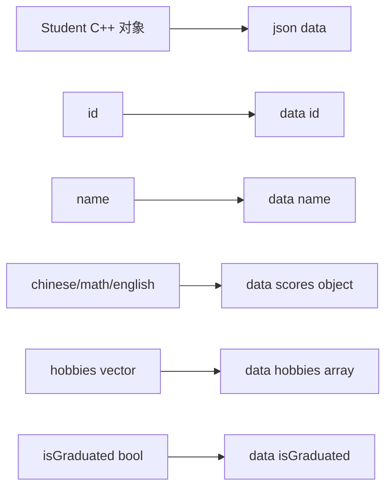
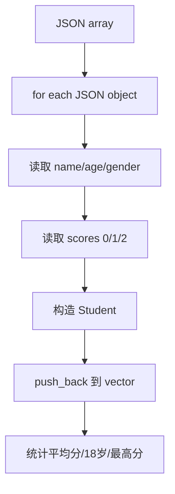
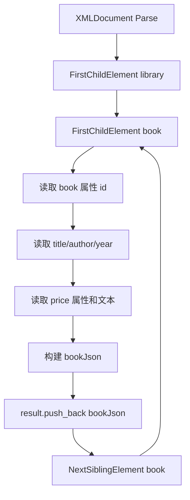
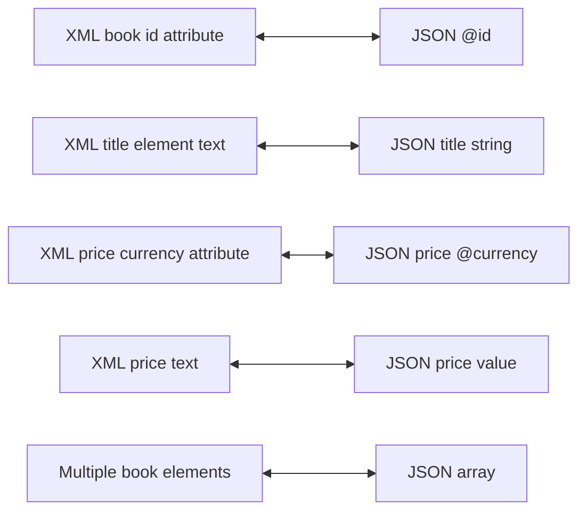

# 06_Json 知识点整理

本目录学习 C++ 中 JSON 的构建、解析、序列化、反序列化、JSON 与 C++ 对象互转、JSON 数组统计分析，以及 XML 与 JSON 的双向转换。主要使用两个第三方库：

- `nlohmann/json`：现代 C++ JSON 头文件库。
- `tinyxml2`：轻量级 XML 解析与生成库。

涉及源码：

- `01_json_basic.cc`：从文件/字符串解析 JSON，使用 `dump()` 序列化输出。
- `02_build_json.cc`：JSON 类型判断、基本类型、数组、对象构建与遍历。
- `03_parse_json.cc`：基础 JSON 类型反序列化示例。
- `04_obj_to_json.cc`：C++ `Student` 对象手动映射为 JSON。
- `05_json_to_obj.cc`：JSON 字符串解析为 C++ `Book` 对象。
- `06_parse_json_array.cc`：解析 JSON 数组并做统计。
- `07_XML_to_json.cc`：使用 tinyxml2 解析 XML 并转换为 JSON。
- `practice/01_obj_to_json.cc`：对象转 JSON 练习。
- `practice/02_json_to_obj.cc`：JSON 转对象练习。
- `practice/03_parse_json_array.cc`：JSON 数组统计练习。
- `practice/04_XML_to_json.cc`：XML 转 JSON 练习。
- `practice/05_json_to_XML.cc`：JSON 转 XML。
- `example.json`：JSON 文件示例。
- `practice/library.xml`：XML 文件示例。

> [!NOTE]
> `nlohmann/json` 通常只需要 `#include <nlohmann/json.hpp>`，属于 header-only 使用方式；`tinyxml2` 需要 `#include <tinyxml2.h>`，编译时通常还要链接 `-ltinyxml2`。

## 1. JSON 基础概念

### 1.1 JSON 是什么

JSON，全称 JavaScript Object Notation，是一种轻量级数据交换格式。它常用于：

- 配置文件。
- Web API 请求和响应。
- 跨语言数据交换。
- 日志、测试数据、序列化存储。

JSON 的基本数据类型：

| JSON 类型 | 示例 | C++ 常见映射 |
| --- | --- | --- |
| null | `null` | 空值、`nullptr` 语义 |
| boolean | `true` / `false` | `bool` |
| number | `3.14` / `100` | `int`、`double` 等 |
| string | `"hello"` | `std::string` |
| array | `[1, 2, 3]` | `std::vector<T>` |
| object | `{"name":"Tom"}` | struct/class/map |

> [!IMPORTANT]
> JSON 是数据格式，不是 C++ 类型系统。解析 JSON 时必须明确字段是否存在、类型是否符合预期，以及数组下标是否越界。

### 1.2 序列化与反序列化

`01_json_basic.cc` 注释中说明：

- 序列化：将内存中的数据结构或对象转换为可存储或可传输的格式。
- 反序列化：序列化的逆过程，将字节流恢复为内存中的数据结构或对象。

在 `nlohmann/json` 中：

```cpp
json j = json::parse(text); // 反序列化
std::string s = j.dump();   // 序列化
```

带缩进输出：

```cpp
cout << j.dump(2) << endl;
```

`dump(2)` 表示使用 2 个空格缩进，更适合人阅读。

## 2. nlohmann/json 基本用法

### 2.1 头文件与别名

所有 JSON 示例都使用：

```cpp
#include <nlohmann/json.hpp>

using json = nlohmann::json;
```

`using json = nlohmann::json;` 是类型别名，之后可以直接写：

```cpp
json data;
```

而不用每次写完整类型：

```cpp
nlohmann::json data;
```

### 2.2 从文件解析 JSON

`01_json_basic.cc`：

```cpp
ifstream f("example.json");
json j1 = json::parse(f);
cout << j1.dump(2) << endl;
```

流程：

```mermaid
flowchart LR
    A[example.json 文件] --> B[ifstream]
    B --> C[json::parse]
    C --> D[nlohmann::json 对象]
    D --> E[dump(2) 格式化输出]
```

`example.json` 内容：

```json
{
    "user": {
        "name": "花生",
        "age": 18,
        "contacts": [
            {
                "type": "email",
                "value": "peanut@example.com"
            },
            {
                "type": "phone",
                "value": "1234567890"
            }
        ],
        "is_active": true
    }
}
```

> [!CAUTION]
> 示例没有检查文件是否打开成功。真实代码应先检查 `if (!f)`，否则文件不存在时 `json::parse(f)` 会抛异常或解析失败。

### 2.3 从字符串解析 JSON

代码：

```cpp
json j2 = json::parse(R"({
    "pi": 3.14159,
    "happy": true
})");
```

这里使用 C++ 原始字符串字面量：

```cpp
R"(... )"
```

优点：

- 不需要转义双引号。
- 适合写多行 JSON、XML、SQL 等文本。

普通字符串要写成：

```cpp
"{\"pi\":3.14159,\"happy\":true}"
```

可读性更差。

### 2.4 `dump()`

常见写法：

```cpp
j.dump();    // 紧凑输出
j.dump(2);   // 2 空格缩进
j.dump(4);   // 4 空格缩进
```

示例：

```cpp
cout << data.dump(2) << endl;
```

> [!NOTE]
> 机器传输时通常使用紧凑 JSON，减少体积；日志和调试时使用 `dump(2)` 或 `dump(4)`，便于阅读。

## 3. JSON 类型判断与基本类型转换

### 3.1 类型判断

`02_build_json.cc`：

```cpp
json data;
data.is_null();
data.is_number();
data.is_boolean();
data.is_string();
data.is_array();
data.is_object();
```

常用类型判断：

| 接口 | 判断 |
| --- | --- |
| `is_null()` | 是否是 null。 |
| `is_number()` | 是否是数字。 |
| `is_boolean()` | 是否是 bool。 |
| `is_string()` | 是否是字符串。 |
| `is_array()` | 是否是数组。 |
| `is_object()` | 是否是对象。 |

> [!IMPORTANT]
> 从外部输入解析来的 JSON，不要直接假设类型正确。访问前先判断类型，或者使用 `get<T>()` 并处理异常。

### 3.2 直接赋值构建基本类型

示例：

```cpp
json j1 = 3.14;
json j2 = true;
json j3 = "茜茜";
```

转换回 C++：

```cpp
double pi = j1;
bool flag = j2;
string name = j3;
```

显式转换：

```cpp
double pi = j1.get<double>();
bool ok = j2.get<bool>();
string idol = j3.get<string>();
```

> [!NOTE]
> `get<T>()` 更明确，适合教学和工程代码；隐式转换更短，但类型不匹配时错误位置可能不够直观。

### 3.3 `boolalpha`

代码：

```cpp
cout << boolalpha << flag << endl;
```

默认情况下，`bool` 输出为：

```text
1
0
```

使用 `boolalpha` 后输出：

```text
true
false
```

## 4. JSON 数组

### 4.1 构建数组

示例注释中：

```cpp
json array = { "peanut", "loves", "xixi", 520 };
```

这是 JSON 数组，元素可以是不同类型：

```json
["peanut", "loves", "xixi", 520]
```

### 4.2 访问数组元素

代码：

```cpp
cout << array[0] << " "
     << array[1] << " "
     << array[2] << " "
     << array[3] << endl;
```

获取数组大小：

```cpp
array.size()
```

遍历：

```cpp
for (auto& element : array) {
    cout << element << " ";
}
```

> [!CAUTION]
> `array[index]` 不会自动帮你判断业务语义是否正确。解析外部 JSON 时应检查 `is_array()`、`size()`，避免数组下标越界或类型错误。

### 4.3 JSON 数组转 `std::vector`

示例：

```cpp
vector<int> scores = stu["scores"];
vector<string> tags = j["book"]["tags"];
```

`nlohmann/json` 支持将 JSON array 转换为 STL 容器，前提是每个元素能转换为目标元素类型。

也可以显式写：

```cpp
vector<int> scores = stu["scores"].get<vector<int>>();
```

## 5. JSON 对象

### 5.1 构建对象

`02_build_json.cc`：

```cpp
json object = {
    { "id", 1 },
    { "name", "花生" },
    { "age", 18 }
};
```

对应 JSON：

```json
{
  "id": 1,
  "name": "花生",
  "age": 18
}
```

### 5.2 根据 key 访问

代码：

```cpp
cout << object["id"] << " "
     << object["name"] << " "
     << object["age"] << endl;
```

### 5.3 遍历对象

代码：

```cpp
for (auto& entry : object.items()) {
    cout << entry.key() << ": " << entry.value() << endl;
}
```

`items()` 返回可迭代代理对象，每个元素包含：

- `entry.key()`：键。
- `entry.value()`：值。

> [!IMPORTANT]
> 对象访问建议先判断字段是否存在：`object.contains("id")`。直接使用 `object["missing"]` 可能插入 null 字段，改变原 JSON 对象。

## 6. `04_obj_to_json.cc`：C++ 对象转 JSON

### 6.1 C++ 结构体

代码：

```cpp
struct Student {
    int id;
    string name;
    int chinese;
    int math;
    int english;
    vector<string> hobbies;
    bool isGraduated;
};
```

示例对象：

```cpp
Student s = {
    1001,
    "花生",
    92,
    95,
    88,
    { "唱歌", "跳舞", "rap", "篮球" },
    false
};
```

### 6.2 手动映射为 JSON

代码：

```cpp
json data;
data["id"] = s.id;
data["name"] = s.name;
data["scores"]["chinese"] = s.chinese;
data["scores"]["math"] = s.math;
data["scores"]["english"] = s.english;
data["hobbies"] = s.hobbies;
data["isGraduated"] = s.isGraduated;
```

映射关系：



输出 JSON：

```json
{
  "hobbies": ["唱歌", "跳舞", "rap", "篮球"],
  "id": 1001,
  "isGraduated": false,
  "name": "花生",
  "scores": {
    "chinese": 92,
    "english": 88,
    "math": 95
  }
}
```

> [!NOTE]
> JSON object 的字段顺序不应作为业务语义依赖。不同库或不同输出设置下顺序可能不同。

### 6.3 嵌套对象自动创建

代码：

```cpp
data["scores"]["chinese"] = s.chinese;
```

如果 `data["scores"]` 不存在，`nlohmann/json` 会把它创建为对象，然后设置 `"chinese"` 字段。

> [!CAUTION]
> 自动创建很方便，但也可能掩盖拼写错误。例如 `data["scoers"]["math"]` 会创建一个错误字段，而不是报错。

## 7. `05_json_to_obj.cc`：JSON 转 C++ 对象

### 7.1 原始 JSON 字符串

代码：

```cpp
const char* str = R"({
    "book": {
        "title": "JavaScript 高级程序设计",
        "author": "Nicholas C. Zakas",
        "price": 129.00,
        "publisher": "人民邮电出版社",
        "tags": ["前端", "JavaScript", "编程"]
    }
})";
```

### 7.2 解析 JSON

代码：

```cpp
json data = json::parse(str);
```

### 7.3 填充 C++ 对象

代码：

```cpp
Book book;
book.title = data["book"]["title"];
book.author = data["book"]["author"];
book.price = data["book"]["price"];
book.publisher = data["book"]["publisher"];
book.tags = data["book"]["tags"];
```

`Book` 结构：

```cpp
struct Book {
    string title;
    string author;
    double price;
    string publisher;
    vector<string> tags;
};
```

> [!IMPORTANT]
> 这类手动映射要求 JSON 字段完整且类型正确。真实项目中应使用 `contains()`、`is_*()` 或异常处理来应对缺字段、类型错误和空值。

### 7.4 打印 vector

代码：

```cpp
int ntags = book.tags.size();
for (int i = 0; i < ntags; ++i) {
    if (i != ntags - 1) {
        cout << book.tags[i] << ", ";
    } else {
        cout << book.tags[i] << "]" << endl;
    }
}
```

这个逻辑用于控制逗号格式，避免最后一个元素后面多一个逗号。

## 8. `06_parse_json_array.cc`：JSON 数组统计

### 8.1 数据结构

JSON 字符串：

```json
[
  {
    "name": "赵一",
    "age": 18,
    "gender": "男",
    "scores": [85, 92, 78]
  }
]
```

C++ 结构体：

```cpp
struct Student {
    string name;
    int age;
    string gender;
    int chinese;
    int math;
    int english;
};
```

### 8.2 解析数组并转换为对象

代码：

```cpp
json data = json::parse(jsonstring);
vector<Student> students;

for (const auto& j : data) {
    Student s;
    s.name = j["name"];
    s.age = j["age"];
    s.gender = j["gender"];
    s.chinese = j["scores"][0];
    s.math = j["scores"][1];
    s.english = j["scores"][2];
    students.push_back(s);
}
```

流程：



### 8.3 统计最高总分

代码：

```cpp
int max_score = 0;
for (const auto& j : data) {
    // ...
    int total_score = s.chinese + s.math + s.english;
    if (total_score > max_score) {
        max_score = total_score;
    }
    students.push_back(s);
}
```

然后再次遍历：

```cpp
for (const auto& s : students) {
    int total_score = s.chinese + s.math + s.english;
    if (total_score == max_score) {
        cout << s.name << " ";
    }
}
```

这样可以支持多个学生并列最高分。

### 8.4 平均分

代码：

```cpp
(s.chinese + s.math + s.english) / 3.0
```

使用 `3.0` 而不是 `3`，确保进行浮点除法。

> [!NOTE]
> 如果写 `/ 3`，两个整数相除会先进行整数除法，小数部分被截断。

## 9. practice 代码差异

### 9.1 `practice/03_parse_json_array.cc`

practice 版本直接使用：

```cpp
vector<int> scores = stu["scores"];
```

然后遍历分数：

```cpp
for (int s : scores) {
    sum += s;
}
```

这种写法比固定访问 `[0] [1] [2]` 更灵活，可以支持分数数量变化。

但 practice 版本只记录一个最高分学生：

```cpp
if (sum > max_total) {
    max_total = sum;
    top_student = name;
}
```

如果有并列最高，只会保留第一个。

### 9.2 `03_parse_json.cc` 未完整演示

`03_parse_json.cc` 只展示了前半部分：

```cpp
json d2 = true;
```

后续没有继续输出或转换。它更像课堂中未写完的基础示例，完整类型转换可参考 `02_build_json.cc`。

## 10. tinyxml2 基础

### 10.1 头文件和命名空间

XML 示例使用：

```cpp
#include <tinyxml2.h>

using namespace tinyxml2;
```

核心类型：

| 类型 | 含义 |
| --- | --- |
| `XMLDocument` | XML 文档对象。 |
| `XMLElement` | XML 元素节点。 |
| `XMLDeclaration` | XML 声明，例如 `<?xml version="1.0"?>`。 |
| `XMLError` | XML 操作结果码。 |

### 10.2 解析 XML 字符串

代码：

```cpp
XMLDocument doc;
if (doc.Parse(xmlstring) != XML_SUCCESS) {
    cerr << "Failed to parse XML string" << endl;
    return -1;
}
```

`Parse` 返回 `XMLError`，成功时为 `XML_SUCCESS`。

### 10.3 获取根元素和子元素

代码：

```cpp
XMLElement* library = doc.FirstChildElement();
XMLElement* book = library->FirstChildElement("book");
```

遍历同名兄弟元素：

```cpp
while (book) {
    // ...
    book = book->NextSiblingElement("book");
}
```

读取属性：

```cpp
const char* id = book->Attribute("id");
```

读取文本：

```cpp
const char* text = price->GetText();
```

> [!CAUTION]
> `Attribute()` 和 `GetText()` 都可能返回 `nullptr`。示例中大多数地方做了空指针判断，这是好习惯。

## 11. `07_XML_to_json.cc`：XML 转 JSON

### 11.1 XML 输入

示例 XML：

```xml
<library>
    <book id="B001">
        <title>三体</title>
        <author>刘慈欣</author>
        <year>2008</year>
        <price currency="CNY">68.00</price>
    </book>
</library>
```

### 11.2 转换规则

示例采用规则：

- 每个 `<book>` 转成一个 JSON object。
- XML 属性用 `@` 前缀表示。
- XML 文本内容存为普通字段或 `value`。
- 多个 `<book>` 放入 JSON array。

映射：

| XML | JSON |
| --- | --- |
| `<book id="B001">` | `"@id": "B001"` |
| `<title>三体</title>` | `"title": "三体"` |
| `<year>2008</year>` | `"year": 2008` |
| `<price currency="CNY">68.00</price>` | `"price": {"@currency":"CNY","value":68.0}` |

流程：



### 11.3 数字转换

代码：

```cpp
bookJson["year"] = stoi(year->GetText());
priceJson["value"] = stod(text);
```

`stoi`：字符串转 `int`。

`stod`：字符串转 `double`。

> [!CAUTION]
> `stoi/stod` 在输入非法时会抛异常。示例假设 XML 内容合法；真实项目应捕获异常或使用更稳妥的转换检查。

## 12. `practice/05_json_to_XML.cc`：JSON 转 XML

### 12.1 解析 JSON 数组

代码：

```cpp
json books;

try {
    books = json::parse(jsonString);
} catch (const json::parse_error& e) {
    cerr << "JSON parse error: " << e.what() << endl;
    return -1;
}
```

这是本目录中少数显式捕获 JSON 解析异常的示例。

> [!IMPORTANT]
> 外部输入 JSON 时建议使用 `try/catch` 捕获 `json::parse_error`，否则格式错误会直接抛异常终止当前流程。

### 12.2 创建 XML 文档

代码：

```cpp
XMLDocument doc;

XMLDeclaration* declaration = doc.NewDeclaration();
doc.InsertEndChild(declaration);

XMLElement* library = doc.NewElement("library");
doc.InsertEndChild(library);
```

含义：

- `XMLDocument doc`：创建 XML 文档。
- `NewDeclaration()`：创建 XML 声明。
- `InsertEndChild()`：把节点插入到文档末尾。
- `NewElement("library")`：创建 `<library>` 元素。

### 12.3 JSON 字段转 XML 元素/属性

代码：

```cpp
XMLElement* book = doc.NewElement("book");

if (item.contains("@id")) {
    book->SetAttribute("id", item["@id"].get<string>().c_str());
}
```

这里把 JSON 的 `"@id"` 转成 XML 属性 `id`。

普通字段转子元素：

```cpp
XMLElement* title = doc.NewElement("title");
title->SetText(item["title"].get<string>().c_str());
book->InsertEndChild(title);
```

数字字段：

```cpp
XMLElement* year = doc.NewElement("year");
year->SetText(item["year"].get<int>());
book->InsertEndChild(year);
```

### 12.4 格式化价格

代码：

```cpp
string formatPrice(double price) {
    stringstream ss;
    ss << fixed << setprecision(2) << price;
    return ss.str();
}
```

知识点：

- `stringstream` 用于字符串流拼接/格式化。
- `fixed` 使用定点小数格式。
- `setprecision(2)` 保留 2 位小数。

示例：

```text
68.0 -> "68.00"
```

### 12.5 保存 XML 文件

代码：

```cpp
XMLError result = doc.SaveFile("library.xml");

if (result != XML_SUCCESS) {
    cerr << "Failed to save XML file" << endl;
    return -1;
}
```

`SaveFile` 把 XML 文档写入文件。

> [!NOTE]
> `practice/library.xml` 就是 JSON 转 XML 示例生成或对应的目标 XML 结构。

## 13. JSON 与 XML 转换设计

JSON 和 XML 不是一一等价的数据模型：

- JSON 有 object、array、number、boolean、null。
- XML 有元素、属性、文本、注释、命名空间、顺序。

因此转换时必须约定规则。本目录采用：

```text
XML attribute  -> JSON key with @ prefix
XML text       -> JSON string/number or value field
Repeated nodes -> JSON array
Child element  -> JSON object field
```

双向转换示意：



> [!IMPORTANT]
> XML/JSON 转换没有唯一标准。工程中必须先定义稳定映射规则，否则不同模块可能生成不兼容的数据结构。

## 14. 异常与健壮性

### 14.1 JSON 解析异常

`json::parse()` 在格式错误时可能抛出 `json::parse_error`。

推荐：

```cpp
try {
    json data = json::parse(input);
} catch (const json::parse_error& e) {
    cerr << e.what() << endl;
}
```

### 14.2 字段缺失

推荐检查：

```cpp
if (j.contains("book") && j["book"].is_object()) {
    // safe
}
```

### 14.3 类型错误

推荐：

```cpp
if (j["age"].is_number()) {
    int age = j["age"].get<int>();
}
```

### 14.4 数组越界

推荐：

```cpp
if (j["scores"].is_array() && j["scores"].size() >= 3) {
    int chinese = j["scores"][0].get<int>();
}
```

> [!CAUTION]
> 教学示例通常假设输入格式完全正确；真实项目中 JSON/XML 都属于外部输入，必须把缺字段、错类型、非法格式当作常态处理。

## 15. 编译与运行参考

### 15.1 JSON 示例

`nlohmann/json` 是头文件库，通常只需包含头文件：

```bash
g++ 01_json_basic.cc -o json_basic -std=c++11
./json_basic
```

如果头文件不在默认搜索路径，需要加 `-I`。

### 15.2 XML 示例

tinyxml2 示例通常需要链接库：

```bash
g++ 07_XML_to_json.cc -o xml_to_json -std=c++11 -ltinyxml2
./xml_to_json
```

JSON 转 XML：

```bash
g++ practice/05_json_to_XML.cc -o json_to_xml -std=c++11 -ltinyxml2
./json_to_xml
```

## 16. 易错点总结

- `json::parse()` 可能抛异常，外部输入要 `try/catch`。
- 直接 `j["missing"]` 可能创建 null 字段，建议用 `contains()`。
- 数组访问前检查 `is_array()` 和 `size()`。
- 使用 `get<T>()` 时要确保 JSON 类型能转换成 `T`。
- `std::vector<T>` 与 JSON array 可自动转换，但元素类型必须匹配。
- JSON object 字段顺序不应作为业务语义。
- 原始字符串 `R"( ... )"` 适合写 JSON/XML 字面量。
- `stoi/stod` 可能抛异常。
- `Attribute()`、`GetText()` 可能返回 `nullptr`。
- XML 和 JSON 没有唯一转换规则，必须约定属性、文本、数组的映射方式。
- `fixed << setprecision(2)` 会影响流后续数字格式，作用于同一个流对象。
- UTF-8 中文文本能正常放入 JSON/XML，但源文件、终端和编译环境都应使用一致编码。

> [!IMPORTANT]
> 本章核心是“数据格式和 C++ 对象之间的映射”：JSON/XML 是外部数据表示，C++ struct/vector/string/int/double/bool 是内存模型。写代码时要明确每个字段如何转换、缺失时如何处理、类型错误时如何报错。
