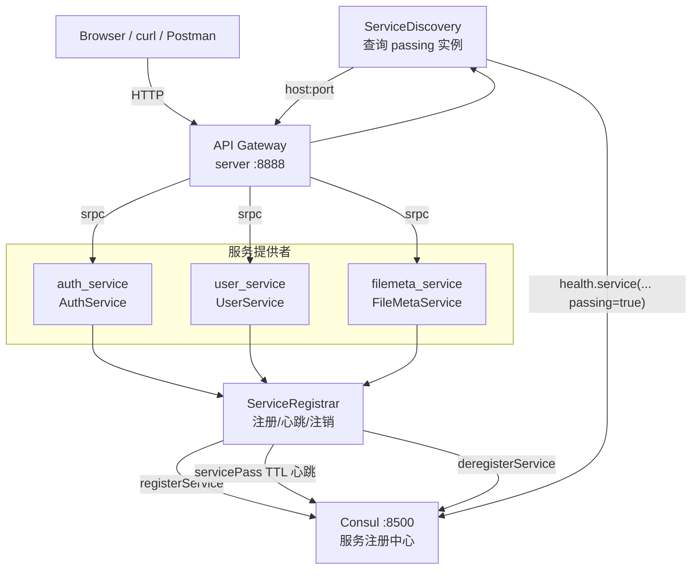
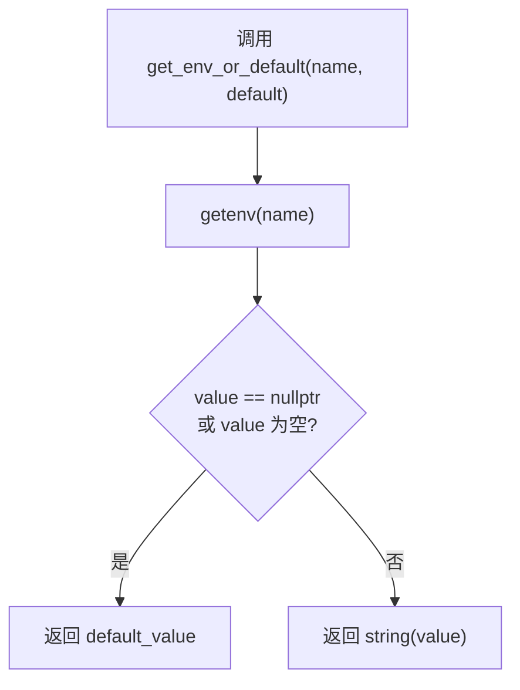
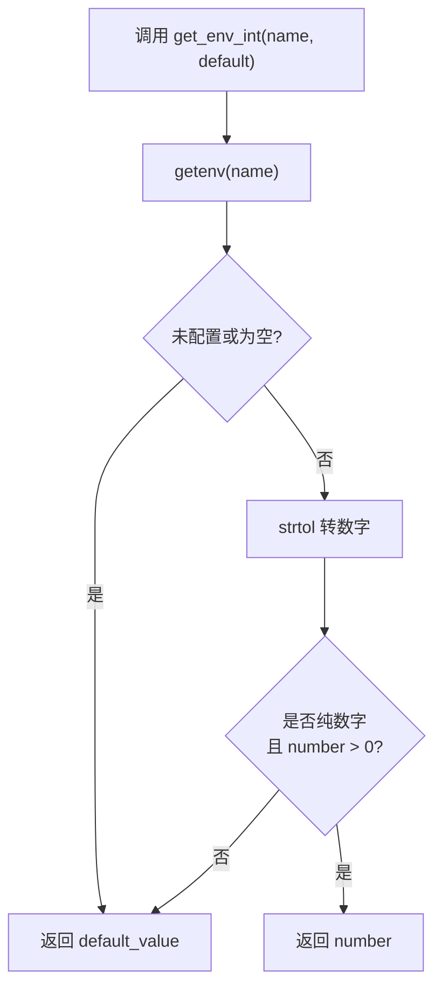
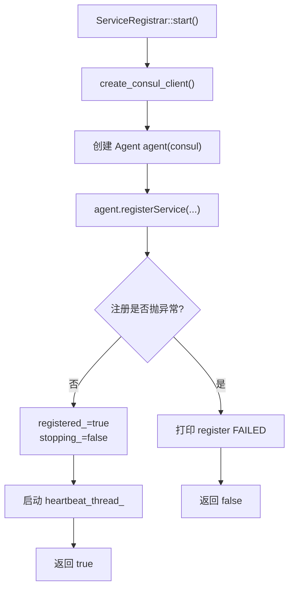
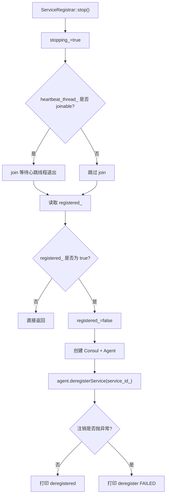
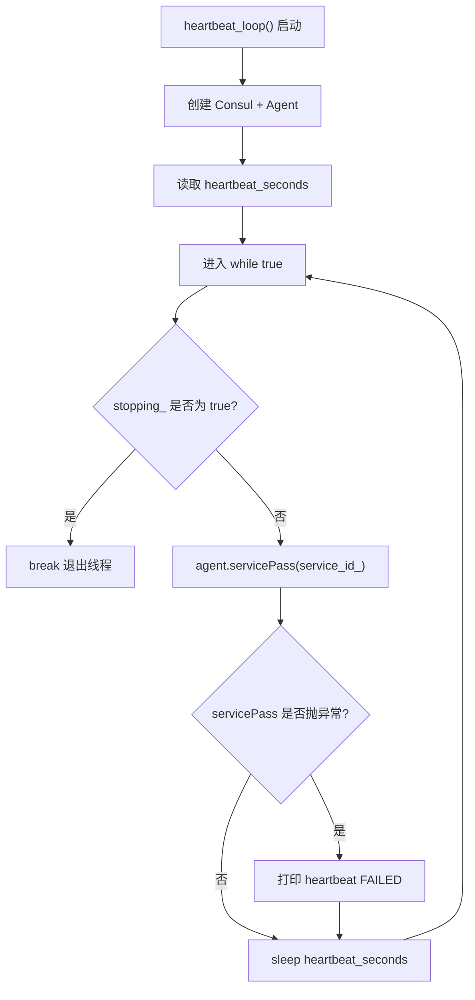
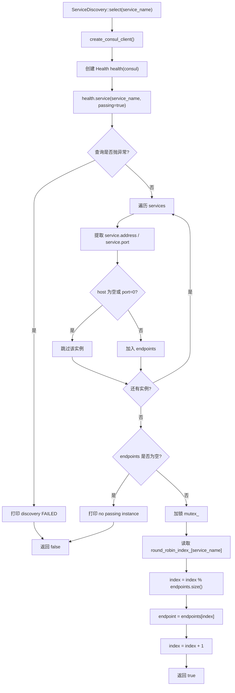
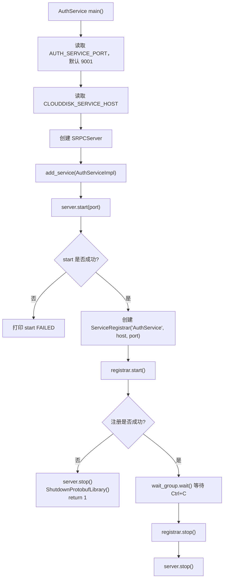
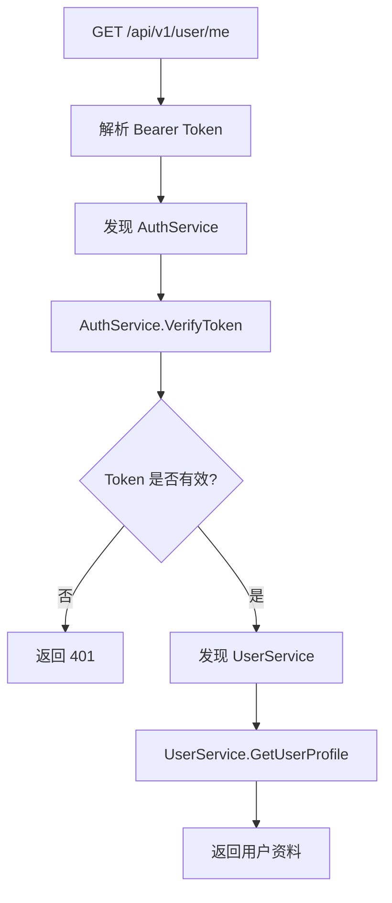
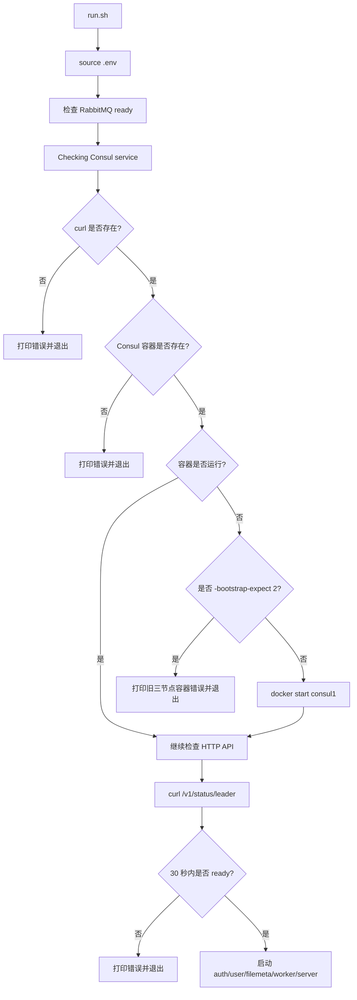

# CloudDisk 第五期：Consul 注册中心代码详解

本文档专门解释当前 `CloudDisk` 第五期项目中的 Consul 相关代码。

对应代码位置：

```text
src/common/ServiceRegistry.h
src/common/ServiceRegistry.cc
src/services/AuthServiceMain.cc
src/services/UserServiceMain.cc
src/services/FileMetaServiceMain.cc
src/gateway/CloudDiskServer.h
src/gateway/CloudDiskServer.cc
run.sh
.env
CMakeLists.txt
```

本文档重点回答：

```text
1. 当前代码为什么没有完全照抄 PDF 中 ppconsul demo 的写法。
2. 每个 Consul 相关函数做什么。
3. 服务启动、注册、心跳、注销、服务发现的完整流程。
4. 每个关键流程分支会走向哪里。
5. API Gateway 如何从 Consul 找到后端 srpc 服务。
```

---

## 一、PDF Demo 和当前项目代码的关系

PDF 示例文件：

```text
08_CloudDisk/05_Consul/ppconsul_demo01.cc
08_CloudDisk/05_Consul/ppconsul_demo02.cc
```

PDF demo 的核心作用是演示 ppconsul 的基础 API：

```cpp
Consul consul("http://127.0.0.1:8500", ppconsul::kw::dc = "dc1");
Agent agent(consul);

agent.registerService(
    kw::id = "my-service-1",
    kw::name = "my-service",
    kw::address = "127.0.0.1",
    kw::port = 8888,
    kw::check = TtlCheck { std::chrono::seconds(10) });

agent.servicePass("my-service-1");
```

也就是说，PDF demo 只演示三件事：

```text
1. 连接 Consul。
2. 注册一个服务实例。
3. 定时发送 TTL 心跳。
```

但 CloudDisk 第五期不是单文件 demo，而是一个已有微服务项目。当前项目需要额外处理：

```text
1. AuthService/UserService/FileMetaService 三个服务都要注册。
2. API Gateway 要按服务名发现后端服务。
3. 同一个服务可能有多个实例。
4. 退出时要主动注销服务实例。
5. Consul 地址、dc、TTL、心跳间隔要从 .env 读取。
6. 业务代码不应该到处散落 ppconsul 细节。
```

所以当前项目没有在三个 `Main.cc` 中反复复制 PDF demo，而是把 Consul 能力封装成：

```text
ServiceRegistrar   服务注册、TTL 心跳、注销
ServiceDiscovery   服务发现、健康实例筛选、简单轮询
```

这两个类放在：

```text
src/common/ServiceRegistry.h
src/common/ServiceRegistry.cc
```

这样三个服务入口和 API Gateway 都能复用。

---

## 二、整体调用关系



当前第五期的原则是：

```text
1. 微服务必须注册到 Consul。
2. API Gateway 必须从 Consul 发现服务。
3. 没有退回固定地址的逻辑。
```

如果 Consul 不可用：

```text
1. run.sh 在启动阶段会失败。
2. 微服务启动时注册失败会退出。
3. 网关运行中发现失败会返回 500。
```

---

## 三、ServiceRegistry.h 结构说明

### 1. ServiceEndpoint

位置：

```text
src/common/ServiceRegistry.h
```

代码：

```cpp
struct ServiceEndpoint {
    std::string host;
    unsigned short port;
};
```

作用：

```text
ServiceEndpoint 表示一个可以被 srpc client 连接的服务实例地址。
```

它只保存两个字段：

```text
host  服务实例 IP 或域名
port  服务实例 srpc 监听端口
```

为什么需要这个结构：

```text
Consul 返回的信息很多，包括节点、服务、健康检查等。
但 API Gateway 创建 srpc client 只需要 host 和 port。
所以把 Consul 返回值转换成 ServiceEndpoint，可以让网关代码更简单。
```

示例：

```text
AuthService -> 127.0.0.1:9001
UserService -> 127.0.0.1:9002
FileMetaService -> 127.0.0.1:9003
```

### 2. ServiceRegistrar

位置：

```text
src/common/ServiceRegistry.h
```

职责：

```text
1. 注册服务实例到 Consul。
2. 启动后台心跳线程。
3. 停止心跳线程。
4. 退出时注销服务实例。
```

被谁使用：

```text
AuthServiceMain.cc
UserServiceMain.cc
FileMetaServiceMain.cc
```

构造函数：

```cpp
ServiceRegistrar(const std::string& service_name,
                 const std::string& host,
                 unsigned short port);
```

参数含义：

```text
service_name  注册到 Consul 的服务名，例如 AuthService
host          服务暴露给 API Gateway 的地址
port          srpc server 监听端口
```

公开函数：

```cpp
bool start();
void stop();
```

`start()`：

```text
注册服务，并启动心跳线程。
```

`stop()`：

```text
停止心跳线程，并注销 Consul 服务实例。
```

私有函数：

```cpp
void heartbeat_loop();
```

它是后台线程的入口函数，循环调用：

```cpp
agent.servicePass(service_id_);
```

### 3. ServiceDiscovery

位置：

```text
src/common/ServiceRegistry.h
```

职责：

```text
1. 按服务名查询 Consul 中 passing 状态的健康实例。
2. 如果有多个健康实例，做简单 round-robin。
3. 返回选中的 host/port。
```

被谁使用：

```text
API Gateway，也就是 src/gateway/CloudDiskServer.cc
```

公开函数：

```cpp
bool select(const std::string& service_name,
            ServiceEndpoint& endpoint);
```

参数：

```text
service_name  要发现的服务名，例如 AuthService
endpoint      输出参数，成功时保存 host/port
```

返回值：

```text
true   找到了可用实例
false  Consul 查询失败，或没有 passing 实例
```

内部成员：

```cpp
std::unordered_map<std::string, std::size_t> round_robin_index_;
std::mutex mutex_;
```

`round_robin_index_` 的作用：

```text
保存每个服务下一次要选择的实例下标。
例如 AuthService 有 2 个实例：
第 1 次选 0
第 2 次选 1
第 3 次选 0
```

`mutex_` 的作用：

```text
API Gateway 可能同时处理多个 HTTP 请求。
多个请求同时修改 round_robin_index_ 时需要加锁。
```

---

## 四、ServiceRegistry.cc 辅助函数详解

### 1. namespace 别名

代码：

```cpp
namespace consul_agent = ppconsul::agent;
namespace consul_health = ppconsul::health;
```

作用：

```text
给 ppconsul 命名空间起短名字。
```

不用别名时，代码会写成：

```cpp
ppconsul::agent::Agent
ppconsul::health::Health
ppconsul::health::kw::passing
```

使用别名后：

```cpp
consul_agent::Agent
consul_health::Health
consul_health::kw::passing
```

这只是为了代码更短，没有改变逻辑。

### 2. get_env_or_default()

代码：

```cpp
static string get_env_or_default(const char* name, const string& default_value)
{
    const char* value = getenv(name);

    if (value == nullptr || string(value).empty()) {
        return default_value;
    }

    return string(value);
}
```

作用：

```text
读取字符串环境变量。
如果环境变量不存在或为空，就返回默认值。
```

流程图：



使用场景：

```text
CONSUL_HTTP_ADDR
CONSUL_DC
CLOUDDISK_SERVICE_HOST
```

为什么不直接写死：

```text
1. 本机开发可以用默认值。
2. 换机器或换 Consul 地址时，只改 .env。
3. 代码不用重新编译。
```

### 3. get_env_int()

代码：

```cpp
static int get_env_int(const char* name, int default_value)
{
    const char* value = getenv(name);

    if (value == nullptr || string(value).empty()) {
        return default_value;
    }

    char* end = nullptr;
    long number = strtol(value, &end, 10);

    if (*end != '\0' || number <= 0) {
        return default_value;
    }

    return static_cast<int>(number);
}
```

作用：

```text
读取正整数环境变量。
如果没有配置、配置为空、配置不是纯数字、配置小于等于 0，就返回默认值。
```

流程图：



使用场景：

```text
CONSUL_TTL_SECONDS
CONSUL_HEARTBEAT_SECONDS
```

示例：

```text
CONSUL_TTL_SECONDS=10      -> 返回 10
CONSUL_TTL_SECONDS=abc     -> 返回默认值 10
CONSUL_TTL_SECONDS=-1      -> 返回默认值 10
CONSUL_TTL_SECONDS=        -> 返回默认值 10
```

### 4. consul_http_addr()

代码：

```cpp
static string consul_http_addr()
{
    return get_env_or_default("CONSUL_HTTP_ADDR", "http://127.0.0.1:8500");
}
```

作用：

```text
读取 Consul HTTP API 地址。
```

默认值：

```text
http://127.0.0.1:8500
```

对应 `.env`：

```env
CONSUL_HTTP_ADDR=http://127.0.0.1:8500
```

这个地址供 ppconsul 使用。ppconsul 本质上是通过 Consul HTTP API 操作注册中心。

### 5. consul_dc()

代码：

```cpp
static string consul_dc()
{
    return get_env_or_default("CONSUL_DC", "dc1");
}
```

作用：

```text
读取 Consul 数据中心名称。
```

默认值：

```text
dc1
```

PDF 示例中也使用：

```cpp
ppconsul::kw::dc = "dc1"
```

### 6. consul_ttl_seconds()

代码：

```cpp
static int consul_ttl_seconds()
{
    return get_env_int("CONSUL_TTL_SECONDS", 10);
}
```

作用：

```text
读取 TTL 健康检查超时时间。
```

默认：

```text
10 秒
```

含义：

```text
如果服务超过 10 秒没有向 Consul 发送 servicePass，
Consul 会把这个实例标记为 critical。
```

### 7. consul_heartbeat_seconds()

代码：

```cpp
static int consul_heartbeat_seconds()
{
    return get_env_int("CONSUL_HEARTBEAT_SECONDS", 5);
}
```

作用：

```text
读取心跳发送间隔。
```

默认：

```text
5 秒
```

为什么默认 5 秒：

```text
TTL 默认 10 秒，心跳间隔必须小于 TTL。
5 秒发一次心跳，可以保证正常运行时不会超时。
```

### 8. create_consul_client()

代码：

```cpp
static ppconsul::Consul create_consul_client()
{
    return ppconsul::Consul(consul_http_addr(), ppconsul::kw::dc = consul_dc());
}
```

作用：

```text
创建 ppconsul 的 Consul 客户端。
```

它等价于 PDF 示例中的：

```cpp
Consul consul("http://127.0.0.1:8500", ppconsul::kw::dc = "dc1");
```

只是当前代码把地址和 dc 从环境变量读取。

为什么封装成函数：

```text
1. 注册服务时要创建 Consul client。
2. 心跳线程里也要创建 Consul client。
3. 服务发现时也要创建 Consul client。
4. 封装后避免重复写 consul_http_addr() 和 consul_dc()。
```

### 9. make_service_id()

代码：

```cpp
static string make_service_id(const string& service_name,
                              const string& host,
                              unsigned short port)
{
    return service_name + "-" + host + "-" + to_string(port);
}
```

作用：

```text
生成 Consul 中的服务实例 ID。
```

Consul 中有两个概念：

```text
service name  服务名，可以重复
service id    实例 ID，必须唯一
```

例如启动两个 AuthService：

```text
AuthService :9001
AuthService :9011
```

它们服务名都叫：

```text
AuthService
```

但实例 ID 应该不同：

```text
AuthService-127.0.0.1-9001
AuthService-127.0.0.1-9011
```

这样 API Gateway 查询 `AuthService` 时可以拿到多个实例；Consul 内部又能区分每个实例。

### 10. get_service_registry_host()

代码：

```cpp
string get_service_registry_host()
{
    return get_env_or_default("CLOUDDISK_SERVICE_HOST", "127.0.0.1");
}
```

作用：

```text
读取服务注册到 Consul 时暴露给 API Gateway 的地址。
```

对应 `.env`：

```env
CLOUDDISK_SERVICE_HOST=127.0.0.1
```

为什么要有这个配置：

```text
Consul 里保存的 address 是消费者要连接的地址。
如果所有进程都在同一台机器上，127.0.0.1 可以用。
如果 API Gateway 和微服务分布在不同机器上，不能注册 127.0.0.1，
必须注册 API Gateway 能访问到的内网 IP。
```

---

## 五、ServiceRegistrar 详解

### 1. 构造函数

代码：

```cpp
ServiceRegistrar::ServiceRegistrar(const string& service_name,
                                   const string& host,
                                   unsigned short port)
    : service_name_(service_name)
    , service_id_(make_service_id(service_name, host, port))
    , host_(host)
    , port_(port)
    , registered_(false)
    , stopping_(false)
{}
```

作用：

```text
保存服务注册需要的基本信息。
```

字段含义：

```text
service_name_  服务名，例如 AuthService
service_id_    实例 ID，例如 AuthService-127.0.0.1-9001
host_          注册到 Consul 的 address
port_          注册到 Consul 的 port
registered_    是否已经成功注册
stopping_      心跳线程是否应该退出
```

构造函数只保存数据，不连接 Consul。

真正连接 Consul 和注册服务是在：

```cpp
start()
```

### 2. 析构函数

代码：

```cpp
ServiceRegistrar::~ServiceRegistrar()
{
    stop();
}
```

作用：

```text
兜底停止心跳并注销服务。
```

为什么析构函数里还要调用 `stop()`：

```text
main() 中虽然会显式 registrar.stop()，
但如果以后有人忘记调用 stop()，析构函数仍然会尽量清理。
```

`stop()` 内部是安全的：

```text
1. 没有启动心跳线程时，不会 join。
2. 没有注册成功时，不会注销。
3. 重复调用 stop() 不会重复注销。
```

### 3. start()

代码核心：

```cpp
bool ServiceRegistrar::start()
{
    try {
        ppconsul::Consul consul = create_consul_client();
        consul_agent::Agent agent(consul);

        agent.registerService(
            consul_agent::kw::id = service_id_,
            consul_agent::kw::name = service_name_,
            consul_agent::kw::address = host_,
            consul_agent::kw::port = port_,
            consul_agent::kw::tags = ppconsul::Tags { "srpc", "cloud-disk" },
            consul_agent::kw::check = consul_agent::TtlCheck { chrono::seconds(consul_ttl_seconds()) });

        {
            lock_guard<mutex> lock(mutex_);
            registered_ = true;
            stopping_ = false;
        }

        heartbeat_thread_ = thread(&ServiceRegistrar::heartbeat_loop, this);
        return true;
    } catch (const exception& ex) {
        cerr << "[Consul] register FAILED ...";
        return false;
    }
}
```

完整流程：



`registerService()` 参数解释：

```cpp
consul_agent::kw::id = service_id_
```

实例 ID，必须唯一。

```cpp
consul_agent::kw::name = service_name_
```

服务名，API Gateway 发现服务时用这个名字。

```cpp
consul_agent::kw::address = host_
```

消费者连接服务时使用的地址。

```cpp
consul_agent::kw::port = port_
```

消费者连接服务时使用的端口。

```cpp
consul_agent::kw::tags = ppconsul::Tags { "srpc", "cloud-disk" }
```

标签。当前项目不依赖标签做筛选，只用于 Consul UI 中辅助识别。

```cpp
consul_agent::kw::check = consul_agent::TtlCheck { chrono::seconds(consul_ttl_seconds()) }
```

注册 TTL 健康检查。

分支说明：

```text
注册成功：
  1. registered_ = true
  2. 启动心跳线程
  3. 返回 true
  4. 微服务继续运行

注册失败：
  1. 捕获异常
  2. 打印 register FAILED
  3. 返回 false
  4. 微服务 main() 停止 srpc server 并退出
```

### 4. stop()

代码核心：

```cpp
void ServiceRegistrar::stop()
{
    {
        lock_guard<mutex> lock(mutex_);
        stopping_ = true;
    }

    if (heartbeat_thread_.joinable()) {
        heartbeat_thread_.join();
    }

    bool need_deregister = false;
    {
        lock_guard<mutex> lock(mutex_);
        need_deregister = registered_;
        registered_ = false;
    }

    if (!need_deregister) {
        return;
    }

    try {
        ppconsul::Consul consul = create_consul_client();
        consul_agent::Agent agent(consul);
        agent.deregisterService(service_id_);
    } catch (const exception& ex) {
        cerr << "[Consul] deregister FAILED ...";
    }
}
```

流程图：



为什么先停心跳再注销：

```text
如果先注销服务，再让心跳线程继续 servicePass，
心跳线程可能会对一个已经注销的实例继续发送心跳。
所以先 stopping_=true，再 join 线程，最后注销。
```

为什么要判断 `registered_`：

```text
如果 start() 注册失败，registered_ 仍然是 false。
这时 stop() 不应该调用 deregisterService。
```

注销失败如何处理：

```text
注销失败只打印日志，不阻止进程退出。
即使没有成功注销，TTL 心跳停止后，Consul 也会把实例标记为 critical。
```

### 5. heartbeat_loop()

代码核心：

```cpp
void ServiceRegistrar::heartbeat_loop()
{
    ppconsul::Consul consul = create_consul_client();
    consul_agent::Agent agent(consul);
    const int heartbeat_seconds = consul_heartbeat_seconds();

    while (true) {
        {
            lock_guard<mutex> lock(mutex_);
            if (stopping_) {
                break;
            }
        }

        try {
            agent.servicePass(service_id_);
        } catch (const exception& ex) {
            cerr << "[Consul] heartbeat FAILED ...";
        }

        this_thread::sleep_for(chrono::seconds(heartbeat_seconds));
    }
}
```

作用：

```text
后台循环向 Consul 发送 TTL 心跳。
```

流程图：



为什么心跳线程里重新创建 Consul client：

```text
start() 中的 Consul 和 Agent 是局部变量。
start() 返回后，它们就销毁了。
心跳线程需要长期运行，所以在线程内部创建自己的 Consul 和 Agent。
```

为什么心跳失败不退出服务：

```text
心跳失败可能是 Consul 短暂不可用。
当前学习项目里只打印日志，不做复杂重连状态机。
下一轮循环还会继续尝试 servicePass。
```

---

## 六、ServiceDiscovery::select() 详解

代码核心：

```cpp
bool ServiceDiscovery::select(const string& service_name,
                              ServiceEndpoint& endpoint)
{
    try {
        ppconsul::Consul consul = create_consul_client();
        consul_health::Health health(consul);

        vector<consul_health::NodeServiceChecks> services =
            health.service(service_name, consul_health::kw::passing = true);

        vector<ServiceEndpoint> endpoints;

        for (const auto& item : services) {
            const ppconsul::ServiceInfo& service = get<1>(item);
            string host = service.address;

            if (host.empty() || service.port == 0) {
                continue;
            }

            endpoints.push_back(ServiceEndpoint { host, service.port });
        }

        if (!endpoints.empty()) {
            lock_guard<mutex> lock(mutex_);
            size_t& index = round_robin_index_[service_name];
            index = index % endpoints.size();
            endpoint = endpoints[index];
            index = (index + 1) % endpoints.size();
            return true;
        }

        cerr << "[Consul] no passing instance ...";
    } catch (const exception& ex) {
        cerr << "[Consul] discovery FAILED ...";
    }

    return false;
}
```

### 1. 创建 Health 客户端

```cpp
ppconsul::Consul consul = create_consul_client();
consul_health::Health health(consul);
```

作用：

```text
Health API 用于查询服务健康状态。
```

这里没有使用 `Catalog` API，因为：

```text
Catalog API 查询的是注册过的服务实例。
它不保证实例当前健康。

Health API 可以加 passing=true，
只返回健康检查通过的实例。
```

### 2. 查询 passing 实例

```cpp
health.service(service_name, consul_health::kw::passing = true);
```

含义：

```text
查询指定服务名下所有健康实例。
```

例如：

```text
service_name = "AuthService"
```

等价于向 Consul 查询：

```text
/v1/health/service/AuthService?passing=true
```

### 3. 提取 host/port

Consul 返回的数据类型是：

```cpp
vector<consul_health::NodeServiceChecks>
```

`NodeServiceChecks` 本质上是一个 tuple：

```text
tuple<Node, ServiceInfo, vector<CheckInfo>>
```

当前项目只需要：

```cpp
const ppconsul::ServiceInfo& service = get<1>(item);
```

然后读取：

```text
service.address
service.port
```

如果 `host.empty()` 或 `port == 0`：

```text
说明这个实例没有可连接地址，跳过。
```

### 4. round-robin 选择实例

如果有多个健康实例：

```cpp
size_t& index = round_robin_index_[service_name];
index = index % endpoints.size();
endpoint = endpoints[index];
index = (index + 1) % endpoints.size();
```

示例：

```text
AuthService 健康实例：
0 -> 127.0.0.1:9001
1 -> 127.0.0.1:9011
2 -> 127.0.0.1:9021
```

选择顺序：

```text
第 1 次 select("AuthService") -> 9001
第 2 次 select("AuthService") -> 9011
第 3 次 select("AuthService") -> 9021
第 4 次 select("AuthService") -> 9001
```

为什么需要 `mutex_`：

```text
API Gateway 可能并发处理多个 HTTP 请求。
多个线程可能同时修改 round_robin_index_。
所以选择实例时用 lock_guard<mutex> 加锁。
```

### 5. select() 全部分支



### 6. API Gateway 如何处理 false

如果 `select()` 返回 false，网关会直接返回：

```cpp
response_error(resp, HttpStatusInternalServerError, "内部服务器错误");
```

也就是说：

```text
发现不到服务，不会退回固定地址。
```

---

## 七、三个微服务如何接入 ServiceRegistrar

三个服务入口的接入方式基本一致。

以 AuthService 为例：

```cpp
unsigned short port = get_env_port("AUTH_SERVICE_PORT", 9001);
string service_host = get_service_registry_host();

srpc::SRPCServer server;
AuthServiceImpl service;
server.add_service(&service);

if (server.start(port) == 0) {
    ServiceRegistrar registrar("AuthService", service_host, port);

    if (!registrar.start()) {
        server.stop();
        google::protobuf::ShutdownProtobufLibrary();
        return 1;
    }

    wait_group.wait();
    registrar.stop();
    server.stop();
}
```

### 1. 为什么先 server.start，再 registrar.start

顺序是：

```text
1. server.start(port)
2. registrar.start()
```

原因：

```text
必须先确保 srpc 服务已经监听端口，再把它注册到 Consul。
否则 API Gateway 可能发现一个还没真正监听的实例。
```

### 2. AuthService 注册流程



### 3. UserService 注册流程

差异只有服务名和默认端口：

```text
服务名：UserService
端口环境变量：USER_SERVICE_PORT
默认端口：9002
```

### 4. FileMetaService 注册流程

差异只有服务名和默认端口：

```text
服务名：FileMetaService
端口环境变量：FILEMETA_SERVICE_PORT
默认端口：9003
```

### 5. 服务退出流程

当你按 Ctrl+C：

```text
1. signal handler 调用 wait_group.done()。
2. wait_group.wait() 返回。
3. registrar.stop() 停止心跳并注销服务。
4. server.stop() 停止 srpc server。
5. 进程退出。
```

---

## 八、API Gateway 如何接入 ServiceDiscovery

API Gateway 中有一个成员：

```cpp
ServiceDiscovery discovery_;
```

每次调用后端服务前，都会执行：

```cpp
ServiceEndpoint endpoint;
if (!discovery_.select("AuthService", endpoint)) {
    response_error(resp, HttpStatusInternalServerError, "内部服务器错误");
    return;
}

auto auth_client = make_shared<pb::AuthService::SRPCClient>(
    endpoint.host.c_str(),
    endpoint.port);
```

### 1. 为什么用 shared_ptr 保存 client

srpc 调用是异步的：

```text
1. 当前 HTTP 回调函数很快返回。
2. srpc task 后续才真正执行。
3. RPC 回调执行时需要 client 的连接参数仍然有效。
```

所以代码里用：

```cpp
auto auth_client = make_shared<pb::AuthService::SRPCClient>(...);

srpc::SRPCClientTask* task = auth_client->create_Login_task(
    [auth_client, resp](...) {
        ...
    });
```

lambda 捕获 `auth_client`，保证回调执行前 client 不会析构。

### 2. 注册接口

流程：

```text
POST /api/v1/auth/register
  -> 解析 JSON
  -> discovery_.select("AuthService")
  -> 创建 AuthService::SRPCClient
  -> create_Register_task
  -> resp->add_task(task)
```

如果发现失败：

```text
直接返回 HTTP 500
```

### 3. 登录接口

流程：

```text
POST /api/v1/auth/login
  -> 解析 JSON
  -> discovery_.select("AuthService")
  -> 创建 AuthService::SRPCClient
  -> create_Login_task
  -> resp->add_task(task)
```

### 4. verify_token_async

需要登录态的接口都会先校验 token。

流程：

```text
解析 Authorization: Bearer <token>
  -> verify_token_async
  -> discovery.select("AuthService")
  -> AuthService.VerifyToken
  -> token 有效后执行 next(identity)
```

### 5. /api/v1/user/me

这个接口会调用两个服务：

```text
1. AuthService.VerifyToken
2. UserService.GetUserProfile
```

流程图：



### 6. /api/v1/files GET

查询文件列表会调用：

```text
1. AuthService.VerifyToken
2. FileMetaService.ListFiles
```

### 7. /api/v1/files POST

上传文件会调用：

```text
1. AuthService.VerifyToken
2. FileMetaService.CreateFile
```

并额外执行：

```text
1. 保存临时文件。
2. 发布 RabbitMQ 上传任务。
```

### 8. /api/v1/file/{id}

下载文件会调用：

```text
1. AuthService.VerifyToken
2. FileMetaService.GetFileForDownload
```

然后由 API Gateway 自己调用 OSS 下载文件内容。

---

## 九、run.sh 中的 Consul 流程

`run.sh` 中和 Consul 相关的流程：

```text
1. 读取 .env。
2. 得到 CONSUL_CONTAINER，默认 consul1。
3. 检查 curl 是否存在。
4. 检查 Consul 容器是否存在。
5. 如果容器存在但没运行，尝试启动。
6. 如果发现容器是 -bootstrap-expect 2 的旧三节点容器，直接退出。
7. 等待 Consul HTTP API ready。
8. Consul ready 后才启动业务进程。
```

流程图：



为什么检查 `-bootstrap-expect 2`：

```text
PDF 三节点示例中 consul1 使用 -bootstrap-expect 2。
如果只启动这个旧 consul1，它不会作为单节点注册中心正常工作。
当前 run.sh 只负责单节点 Consul，所以发现旧三节点容器时直接退出并提示重建。
```

---

## 十、.env 中 Consul 配置

当前 `.env`：

```env
CONSUL_HTTP_ADDR=http://127.0.0.1:8500
CONSUL_DC=dc1
CONSUL_CONTAINER=consul1
CLOUDDISK_SERVICE_HOST=127.0.0.1
CONSUL_TTL_SECONDS=10
CONSUL_HEARTBEAT_SECONDS=5
```

含义：

```text
CONSUL_HTTP_ADDR
  ppconsul 访问 Consul HTTP API 的地址。

CONSUL_DC
  Consul 数据中心名称。

CONSUL_CONTAINER
  run.sh 检查和启动的 Docker 容器名。

CLOUDDISK_SERVICE_HOST
  微服务注册到 Consul 时写入的 address。

CONSUL_TTL_SECONDS
  TTL 健康检查超时时间。

CONSUL_HEARTBEAT_SECONDS
  servicePass 心跳发送间隔。
```

重要约束：

```text
CONSUL_HEARTBEAT_SECONDS 必须小于 CONSUL_TTL_SECONDS。
```

否则服务可能还没来得及发送下一次心跳，就被 Consul 标记为 critical。

---

## 十一、当前实现相比 PDF Demo 的优势

### 1. 注册逻辑复用

PDF demo 是一个服务写一次注册逻辑。

当前代码是：

```text
AuthService/UserService/FileMetaService 共用 ServiceRegistrar。
```

好处：

```text
1. 少重复代码。
2. 修改 TTL、注册方式、注销逻辑时只改一个文件。
3. 三个服务行为一致。
```

### 2. 生命周期更完整

PDF demo 重点是注册和心跳。

当前代码还补上了：

```text
1. 注册失败返回 false。
2. 服务退出时停止心跳线程。
3. 服务退出时 deregisterService。
4. 析构函数兜底 stop。
```

### 3. 支持服务发现

PDF demo 没有 API Gateway 服务发现逻辑。

当前代码提供：

```text
ServiceDiscovery::select()
```

它能：

```text
1. 查 passing 实例。
2. 过滤无效 host/port。
3. 多实例 round-robin。
4. 查询失败时返回 false。
```

### 4. 更适合 srpc 微服务项目

当前 CloudDisk 后端是 srpc，不是 PDF demo 中的简单 HttpServer。

当前实现把 Consul 与 srpc 的结合点控制在两个地方：

```text
1. srpc 服务启动成功后注册。
2. API Gateway 创建 srpc client 前发现 endpoint。
```

业务 RPC 方法本身不需要知道 Consul。

### 5. 配置从 .env 来

PDF demo 中地址写死：

```cpp
Consul consul("http://127.0.0.1:8500", ppconsul::kw::dc = "dc1");
```

当前代码从 `.env` 来：

```text
CONSUL_HTTP_ADDR
CONSUL_DC
CLOUDDISK_SERVICE_HOST
CONSUL_TTL_SECONDS
CONSUL_HEARTBEAT_SECONDS
```

这样换环境时不用改代码。

---

## 十二、学习时建议按这个顺序理解

建议你按下面顺序读代码：

```text
1. 先读 ServiceEndpoint，理解最终只需要 host/port。
2. 再读 get_env_or_default 和 get_env_int，理解配置读取。
3. 再读 create_consul_client，理解 Consul client 从哪里来。
4. 再读 ServiceRegistrar::start，理解服务注册。
5. 再读 heartbeat_loop，理解 TTL 心跳。
6. 再读 stop，理解退出注销。
7. 再读 ServiceDiscovery::select，理解网关如何找服务。
8. 最后读三个 ServiceMain.cc 和 CloudDiskServer.cc 中的接入点。
```

最关键的两条主线：

```text
服务提供者：
server.start -> registrar.start -> registerService -> heartbeat_loop -> registrar.stop

服务消费者：
HTTP request -> discovery.select -> health.service(passing=true) -> SRPCClient(host, port)
```

---

## 十三、常见疑问

### 1. 为什么服务注册失败就退出？

因为当前第五期已经删除固定地址回退逻辑。

如果服务注册失败还继续运行，API Gateway 也发现不到它，运行状态会更混乱。

所以当前策略是：

```text
注册失败 = 服务启动失败
```

### 2. 为什么 API Gateway 发现失败返回 500？

因为这表示后端服务不可用，属于服务端内部依赖失败。

当前项目不把 Consul 错误细节返回给前端，只返回：

```text
内部服务器错误
```

具体原因写在服务端日志中。

### 3. 为什么不缓存 Consul 查询结果？

为了让学习项目代码更直观，当前每次需要调用服务时都直接查询 Consul。

优点：

```text
1. 逻辑简单。
2. 服务上下线后，网关更快感知。
3. 方便你观察 Consul 对请求路径的影响。
```

缺点：

```text
每次 RPC 前多一次 Consul 查询。
```

后续可以加短 TTL 缓存，但当前第五期先保持简单。

### 4. 为什么不用 Catalog API？

因为 Catalog API 只能告诉你“注册过哪些实例”，不能保证它们健康。

当前代码使用：

```cpp
health.service(service_name, consul_health::kw::passing = true)
```

它只返回健康实例，更适合真实调用。

### 5. 为什么 OssUploadWorker 不注册？

因为它不提供 RPC 服务，不监听端口。

它是 RabbitMQ 消费者：

```text
RabbitMQ -> OssUploadWorker -> OSS
```

API Gateway 不会通过服务名调用它，所以当前不需要注册。
