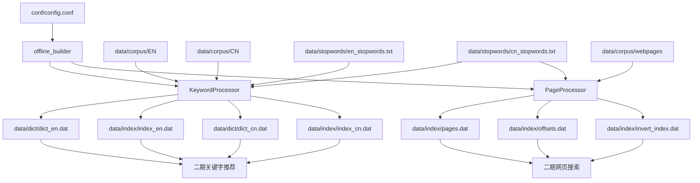
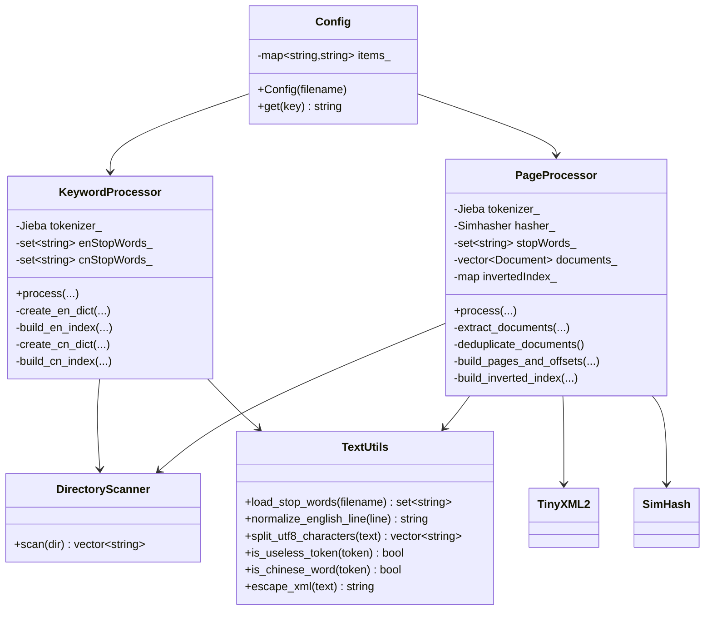
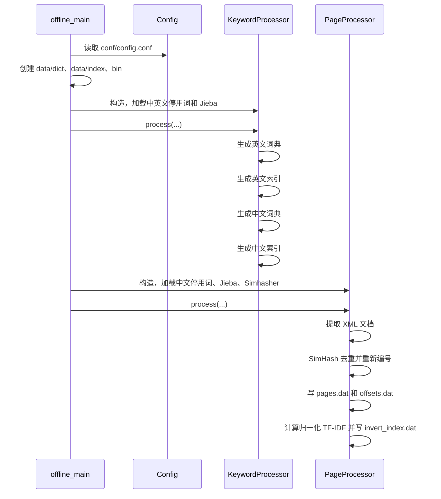
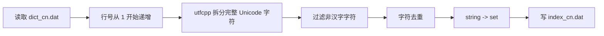
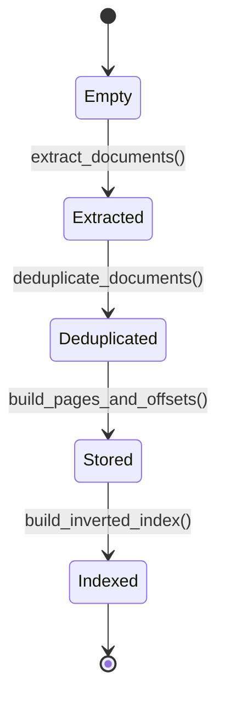
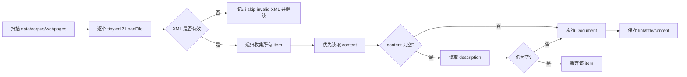
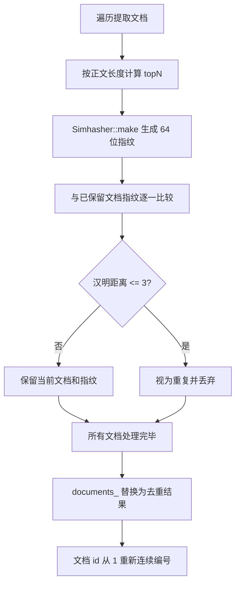
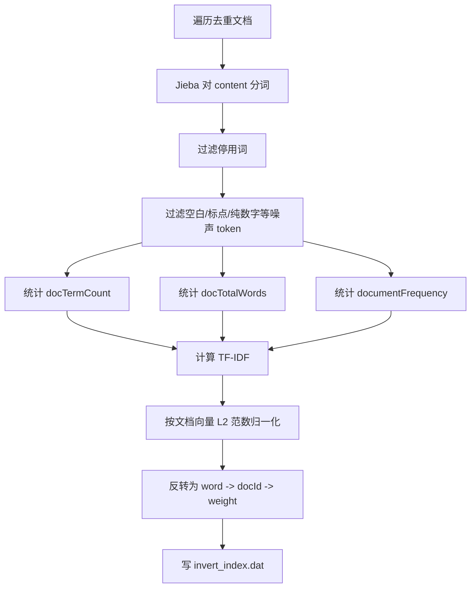

# SearchEngine V1 技术文档

`01_SearchEngine_V1` 是搜索引擎项目第一期的离线建库程序。它不提供网络服务，也不处理用户查询，而是把课程语料预处理成二期在线服务可以直接加载的数据文件。

当前可执行程序只有一个：`offline_builder`。它从 `conf/config.conf` 读取路径配置，依次生成关键字推荐数据和网页搜索数据。

## 1. 项目目标

第一期的输出分为两组：

1. 关键字推荐数据
   - 英文词典：`data/dict/dict_en.dat`
   - 英文字符索引：`data/index/index_en.dat`
   - 中文词典：`data/dict/dict_cn.dat`
   - 中文字符索引：`data/index/index_cn.dat`

2. 网页搜索数据
   - 网页库：`data/index/pages.dat`
   - 网页偏移库：`data/index/offsets.dat`
   - 倒排索引库：`data/index/invert_index.dat`

整体数据流如下：



## 2. 目录结构

```text
01_SearchEngine_V1/
├── CMakeLists.txt
├── README.md
├── bin/                         # CMake 输出的 offline_builder
├── build/                       # CMake 构建目录
├── conf/
│   └── config.conf              # 离线建库路径配置
├── data/
│   ├── corpus/
│   │   ├── CN/                  # 中文关键字推荐语料
│   │   ├── EN/                  # 英文关键字推荐语料
│   │   └── webpages/            # 网页 XML 语料
│   ├── stopwords/
│   │   ├── cn_stopwords.txt
│   │   └── en_stopwords.txt
│   ├── dict/                    # 词典输出目录
│   └── index/                   # 索引、网页库、偏移库输出目录
├── include/
│   ├── common/
│   │   ├── Config.h
│   │   ├── DirectoryScanner.h
│   │   └── TextUtils.h
│   └── offline/
│       ├── KeywordProcessor.h
│       └── PageProcessor.h
└── src/
    ├── common/
    │   ├── Config.cc
    │   ├── DirectoryScanner.cc
    │   └── TextUtils.cc
    └── offline/
        ├── KeywordProcessor.cc
        ├── PageProcessor.cc
        └── offline_main.cc
```

当前实现集中在 `common` 和 `offline` 两个模块中。`common` 提供配置读取、目录扫描和文本工具；`offline` 负责具体离线建库算法。

## 3. 构建与运行

### 3.1 依赖

系统库：

```bash
sudo apt install cmake g++ libtinyxml2-dev
```

第三方头文件库按课程环境安装到 `/usr/local/include`：

```text
/usr/local/include/cppjieba/Jieba.hpp
/usr/local/include/utfcpp/utf8.h
/usr/local/include/simhash/Simhasher.hpp
```

项目使用 C++17。`tinyxml2` 通过 `find_library(TINYXML2_LIB tinyxml2)` 查找并链接，`cppjieba`、`utfcpp`、`simhash` 通过头文件引入。

### 3.2 编译运行

必须从 `01_SearchEngine_V1` 项目根目录运行，因为配置文件中的路径是相对路径。

```bash
cd 课件/07_搜索引擎项目/01_SearchEngine_V1
cmake -S . -B build
cmake --build build
./bin/offline_builder
```

程序入口在 `src/offline/offline_main.cc`。入口会先创建 `data/dict`、`data/index`、`bin`，再按顺序执行：

1. `KeywordProcessor::process()`
2. `PageProcessor::process()`

成功结束时输出：

```text
========== Build Finished ==========
Output directories: data/dict, data/index
```

任何不可恢复错误会抛出 `std::exception`，由 `main()` 统一打印 `[Error] ...` 并返回 `1`。

## 4. 配置文件

配置文件路径固定为 `conf/config.conf`，格式是简单的 `key=value`：

```text
en_corpus_dir=data/corpus/EN
cn_corpus_dir=data/corpus/CN
webpage_corpus_dir=data/corpus/webpages

en_stop_words=data/stopwords/en_stopwords.txt
cn_stop_words=data/stopwords/cn_stopwords.txt

en_dict=data/dict/dict_en.dat
cn_dict=data/dict/dict_cn.dat
en_dict_index=data/index/index_en.dat
cn_dict_index=data/index/index_cn.dat

pages=data/index/pages.dat
offsets=data/index/offsets.dat
invert_index=data/index/invert_index.dat
```

解析规则由 `Config` 实现：

- 支持空行。
- 支持以 `#` 开头的整行注释。
- 支持 `key = value` 两侧空白。
- 不支持行尾注释。
- 使用第一个 `=` 分隔 key 和 value。
- key 或 value 为空会抛异常。
- 同名 key 重复出现时，后面的配置覆盖前面的配置。
- 查询不存在的 key 会抛异常，避免后续模块使用空路径继续运行。

## 5. 模块架构



### 5.1 DirectoryScanner

`DirectoryScanner::scan(dir)` 使用 POSIX 目录流接口实现：

- `opendir()` 打开目录。
- `readdir()` 遍历目录项。
- 跳过 `.` 和 `..`。
- 使用 `stat()` 判断最终目标是否是普通文件。
- 接收普通文件以及指向普通文件的符号链接。
- 忽略子目录、设备文件等非普通文件。
- 返回完整路径。
- 对结果排序，保证同一语料多次建库的处理顺序稳定。
- 不递归扫描子目录。

目录无法打开时抛出 `std::runtime_error`。

### 5.2 TextUtils

`TextUtils` 放置无状态文本工具：

| 函数 | 作用 |
| --- | --- |
| `load_stop_words()` | 按空白读取停用词，放入 `std::set` 去重 |
| `normalize_english_line()` | 英文字母转小写，非字母替换为空格 |
| `split_utf8_characters()` | 使用 utfcpp 按 Unicode 码点拆分 UTF-8 文本 |
| `is_useless_token()` | 判断 token 是否只由空白、标点、ASCII 数字等噪声组成 |
| `is_chinese_word()` | 判断 token 是否非空且每个 Unicode 码点都是汉字 |
| `escape_xml()` | 转义 `&`、`<`、`>`，保护 `pages.dat` 的 XML 风格结构 |

`is_chinese_word()` 是当前中文关键字词典过滤的核心。它接受 CJK 统一表意文字、扩展 A-I、兼容表意文字以及中文数字 `〇`，拒绝英文、数字、标点、圈号数字、罗马数字和中英混合 token。

## 6. 主流程时序



关键依赖顺序不能调整：

- 字符索引必须在词典生成之后构建，因为索引保存的是词典物理行号。
- 网页偏移库和倒排索引必须在去重之后构建，因为二者引用同一批重新编号后的文档 id。

## 7. 关键字推荐离线建库

关键字推荐由 `KeywordProcessor` 负责，输出四个文件：

```text
data/dict/dict_en.dat
data/index/index_en.dat
data/dict/dict_cn.dat
data/index/index_cn.dat
```

### 7.1 英文词典

英文词典生成流程：


实现要点：

- 英文语料逐行读取，不一次性读完整文件。
- `TextUtils::normalize_english_line()` 只保留字母。
- 非字母替换为空格，而不是删除，避免 `hello,world` 变成 `helloworld`。
- 单词统一小写。
- 停用词来自 `data/stopwords/en_stopwords.txt`。
- 词频表使用 `std::map<std::string, int>`，输出按单词字典序稳定排序。

输出格式：

```text
word frequency
```

示例：

```text
aah 1
aaron 355
aaronites 2
```

### 7.2 英文索引

英文索引从 `dict_en.dat` 重新读取词典生成，而不是直接使用内存词频表。这样可以确保索引行号与磁盘词典的真实物理行号一致。


输出格式：

```text
character lineNo1 lineNo2 lineNo3 ...
```

行号从 `1` 开始，不是从 `0` 开始。同一个单词里重复出现的字符只记录一次该单词行号。

### 7.3 中文词典

中文词典生成流程：


实现要点：

- 每个中文文件一次性读入，再交给 Jieba 分词。
- `tokenizer_.Cut(text, words)` 使用 cppjieba 默认 Mix 模式。
- 停用词来自 `data/stopwords/cn_stopwords.txt`。
- 当前版本使用 `TextUtils::is_chinese_word()` 严格过滤中文词典：
  - 保留全部码点都是汉字的 token。
  - 排除英文、数字、标点、特殊符号、圈号数字、罗马数字和中英混合 token。
- 中文词典也使用 `std::map<std::string, int>`，输出顺序稳定。

这个严格过滤只用于关键字推荐的中文词典和中文索引。网页搜索倒排索引没有使用 `is_chinese_word()`，因为网页内容中可能存在有检索价值的英文关键词。

输出格式：

```text
word frequency
```

示例：

```text
一一 1
一万年 1
一下 13
```

### 7.4 中文索引

中文索引从 `dict_cn.dat` 重新读取词典生成。因为中文字符是 UTF-8 多字节编码，所以 key 使用 `std::string`，不能使用 `char`。



输出格式：

```text
character lineNo1 lineNo2 lineNo3 ...
```

注意：

- `character` 是一个完整 UTF-8 汉字。
- 一个词中的相同汉字只为该词记录一次行号。
- 正常情况下 `dict_cn.dat` 已经是纯汉字，构建索引时再次调用 `is_chinese_word(ch)` 是防御性校验。

## 8. 网页搜索离线建库

网页搜索由 `PageProcessor` 负责，输出三个文件：

```text
data/index/pages.dat
data/index/offsets.dat
data/index/invert_index.dat
```

### 8.1 网页处理状态



`PageProcessor` 内部保存 `documents_` 和 `invertedIndex_`。`process()` 会按固定顺序调用四个阶段，不应该跳过中间阶段单独生成某个输出。

### 8.2 XML 文档提取



实现细节：

- XML 使用 `tinyxml2::XMLDocument::LoadFile()` 解析。
- 单个 XML 文件解析失败只打印日志并跳过，不中断其他文件。
- 递归收集所有 `<item>`，不把路径写死为 `rss/channel/item`。
- 正文优先取 `<content>`。
- `<content>` 为空时取 `<description>`。
- 两者都为空时丢弃该 item。
- `<link>` 和 `<title>` 缺失时保留为空字符串，不影响文档进入网页库。
- 提取阶段的 id 只是临时编号，去重后会重新编号。

### 8.3 SimHash 去重



去重规则：

- 指纹长度：64 bit。
- `topN = max(5, min(200, content.size() / 120))`。
- 与此前已经保留的文档比较。
- `simhash::Simhasher::isEqual(hash, oldHash, 3)` 为真时视为重复。
- 保留每组近似重复文档中首次出现的一篇。
- 当前实现是朴素 O(n^2) 比较，适合课程语料规模，便于理解。

### 8.4 网页库与偏移库

去重后生成 `pages.dat` 和 `offsets.dat`。两者必须对应同一批文档 id。

`pages.dat` 使用连续的 XML 风格 `<doc>` 记录：

```xml
<doc>
  <id>1</id>
  <link>...</link>
  <title>...</title>
  <content>...</content>
</doc>
```

写入前会调用 `TextUtils::escape_xml()` 转义 `&`、`<`、`>`，防止正文破坏标签结构。

`offsets.dat` 格式：

```text
docId offset length
```

其中：

- `docId` 是去重后从 `1` 开始的连续编号。
- `offset` 是该 `<doc>` 在 `pages.dat` 中的起始字节偏移。
- `length` 是该 `<doc>` 的字节长度。
- `pages.dat` 以二进制模式写入，避免换行转换影响偏移。

二期可以根据 `offsets.dat` 对 `pages.dat` 执行 `seekg(offset)`，再读取 `length` 字节得到完整网页记录。

### 8.5 倒排索引

倒排索引构建流程：



统计结构：

```text
docTermCount[docId][word] = word 在该文档出现的次数
docTotalWords[docId] = 该文档过滤后的有效 token 总数
documentFrequency[word] = 包含该 word 的文档数量
invertedIndex_[word][docId] = 归一化后的 TF-IDF 权重
```

过滤规则：

- 过滤中文停用词。
- 调用 `TextUtils::is_useless_token()` 过滤空白、标点、ASCII 数字和常见中文标点组成的 token。
- 不强制要求 token 必须是纯汉字，所以当前倒排索引中可能出现英文关键词，例如 `A`、`A00`。这是网页搜索和中文关键字推荐词典的边界差异。

权重公式：

```text
TF  = count(word, doc) / docTotalWords(doc)
IDF = log2(documentCount / (documentFrequency(word) + 1))
w   = TF * IDF
```

对每篇文档的权重向量做 L2 归一化：

```text
norm = sqrt(sum(w_i * w_i))
w'_i = w_i / norm
```

当某篇文档的 `norm == 0.0` 时跳过该文档，避免除以零。

输出格式：

```text
keyword docId weight docId weight ...
```

浮点数使用 `std::fixed << std::setprecision(10)`，固定保留 10 位小数。

## 9. 输出文件格式总表

| 文件 | 生成模块 | 格式 | 说明 |
| --- | --- | --- | --- |
| `data/dict/dict_en.dat` | `create_en_dict()` | `word frequency` | 英文小写单词词频，按字典序输出 |
| `data/index/index_en.dat` | `build_en_index()` | `character lineNo...` | 英文字母到英文词典行号的映射 |
| `data/dict/dict_cn.dat` | `create_cn_dict()` | `word frequency` | 纯汉字中文词语词频，按字典序输出 |
| `data/index/index_cn.dat` | `build_cn_index()` | `character lineNo...` | 单个 UTF-8 汉字到中文词典行号的映射 |
| `data/index/pages.dat` | `build_pages_and_offsets()` | 连续 `<doc>` 记录 | 去重后的网页库 |
| `data/index/offsets.dat` | `build_pages_and_offsets()` | `docId offset length` | `offset` 和 `length` 均按字节计数 |
| `data/index/invert_index.dat` | `build_inverted_index()` | `keyword docId weight ...` | 关键词到文档权重的倒排索引 |

当前仓库中已生成数据的规模参考：

```text
dict_en.dat       34705 行
dict_cn.dat       17040 行
index_en.dat         26 行
index_cn.dat       3086 行
offsets.dat       3827 行
invert_index.dat 96379 行
```

这些数字是当前语料和当前代码生成结果的快照。修改语料、停用词或过滤规则后，应以重新运行 `offline_builder` 的日志和实际文件行为准。

## 10. 异常与错误处理

| 场景 | 当前行为 |
| --- | --- |
| `conf/config.conf` 无法打开 | `Config` 抛出 `runtime_error`，程序退出 |
| 配置行缺少 `=` 或 key/value 为空 | `Config` 抛出 `runtime_error`，程序退出 |
| 查询缺失配置项 | `Config::get()` 抛出 `runtime_error`，程序退出 |
| 语料目录无法打开 | `DirectoryScanner::scan()` 抛出 `runtime_error`，程序退出 |
| 停用词文件无法打开 | `TextUtils::load_stop_words()` 抛出 `runtime_error`，程序退出 |
| 中英文关键字语料文件无法打开 | `KeywordProcessor` 抛出 `runtime_error`，程序退出 |
| 输出词典、索引、网页库、偏移库失败 | 对应模块抛出 `runtime_error`，程序退出 |
| 单个网页 XML 文件解析失败 | `PageProcessor` 打印 skip 日志并继续处理其他 XML |
| UTF-8 文本非法或截断 | utfcpp 相关异常自然传播，由 `main()` 捕获 |
| Jieba 或 SimHash 初始化失败 | 第三方库异常自然传播，由 `main()` 捕获 |

## 11. 验收与排查

### 11.1 基本构建检查

```bash
cmake -S . -B build
cmake --build build
./bin/offline_builder
```

确认生成文件：

```bash
ls data/dict data/index
wc -l data/dict/dict_en.dat \
      data/dict/dict_cn.dat \
      data/index/index_en.dat \
      data/index/index_cn.dat \
      data/index/offsets.dat \
      data/index/invert_index.dat
```

### 11.2 关键字推荐数据检查

英文词典应全部小写，并且不应出现数字和标点：

```bash
head data/dict/dict_en.dat
```

中文词典应全部为汉字：

```bash
perl -CSD -ne '($w)=split; if ($w !~ /^\p{Han}+$/) { print "$.:$w\n"; $bad++ } END { print "dict_non_han=".($bad // 0)."\n" }' data/dict/dict_cn.dat
```

中文索引 key 应是单个汉字：

```bash
perl -CSD -ne '($ch)=split; if ($ch !~ /^\p{Han}$/) { print "$.:$ch\n"; $bad++ } END { print "index_non_han_keys=".($bad // 0)."\n" }' data/index/index_cn.dat
```

当前期望结果是：

```text
dict_non_han=0
index_non_han_keys=0
```

### 11.3 网页搜索数据检查

偏移库行数应等于去重后的网页数量：

```bash
wc -l data/index/offsets.dat
```

随机查看偏移记录：

```bash
head data/index/offsets.dat
```

倒排索引第一列是关键词，后面是成对出现的 `docId weight`：

```bash
head data/index/invert_index.dat
```

如果需要验证某条偏移是否能读出完整 `<doc>`，可以编写一个小程序或用脚本按 `offset length` 从 `pages.dat` 中读取指定字节范围。

## 12. 常见问题

### 12.1 为什么中文词典前面不能出现英文和符号？

`dict_cn.dat` 是中文关键字推荐词典，英文候选词已经由 `dict_en.dat` 负责。如果中文词典混入英文、数字、圈号、罗马数字或特殊符号，`index_cn.dat` 也会出现非中文 key，二期中文推荐候选会被污染。

当前代码通过 `TextUtils::is_chinese_word()` 在 `KeywordProcessor::create_cn_dict()` 中严格过滤，只保留纯汉字 token。

### 12.2 为什么倒排索引里仍可能出现英文关键词？

网页搜索面对的是真实网页内容，正文中可能有英文缩写、产品名、编号等关键词。当前倒排索引只过滤停用词和明显无意义 token，不要求关键词必须是纯汉字。

这是有意保留的差异：

- 中文关键字推荐词典：严格纯汉字。
- 网页搜索倒排索引：允许更宽松的关键词。

### 12.3 为什么索引保存行号而不是直接保存词？

关键字推荐阶段的字符索引用于快速缩小候选词范围。二期可以先通过输入字符找到词典行号，再回到词典中取词和词频。这样避免索引文件重复保存大量词语。

行号约定从 `1` 开始，二期加载时必须保持同一约定。

### 12.4 为什么 `offsets.dat` 使用字节偏移？

`pages.dat` 包含大量中文 UTF-8 内容。一个汉字通常占多个字节，字符数不等于文件位置。`seekg()` 需要的是字节偏移，所以 `offset` 和 `length` 都必须按字节记录。

### 12.5 为什么 SimHash 去重后要重新编号？

去重会删除一部分文档。如果沿用提取阶段的临时 id，网页库、偏移库和倒排索引中会出现不连续编号。当前实现去重后重新从 `1` 连续编号，保证三个输出文件引用同一套文档 id。

## 13. 代码阅读路线

建议按以下顺序阅读：

1. `src/offline/offline_main.cc`：理解整个离线建库入口和异常边界。
2. `include/common/Config.h`、`src/common/Config.cc`：理解配置文件解析规则。
3. `include/common/DirectoryScanner.h`、`src/common/DirectoryScanner.cc`：理解语料文件扫描方式。
4. `include/common/TextUtils.h`、`src/common/TextUtils.cc`：理解停用词、英文归一化、UTF-8 拆字、纯汉字判断和 XML 转义。
5. `include/offline/KeywordProcessor.h`、`src/offline/KeywordProcessor.cc`：理解中英文词典和字符索引。
6. `include/offline/PageProcessor.h`、`src/offline/PageProcessor.cc`：理解 XML 提取、SimHash 去重、网页库、偏移库和 TF-IDF 倒排索引。

## 14. 设计边界

当前版本是第一期离线建库程序，故意不包含以下能力：

- 不提供 TCP/HTTP 服务。
- 不实现二期在线关键字推荐排序。
- 不实现二期网页查询、摘要展示或结果排序接口。
- 不递归扫描语料目录。
- 不对 SimHash 去重做分桶优化。
- 不把生成数据导入数据库。

这些能力应在二期或后续优化中实现。第一期的核心标准是：离线数据完整、格式稳定、路径可配置、异常可定位，并且二期可以直接加载生成结果。
