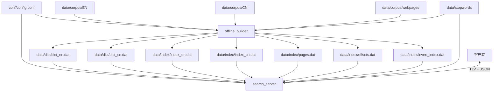
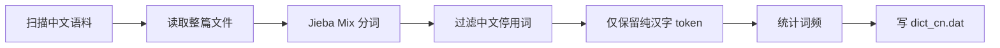
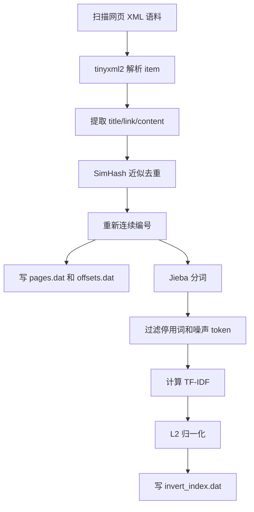
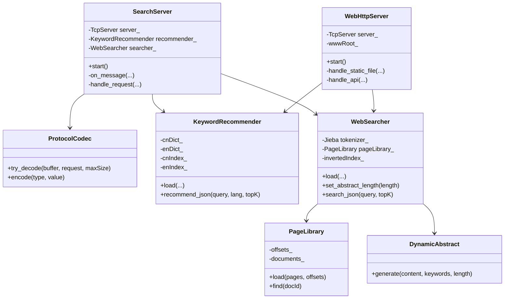
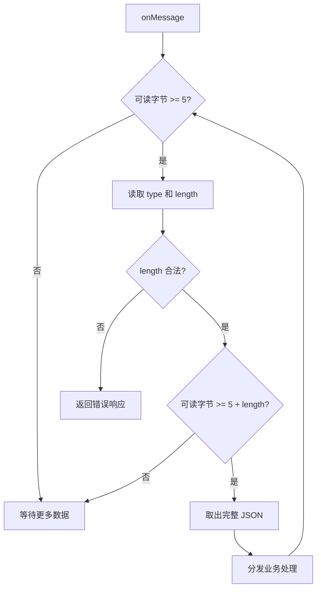
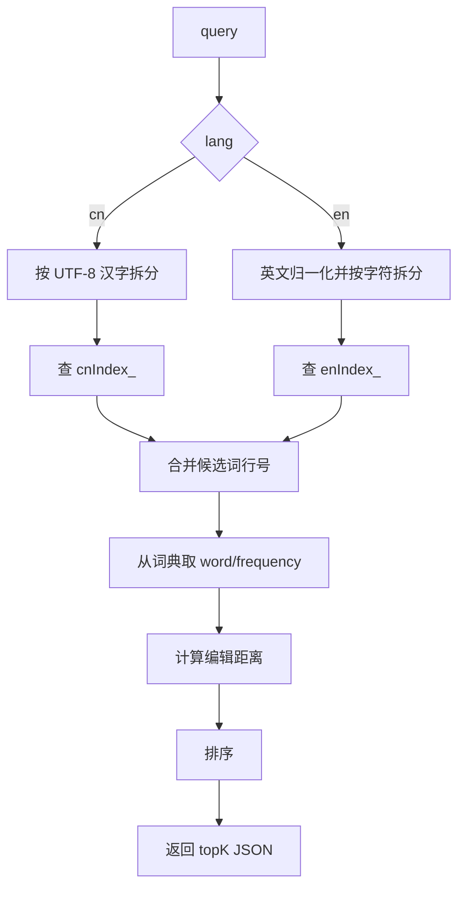
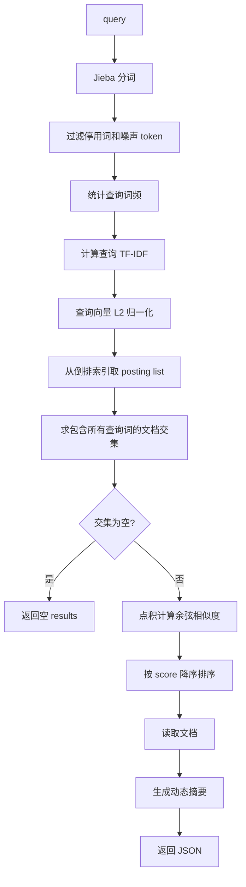
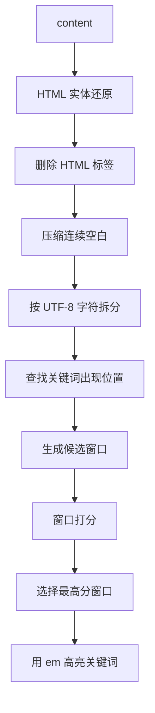

# SearchEngine V2 技术文档

`02_SearchEngine_V2` 是搜索引擎项目第二期实现。当前项目同时包含第一期离线建库程序和第二期在线搜索服务：

1. `offline_builder`：离线建库程序，生成关键字推荐和网页搜索所需的数据文件。
2. `search_server`：基于 `muduo` 的在线 TCP 服务，使用 TLV 协议接收查询并返回 JSON 结果。

第二期不重新扫描原始语料，也不做缓存。服务器启动时加载第一期生成的词典、字符索引、网页库、偏移库和倒排索引；查询阶段只读这些内存数据。

## 1. 项目目标

当前 V2 项目完成了两条完整链路。

离线建库链路：

```text
原始语料 -> offline_builder -> 词典/索引/网页库/倒排索引
```

在线查询链路：

```text
客户端 -> TLV over TCP -> search_server -> 推荐词或网页结果 JSON
```

整体数据流如下：



## 2. 目录结构

```text
02_SearchEngine_V2/
├── CMakeLists.txt
├── README.md
├── bin/
│   ├── offline_builder          # 第一期离线建库程序
│   └── search_server            # 第二期在线服务程序
├── conf/
│   └── config.conf              # 离线路径和在线服务配置
├── data/
│   ├── corpus/                  # 原始语料
│   ├── stopwords/               # 中英文停用词
│   ├── dict/                    # 词典输出目录
│   └── index/                   # 索引、网页库、偏移库输出目录
├── docs/
│   ├── 项目第一期开发思路.md
│   └── 项目第二期开发思路.md
├── include/
│   ├── common/
│   │   ├── Config.h
│   │   ├── DirectoryScanner.h
│   │   └── TextUtils.h
│   ├── offline/
│   │   ├── KeywordProcessor.h
│   │   └── PageProcessor.h
│   └── online/
│       ├── ProtocolCodec.h
│       ├── SearchServer.h
│       ├── KeywordRecommender.h
│       ├── WebSearcher.h
│       ├── PageLibrary.h
│       └── DynamicAbstract.h
└── src/
    ├── common/
    │   ├── Config.cc
    │   ├── DirectoryScanner.cc
    │   └── TextUtils.cc
    ├── offline/
    │   ├── offline_main.cc
    │   ├── KeywordProcessor.cc
    │   └── PageProcessor.cc
    └── online/
        ├── online_main.cc
        ├── ProtocolCodec.cc
        ├── SearchServer.cc
        ├── KeywordRecommender.cc
        ├── WebSearcher.cc
        ├── PageLibrary.cc
        └── DynamicAbstract.cc
```

模块职责：

| 模块 | 作用 |
| --- | --- |
| `common` | 配置读取、目录扫描、UTF-8 和文本处理工具 |
| `offline` | 第一期离线建库，生成二期可加载的数据文件 |
| `online` | 第二期在线 TCP 服务、TLV 协议、推荐和搜索算法 |

## 3. 构建与运行

### 3.1 依赖

项目使用 C++17。当前实现依赖：

```text
cmake
g++
tinyxml2
muduo_net
muduo_base
pthread
cppjieba
utfcpp
simhash
nlohmann/json
```

其中：

1. `tinyxml2` 用于解析网页库 XML 片段。
2. `muduo` 用于第二期 TCP 服务。
3. `cppjieba` 用于中文分词。
4. `utfcpp` 用于 UTF-8 字符拆分和码点判断。
5. `simhash` 用于第一期网页去重。
6. `nlohmann/json` 用于第二期请求和响应 JSON。

### 3.2 编译

必须从项目根目录运行，因为配置文件中的路径都是相对路径。

```bash
cd 课件/07_搜索引擎项目/02_SearchEngine_V2
cmake -S . -B build
cmake --build build
```

构建完成后生成：

```text
bin/offline_builder
bin/search_server
```

### 3.3 运行离线建库

```bash
./bin/offline_builder
```

离线程序入口为 `src/offline/offline_main.cc`，执行顺序为：

1. 读取 `conf/config.conf`。
2. 创建 `data/dict`、`data/index`、`bin`。
3. 调用 `KeywordProcessor::process()` 生成词典和字符索引。
4. 调用 `PageProcessor::process()` 生成网页库、偏移库和倒排索引。

成功结束时输出：

```text
========== Build Finished ==========
Output directories: data/dict, data/index
```

### 3.4 运行在线服务

```bash
./bin/search_server
```

在线程序入口为 `src/online/online_main.cc`，执行顺序为：

1. 读取 `conf/config.conf`。
2. 加载中英文词典和字符索引。
3. 加载网页库、偏移库和倒排索引。
4. 初始化原始 TCP/TLV 服务。
5. 初始化浏览器 HTTP 服务。
6. 同一个进程同时监听两个端口。

默认监听：

```text
0.0.0.0:8888    原始 TCP/TLV 服务
0.0.0.0:18888   浏览器 HTTP 服务
```

启动成功时会输出：

```text
========== SearchEngine V2 Online Server ==========
[Online] TLV listen on 0.0.0.0:8888
[Online] Web listen on http://0.0.0.0:18888
```

浏览器测试页面访问：

```text
http://127.0.0.1:18888
```

## 4. 配置文件

配置文件路径固定为 `conf/config.conf`。格式是简单的 `key=value`。

```text
# Input corpus paths.
en_corpus_dir=data/corpus/EN
cn_corpus_dir=data/corpus/CN
webpage_corpus_dir=data/corpus/webpages

# Stop words .
en_stop_words=data/stopwords/en_stopwords.txt
cn_stop_words=data/stopwords/cn_stopwords.txt

# Keyword suggestion offline data.
en_dict=data/dict/dict_en.dat
cn_dict=data/dict/dict_cn.dat
en_dict_index=data/index/index_en.dat
cn_dict_index=data/index/index_cn.dat

# Web search offline data.
pages=data/index/pages.dat
offsets=data/index/offsets.dat
invert_index=data/index/invert_index.dat

# Online server.
server_ip=0.0.0.0
server_port=8888
http_port=18888
io_threads=4
http_threads=2
max_message_size=1048576
keyword_topk=5
web_topk=10
abstract_length=150
www_root=www
```

`Config` 解析规则：

1. 支持空行。
2. 支持以 `#` 开头的整行注释。
3. 支持 `key = value` 两侧空白。
4. 不支持行尾注释。
5. 使用第一个 `=` 分隔 key 和 value。
6. key 或 value 为空会抛异常。
7. 同名 key 重复出现时，后面的配置覆盖前面的配置。
8. `Config::get()` 查询不存在的 key 会抛异常。

在线服务中，服务器端口、线程数、topK、摘要长度、前端目录等在线配置提供默认值；离线数据路径是必需配置。

## 5. 第一阶段：离线建库

### 5.1 输出文件

离线建库生成两组数据。

关键字推荐数据：

```text
data/dict/dict_en.dat
data/index/index_en.dat
data/dict/dict_cn.dat
data/index/index_cn.dat
```

网页搜索数据：

```text
data/index/pages.dat
data/index/offsets.dat
data/index/invert_index.dat
```

输出文件格式：

| 文件 | 格式 | 说明 |
| --- | --- | --- |
| `dict_en.dat` | `word frequency` | 英文小写单词词频 |
| `index_en.dat` | `character lineNo...` | 英文字母到英文词典行号的映射 |
| `dict_cn.dat` | `word frequency` | 纯汉字中文词语词频 |
| `index_cn.dat` | `character lineNo...` | 单个 UTF-8 汉字到中文词典行号的映射 |
| `pages.dat` | 连续 `<doc>` 记录 | 去重后的网页库 |
| `offsets.dat` | `docId offset length` | 网页库字节偏移 |
| `invert_index.dat` | `word docId weight ...` | 倒排索引，weight 是归一化 TF-IDF |

注意：词典字符索引里的 `lineNo` 从 `1` 开始。第二期加载词典时保留 `dict[0]` 为空记录，使 `lineNo` 可以直接作为数组下标使用。

### 5.2 关键字推荐离线处理

`KeywordProcessor` 负责生成中英文词典和字符索引。

英文词典流程：


英文索引从 `dict_en.dat` 重新读取词典生成，格式为：

```text
character lineNo1 lineNo2 ...
```

中文词典流程：



中文索引使用 `TextUtils::split_utf8_characters()` 按 Unicode 码点拆分词语。索引 key 是一个完整 UTF-8 汉字，不能用 `char`。

### 5.3 网页搜索离线处理

`PageProcessor` 负责生成网页库、偏移库和倒排索引。

处理流程：



网页提取规则：

1. 递归收集 XML 中所有 `<item>`。
2. 正文优先读取 `<content>`。
3. `<content>` 为空时读取 `<description>`。
4. 两者都为空时丢弃该 item。
5. `<title>` 和 `<link>` 缺失时保留为空字符串。

SimHash 去重规则：

```text
topN = max(5, min(200, content.size() / 120))
汉明距离 <= 3 视为重复
```

倒排索引权重：

```text
TF  = count(word, doc) / docTotalWords(doc)
IDF = log2(documentCount / (documentFrequency(word) + 1))
w   = TF * IDF
```

每篇文档的权重向量会做 L2 归一化：

```text
w'_i = w_i / sqrt(sum(w_j * w_j))
```

## 6. 第二阶段：在线服务

### 6.1 在线模块架构



第二期没有缓存。`KeywordRecommender`、`WebSearcher` 和 `PageLibrary` 在启动阶段加载数据，查询阶段只读共享数据。

### 6.2 muduo 线程模型

`SearchServer` 使用 `muduo::net::TcpServer`：

1. 主线程创建 `EventLoop`。
2. `TcpServer` 监听 `server_ip:server_port`。
3. `server_.setThreadNum(io_threads)` 设置 IO 线程数。
4. 连接回调只打印连接和断开日志。
5. 消息回调负责 TLV 解包、业务分发和响应发送。

`WebHttpServer` 同样基于 `muduo::net::TcpServer`，监听 `http_port`，负责浏览器页面和 HTTP API。因为当前二期没有缓存，也没有查询时写共享状态，所以在线数据按只读方式被 TLV 服务和 HTTP 服务共享。

端口分工：

```text
8888   原始 TCP/TLV 服务，方便课程协议测试
18888  浏览器 HTTP 服务，方便直接访问前端页面
```

### 6.3 TLV 协议

由于 TCP 是字节流协议，服务端需要自定义消息边界。当前实现使用 TLV：

```text
1 byte type + 4 bytes length + length bytes value
```

字段说明：

| 字段 | 类型 | 说明 |
| --- | --- | --- |
| `type` | `uint8_t` | 业务类型 |
| `length` | `uint32_t` | value 字节长度，网络字节序 |
| `value` | JSON 字符串 | 请求或响应内容 |

消息类型：

```text
1    关键字推荐
2    网页搜索
100  错误响应
```

`ProtocolCodec::try_decode()` 解析规则：

1. 可读字节少于 5 时返回 `false`，等待更多数据。
2. 读取 `type` 和网络序 `length`。
3. `length > max_message_size` 时抛异常。
4. 可读字节少于 `5 + length` 时返回 `false`。
5. 完整消息到达后才从 `muduo::net::Buffer` 中取走数据。

解包流程：



### 6.4 请求和响应 JSON

关键字推荐请求：

```json
{
  "query": "搜索",
  "lang": "cn",
  "topk": 5
}
```

字段说明：

1. `query`：必需，用户输入。
2. `lang`：可选，`cn`、`en` 或空字符串。为空时根据是否包含非 ASCII 字节简单判断。
3. `topk`：可选，默认使用 `keyword_topk`。

关键字推荐响应：

```json
{
  "type": "keyword",
  "query": "搜索",
  "lang": "cn",
  "results": [
    {"word": "探索", "distance": 1, "frequency": 26}
  ]
}
```

网页搜索请求：

```json
{
  "query": "汽车 召回",
  "topk": 3
}
```

网页搜索响应：

```json
{
  "type": "web",
  "query": "汽车 召回",
  "results": [
    {
      "id": 55,
      "title": "两车企同日召回进口牧马人及奥迪Q7",
      "link": "http://auto.people.com.cn/n1/2021/0125/c1005-32010571.html",
      "abstract": "...<em>汽车</em>...<em>召回</em>...",
      "score": 0.6984652717
    }
  ]
}
```

错误响应：

```json
{
  "error": "invalid request",
  "message": "query is empty"
}
```

## 7. 关键字推荐在线算法

`KeywordRecommender` 的实现思路是“字符索引召回 + 编辑距离排序”。

查询流程：



候选词召回：

1. 中文查询使用 `TextUtils::split_utf8_characters()` 拆成完整汉字。
2. 英文查询使用 `TextUtils::normalize_english_line()` 归一化为小写字母。
3. 对每个字符查询字符索引。
4. 合并所有行号，使用 `std::set<int>` 去重。

编辑距离：

```text
dp[i][j] = query 前 i 个字符变成候选词前 j 个字符的最小编辑次数
```

允许操作：

1. 插入。
2. 删除。
3. 替换。

排序规则：

```text
1. distance 小的优先。
2. distance 相同，frequency 大的优先。
3. distance 和 frequency 都相同，word 字典序小的优先。
```

## 8. 网页搜索在线算法

`WebSearcher` 使用“TF-IDF + 余弦相似度”的向量空间模型，贴合当前一期生成的倒排索引格式。

查询流程：



查询词 IDF 计算方式：

```text
DF = 倒排索引中该词 posting list 的长度
N  = PageLibrary 已加载文档数量
IDF = log2(N / (DF + 1))
```

查询向量权重：

```text
TF = 查询词出现次数 / 查询有效词总数
weight = TF * IDF
```

然后对查询向量做 L2 归一化。

文档召回规则：

1. 每个查询词必须存在于倒排索引。
2. 对所有查询词的 posting list 求文档 id 交集。
3. 如果交集为空，返回空数组。

相似度计算：

一期倒排索引中的文档权重已经归一化，二期查询向量也归一化，所以余弦相似度直接使用点积：

```text
score = sum(queryWeight(word) * docWeight(word))
```

排序规则：

```text
1. score 大的优先。
2. score 相同，docId 小的优先。
```

## 9. 动态摘要

`DynamicAbstract` 根据网页正文和查询关键词生成摘要。它不是固定截取文章开头，而是优先选择关键词附近的正文窗口。

处理流程：



摘要长度来自配置项 `abstract_length`，默认 `150`。

位置权重：

```text
文章开头 0%  - 20%   1.30
文章中间 20% - 80%   1.00
文章结尾 80% - 100%  1.15
```

即：

```text
开头 > 结尾 > 中间
```

窗口评分主要考虑：

1. 命中的关键词数量。
2. 同一关键词重复出现次数。
3. 覆盖了多少个不同查询词。
4. 多个关键词是否在 40 个字符内集中出现。
5. 关键词处于文章开头、中间还是结尾。

摘要高亮格式：

```html
<em>关键词</em>
```

## 10. 浏览器前端和 HTTP 服务

`www/` 目录保存浏览器测试页面。当前页面名称为 `Pandex`，页面主标题为 `关键字推荐&网页搜索`，视觉风格参考 `docs/01-minimalism.html`，采用白底黑字、细边框、充足留白的 minimalism / swiss 风格。

```text
www/
├── index.html
├── styles.css
├── app.js
└── README.md
```

`WebHttpServer` 监听 `http_port`，默认 `18888`。它在同一个 `search_server` 进程内完成两件事：

1. 返回静态文件：`/`、`/index.html`、`/styles.css`、`/app.js`。
2. 提供 HTTP API：`POST /api/suggest`、`POST /api/search`。

HTTP API 不再通过 Python 代理，也不再转发到 TLV 端口，而是直接调用当前进程中的 `KeywordRecommender` 和 `WebSearcher`。这样启动时只需要运行一个程序：

```bash
./bin/search_server
```

浏览器访问：

```text
http://127.0.0.1:18888
```

## 11. 网页库加载

`PageLibrary` 启动时加载 `offsets.dat` 和 `pages.dat`。

加载流程：


当前课程语料规模不大，所以 `PageLibrary` 会把所有文档解析到内存：

```cpp
std::unordered_map<int, Document> documents_;
```

查询时通过 `docId` 直接找到 `title`、`link` 和 `content`，避免每次搜索再读磁盘。

## 12. 测试方式

### 12.1 编译验证

```bash
cmake -S . -B build
cmake --build build
```

预期两个目标都构建成功：

```text
Built target offline_builder
Built target search_server
```

### 12.2 启动服务

```bash
./bin/search_server
```

启动后默认可访问：

```text
TLV:  127.0.0.1:8888
HTTP: http://127.0.0.1:18888
```

### 12.3 浏览器测试

打开：

```text
http://127.0.0.1:18888
```

页面提供两个模式：

1. `网页搜索`
2. `关键字推荐`

### 12.4 HTTP API 测试

```bash
curl -s -X POST http://127.0.0.1:18888/api/suggest \
  -H 'Content-Type: application/json' \
  --data '{"query":"搜索","lang":"cn","topk":3}'

curl -s -X POST http://127.0.0.1:18888/api/search \
  -H 'Content-Type: application/json' \
  --data '{"query":"汽车 召回","topk":2}'
```

### 12.5 使用 Python 发送 TLV 请求

关键字推荐和网页搜索都可以用下面的脚本测试：

```bash
python3 - <<'PY'
import json
import socket
import struct

def request(msg_type, payload):
    body = json.dumps(payload, ensure_ascii=False).encode()
    packet = struct.pack("!BI", msg_type, len(body)) + body

    sock = socket.create_connection(("127.0.0.1", 8888), timeout=5)
    sock.sendall(packet)

    header = sock.recv(5)
    resp_type, length = struct.unpack("!BI", header)

    data = b""
    while len(data) < length:
        data += sock.recv(length - len(data))

    sock.close()
    print("type =", resp_type)
    print(data.decode())

request(1, {"query": "搜索", "lang": "cn", "topk": 5})
request(2, {"query": "汽车 召回", "topk": 3})
PY
```

关键字推荐响应示例：

```json
{
  "lang": "cn",
  "query": "搜索",
  "results": [
    {"distance": 1, "frequency": 26, "word": "探索"}
  ],
  "type": "keyword"
}
```

网页搜索响应会包含：

```text
id
title
link
abstract
score
```

其中 `abstract` 中会用 `<em>` 标记命中的查询词。

## 13. 当前实现边界

当前第二期实现刻意保持简单，便于学习项目主线：

1. 未实现缓存，缓存设计留到第三期。
2. HTTP 服务只实现浏览器测试需要的 GET 静态文件和 POST API，不作为通用 Web 框架。
3. TLV 的 value 使用 JSON，但外层协议是自定义二进制协议。
4. 网页召回严格要求包含所有查询词；没有做降级召回。
5. 网页搜索使用 TF-IDF 和余弦相似度，没有引入 BM25。
6. 动态摘要做轻量 HTML 清理，不实现完整 HTML 解析器。
7. 在线数据启动时一次性加载到内存，适合当前课程语料规模。

## 14. 关键源码入口

| 功能 | 文件 |
| --- | --- |
| 离线入口 | `src/offline/offline_main.cc` |
| 在线入口 | `src/online/online_main.cc` |
| 配置读取 | `src/common/Config.cc` |
| 文本工具 | `src/common/TextUtils.cc` |
| 关键字离线建库 | `src/offline/KeywordProcessor.cc` |
| 网页离线建库 | `src/offline/PageProcessor.cc` |
| TLV 协议 | `src/online/ProtocolCodec.cc` |
| muduo 服务 | `src/online/SearchServer.cc` |
| 浏览器 HTTP 服务 | `src/online/WebHttpServer.cc` |
| 在线关键字推荐 | `src/online/KeywordRecommender.cc` |
| 在线网页搜索 | `src/online/WebSearcher.cc` |
| 网页库加载 | `src/online/PageLibrary.cc` |
| 动态摘要 | `src/online/DynamicAbstract.cc` |

## 15. 总结

当前 V2 项目已经形成完整的“离线建库 + 在线查询”结构：

```text
offline_builder 负责生成数据
search_server 负责加载数据并响应查询
```

第二期核心实现是：

1. `muduo + TLV` 解决 TCP 在线服务和消息边界。
2. 关键字推荐使用字符索引召回和编辑距离排序。
3. 网页搜索使用 TF-IDF 查询向量和倒排索引中的归一化文档向量做余弦相似度排序。
4. 动态摘要根据关键词位置和窗口得分生成，并用 `<em>` 高亮命中词。

这套实现没有引入缓存和过重抽象，重点放在搜索引擎课程项目第二期最核心的在线查询能力上。
