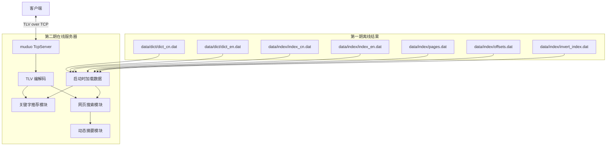
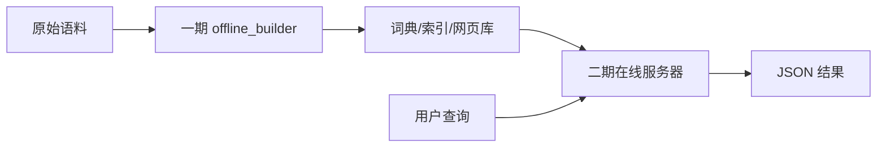
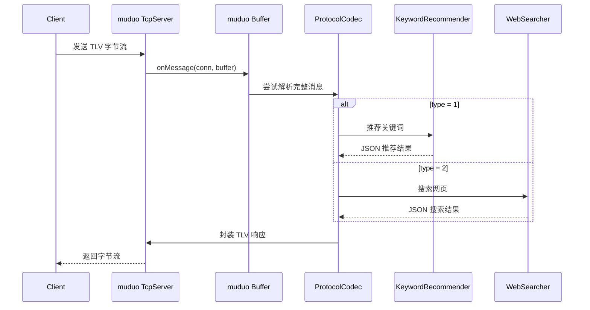
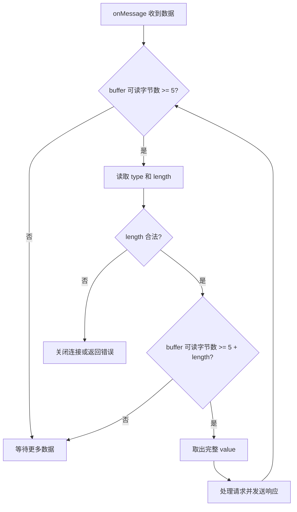
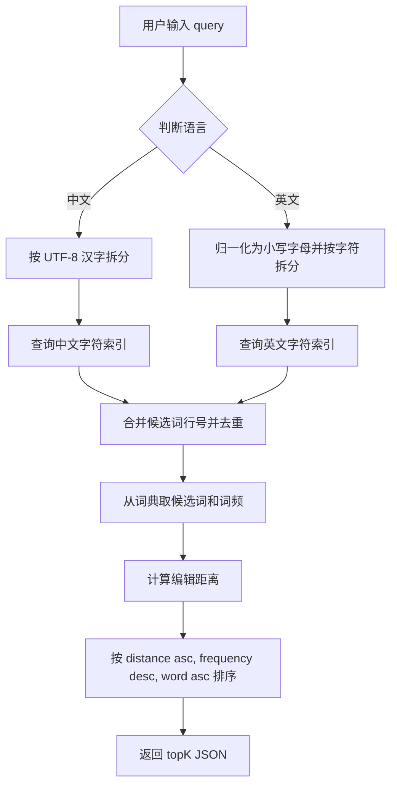
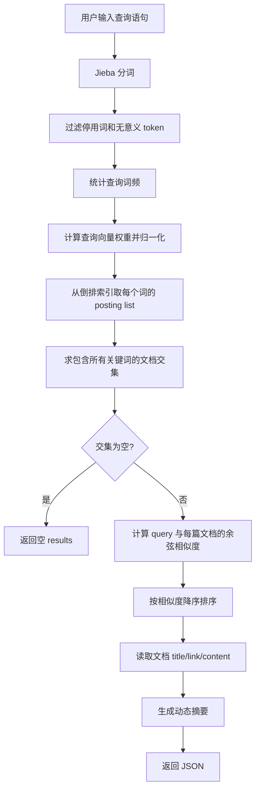
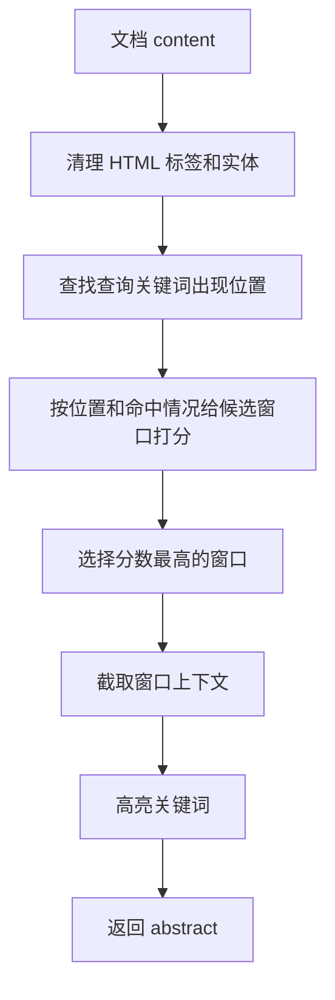

# 搜索引擎项目第二期开发思路

## 1. 二期目标总览

第二期要在第一期离线建库结果的基础上，开发一个在线搜索服务。第一期已经生成了关键字推荐和网页搜索所需的数据文件，第二期不再扫描原始语料，也不重新建库，而是在服务器启动时把这些文件加载到内存，之后通过 TCP 服务响应客户端查询。

本项目第二期采用：

1. 服务器框架：`muduo`。
2. 应用层协议：自定义 `TLV` 协议，解决 TCP 粘包、半包问题。
3. 关键字推荐算法：基于字符索引召回候选词，再用 UTF-8 感知的编辑距离、词频和字典序排序。
4. 网页搜索算法：基于倒排索引的 TF-IDF 向量空间模型，并使用余弦相似度排序。
5. 摘要生成方式：动态摘要，即根据查询关键词在正文中的位置和上下文生成摘要。

整体数据流如下：



## 2. 二期与一期的关系

当前 `02_SearchEngine_V2` 目录中，一期代码已经完成以下产物：

```text
data/dict/dict_en.dat          英文词典，格式：word frequency
data/dict/dict_cn.dat          中文词典，格式：word frequency
data/index/index_en.dat        英文字符索引，格式：character lineNo...
data/index/index_cn.dat        中文字符索引，格式：character lineNo...
data/index/pages.dat           网页库，连续保存 <doc>...</doc>
data/index/offsets.dat         网页偏移库，格式：docId offset length
data/index/invert_index.dat    倒排索引，格式：word docId weight [docId weight]...
```

二期最重要的原则是：在线服务只读这些文件，不修改这些文件。这样可以保证在线查询足够快，也能让离线建库和在线服务职责清晰分离。



## 3. 推荐目录结构

可以在现有 `include/online` 和 `src/online` 目录下补充在线模块。推荐结构如下：

```text
02_SearchEngine_V2/
├── include/
│   ├── common/
│   ├── offline/
│   └── online/
│       ├── ProtocolCodec.h          # TLV 编解码
│       ├── SearchServer.h           # muduo 服务器封装
│       ├── KeywordRecommender.h     # 关键字推荐
│       ├── WebSearcher.h            # 网页搜索
│       ├── PageLibrary.h            # 网页库与偏移库读取
│       ├── DynamicAbstract.h        # 动态摘要
│       └── OnlineConfig.h           # 二期配置封装，可复用 Config
├── src/
│   ├── common/
│   ├── offline/
│   └── online/
│       ├── online_main.cc
│       ├── ProtocolCodec.cc
│       ├── SearchServer.cc
│       ├── KeywordRecommender.cc
│       ├── WebSearcher.cc
│       ├── PageLibrary.cc
│       └── DynamicAbstract.cc
└── conf/
    └── config.conf
```

## 4. 服务器端框架：muduo

### 4.1 选择 muduo 的原因

PDF 第 13 页建议第二期服务器框架可以在 `wfrest` 和 `muduo` 中选择，并推荐 `muduo`。本项目选择 `muduo`，原因如下：

1. `muduo` 工作在 TCP 层，更接近网络编程本质，能清楚理解连接、缓冲区、粘包、半包和 Reactor 模型。
2. 搜索服务的请求和响应都比较简单，使用 TCP 自定义协议足够直接。
3. `muduo` 内置事件循环、连接管理、线程池和缓冲区，适合实现高并发的长连接服务。
4. 本地已经安装好 `muduo` 库，可以直接使用。

### 4.2 muduo 服务模型

服务器启动后，主线程运行 `EventLoop`，`TcpServer` 监听端口。收到完整 TLV 消息后，根据消息类型分发到关键字推荐或网页搜索模块。



### 4.3 线程模型建议

推荐做法：

1. 服务器启动时，主线程先加载所有只读数据。
2. 加载完成后启动 `muduo::net::TcpServer`。
3. 使用 `server.setThreadNum(n)` 开启 IO 线程。
4. 所有词典、索引、网页偏移、倒排索引都作为只读数据共享，不在查询时修改。

只读共享数据天然适合多线程查询。如果后续加入缓存，缓存需要单独考虑加锁或使用线程局部缓存；但第二期可以先不做缓存，避免复杂度过高。

## 5. TLV 协议设计

### 5.1 为什么需要 TLV

TCP 是字节流协议，不保留消息边界。客户端发送两条消息，服务端可能一次收到；客户端发送一条较长消息，服务端也可能分多次收到。因此必须定义应用层协议来识别“哪里是一条完整消息”。

本项目采用 TLV 协议：

```cpp
struct Message {
    uint8_t type;        // 消息类型：1 关键字推荐，2 网页搜索
    uint32_t length;     // value 的字节长度，使用网络字节序
    std::string value;   // JSON 字符串
};
```

协议头长度固定为 5 字节：

```text
1 byte type + 4 bytes length + length bytes value
```

### 5.2 消息类型

```text
type = 1    关键字推荐
type = 2    网页搜索
type = 100  错误响应，可选
```

请求和响应都可以使用同样的 TLV 外壳。`value` 使用 JSON，便于扩展字段。

关键字推荐请求示例：

```json
{
  "query": "搜索",
  "lang": "cn",
  "topk": 5
}
```

关键字推荐响应示例：

```json
{
  "type": "keyword",
  "query": "搜索",
  "results": [
    {"word": "搜索", "distance": 0, "frequency": 12},
    {"word": "搜寻", "distance": 1, "frequency": 4}
  ]
}
```

网页搜索请求示例：

```json
{
  "query": "新能源汽车 召回",
  "topk": 10
}
```

网页搜索响应示例：

```json
{
  "type": "web",
  "query": "新能源汽车 召回",
  "results": [
    {
      "id": 12,
      "title": "新能源汽车相关标题",
      "link": "http://example.com/news.html",
      "abstract": "......新能源汽车......召回......",
      "score": 0.8231
    }
  ]
}
```

### 5.3 TLV 解包流程

`onMessage` 中不要假设一次回调正好得到一条完整消息，应循环解析缓冲区：



实现时要注意：

1. `length` 使用网络字节序，收包时 `ntohl`，发包时 `htonl`。
2. 设置最大消息长度，例如 1 MB，防止异常客户端发送超大 length。
3. 当消息类型不是 1 或 2 时，返回错误 JSON。
4. 只有确认完整消息到达后，才从 `muduo::net::Buffer` 中取走数据。

## 6. 在线数据加载设计

### 6.1 关键字推荐数据结构

词典库格式是：

```text
word frequency
```

索引库格式是：

```text
character lineNo1 lineNo2 lineNo3 ...
```

注意：一期索引中的 `lineNo` 从 1 开始，二期加载词典时也要按 1 开始保存。

推荐内存结构：

```cpp
struct DictEntry {
    std::string word;
    int frequency;
};

std::vector<DictEntry> cnDict;                    // cnDict[0] 可留空，使 lineNo 直接作为下标
std::vector<DictEntry> enDict;
std::unordered_map<std::string, std::vector<int>> cnIndex;
std::unordered_map<std::string, std::vector<int>> enIndex;
```

为了让 `lineNo` 使用更直观，可以让 `dict[0]` 保留空记录，第一条真实词典记录放在 `dict[1]`。

### 6.2 网页搜索数据结构

偏移库格式：

```text
docId offset length
```

倒排索引格式：

```text
word docId weight docId weight ...
```

推荐内存结构：

```cpp
struct PageOffset {
    int docId;
    std::uint64_t offset;
    std::uint64_t length;
};

struct Posting {
    int docId;
    double weight;
};

std::unordered_map<int, PageOffset> offsets;
std::unordered_map<std::string, std::vector<Posting>> invertedIndex;
```

网页库 `pages.dat` 有两种读取方式：

1. 启动时只加载 `offsets.dat`，查询命中文档后再按 offset 和 length 从 `pages.dat` 读取正文。
2. 启动时把所有网页解析到内存，查询时不再读磁盘。

本项目语料规模不大，推荐第二种：启动时把 `pages.dat` 解析为内存中的 `Document`，查询延迟更低，也方便生成动态摘要。

```cpp
struct Document {
    int id;
    std::string title;
    std::string link;
    std::string content;
};

std::unordered_map<int, Document> documents;
```

如果后续语料变大，再改为“偏移库定位 + 按需读取网页库”的方式。

## 7. 关键字推荐算法

### 7.1 算法选择

关键字推荐选择“字符索引召回 + 编辑距离排序”的方案。这是课程 PDF 第 13-14 页给出的核心方法，也适合当前一期生成的数据格式。

算法优点：

1. 召回速度快：不用遍历完整词典，只通过字符索引找到包含相同字符的候选词。
2. 推荐质量稳定：编辑距离能衡量输入词和候选词的相似程度。
3. 排序规则清晰：编辑距离越小越靠前；距离相同，词频越高越靠前；词频相同，字典序小的靠前。
4. 中英文都能复用：英文按字母拆分，中文按 UTF-8 字符拆分。

### 7.2 查询流程



### 7.3 候选词召回

以中文查询 `"搜索"` 为例，拆成 `"搜"`、`"索"` 两个字符：

1. 在 `index_cn.dat` 中找到包含 `"搜"` 的词典行号集合。
2. 在 `index_cn.dat` 中找到包含 `"索"` 的词典行号集合。
3. 合并两个集合并去重。
4. 根据行号到 `dict_cn.dat` 中取出候选词。

这里使用“并集”而不是“交集”。原因是用户可能输入错字或少字，如果用交集，候选词集合可能过小，推荐结果不够稳定。

### 7.4 编辑距离

编辑距离表示把一个字符串变成另一个字符串所需的最少编辑次数。允许的操作通常有：

1. 插入一个字符。
2. 删除一个字符。
3. 替换一个字符。

推荐实现 UTF-8 感知的 Levenshtein 距离：

1. 英文可以按 `char` 拆分。
2. 中文必须按 UTF-8 字符拆分，不能按字节拆分。

动态规划状态：

```text
dp[i][j] = query 的前 i 个字符变成 candidate 的前 j 个字符的最小编辑次数
```

转移：

```text
如果 query[i - 1] == candidate[j - 1]:
    dp[i][j] = dp[i - 1][j - 1]
否则:
    dp[i][j] = min(
        dp[i - 1][j] + 1,      // 删除
        dp[i][j - 1] + 1,      // 插入
        dp[i - 1][j - 1] + 1   // 替换
    )
```

### 7.5 排序规则

每个候选词保存三个排序字段：

```cpp
struct Candidate {
    std::string word;
    int frequency;
    int distance;
};
```

比较规则：

```text
1. distance 小的优先。
2. distance 相同，frequency 大的优先。
3. distance 和 frequency 都相同，word 字典序小的优先。
```

可以直接排序，也可以用 `priority_queue` 维护 topK。考虑课程项目规模，直接排序更容易写清楚；如果候选词很多，再改成堆。

## 8. 网页搜索算法

### 8.1 算法选择

网页搜索选择“TF-IDF + 余弦相似度”的向量空间模型。这也是 PDF 第 14-15 页给出的方案，并且正好匹配一期生成的 `invert_index.dat`。

为什么不直接选择更复杂的 BM25？

BM25 是优秀的检索排序算法，但它需要原始词频、文档长度、平均文档长度等信息；当前一期倒排索引保存的是归一化后的 TF-IDF 权重。如果第二期直接使用 BM25，就需要扩展一期输出格式或重新建库。为了贴合现有项目，第二期主算法选择 TF-IDF 余弦相似度。后续优化阶段可以再把 BM25 作为升级方向。

### 8.2 查询处理流程



### 8.3 查询向量计算

用户输入的查询语句可以看作一篇很短的新文档 `X`。

处理步骤：

1. 使用 `cppjieba` 对查询语句分词。
2. 过滤中文停用词、标点、空白和纯数字 token。
3. 统计每个查询词的出现次数。
4. 为每个词计算查询向量权重。
5. 对查询向量做 L2 归一化。

一期的 `invert_index.dat` 中已经保存了网页中关键词的归一化权重。查询向量也应归一化，这样余弦相似度计算更自然。

查询词的 IDF 有两种可行方式：

1. 从倒排索引的 posting list 长度推导 `DF`，再用 `IDF = log2(N / (DF + 1))` 计算。
2. 简化处理：查询词权重只使用查询词频，然后归一化。

推荐第一种，因为它与一期离线 TF-IDF 思路一致。`N` 可以用文档总数，即 `documents.size()`。

### 8.4 文档召回

PDF 要求“查询包含所有关键字的网页”。所以对每个查询词，从倒排索引中取 posting list，然后求文档 id 交集。

例如查询词为：

```text
新能源汽车 召回
```

倒排索引中可能有：

```text
新能源 -> [1, 5, 9]
汽车   -> [1, 2, 5, 8]
召回   -> [1, 2, 7]
```

交集为：

```text
[1]
```

只有文档 1 同时包含所有查询词，因此进入排序阶段。

如果交集为空，按 PDF 要求可以直接返回空数组。为了用户体验，后续可以扩展“降级召回”：先返回包含最多查询词的网页；但第二期主流程建议先严格实现交集逻辑。

### 8.5 余弦相似度排序

设查询向量为：

```text
X = (x1, x2, ..., xn)
```

某篇文档在这些查询词上的权重向量为：

```text
Y = (y1, y2, ..., yn)
```

余弦相似度为：

```text
cos(theta) = (X · Y) / (|X| * |Y|)
```

由于查询向量和一期文档向量都已经归一化，实际计算可以简化为点积：

```text
score = x1 * y1 + x2 * y2 + ... + xn * yn
```

得分越大，表示查询与网页越相关，排序越靠前。

排序字段建议：

```text
1. score 大的优先。
2. score 相同，docId 小的优先，保证结果稳定。
```

## 9. 动态摘要设计

### 9.1 为什么选择动态摘要

静态摘要只是截取正文前 `n` 个字符，容易出现摘要和查询词无关的问题。动态摘要会围绕查询关键词截取上下文，更符合用户搜索时的阅读习惯。

例如用户搜索 `"特斯拉 召回"`，动态摘要应优先展示正文中出现 `"特斯拉"`、`"召回"` 附近的内容，而不是机械返回文章开头。

### 9.2 摘要生成基本流程



### 9.3 正文清理

当前 `pages.dat` 的 `<content>` 中保留了转义后的 HTML 片段，例如：

```text
&lt;p style="text-indent: 2em;"&gt; 近日，福特汽车...
```

生成摘要前建议做轻量清理：

1. 把 `&lt;`、`&gt;`、`&amp;` 等实体还原或移除。
2. 删除 `<p>`、`<span>`、`<br>` 等 HTML 标签。
3. 把连续空白压缩为一个空格。
4. 保留正常中文、英文、数字和标点。

第二期不必实现完整 HTML 解析器，简单清理即可满足课程项目需要。

### 9.4 动态摘要窗口

推荐摘要长度控制在 120 到 180 个中文字符之间。实现上可以以关键词命中位置为中心截取一个窗口：

```text
窗口左侧保留 50 个字符
窗口右侧保留 90 个字符
总长度约 140 个字符
```

如果关键词靠近文章开头，左侧不足时就从正文开头截取；如果靠近文章结尾，右侧不足时就向左补足。

### 9.5 关键词位置权重规定

动态摘要的核心是给候选窗口打分。用户特别关心“关键词处于文章开头、结尾、中间部分的权重如何规定”，这里给出明确规则。

先把正文长度记为 `L`，关键词第一次出现在正文中的字符位置记为 `pos`，位置比例为：

```text
ratio = pos / L
```

位置权重建议如下：

```text
文章开头 0%  - 20%   positionWeight = 1.30
文章中间 20% - 80%   positionWeight = 1.00
文章结尾 80% - 100%  positionWeight = 1.15
```

原因：

1. 文章开头通常包含导语、核心事实和主题信息，所以权重最高。
2. 文章中间多为展开说明，信息仍然有效，但主题概括性通常弱一些，所以作为基准权重。
3. 文章结尾可能包含总结、结论、出处或补充事实，价值高于普通中间段落，但一般略低于开头。

也就是说，本项目动态摘要位置权重采用：

```text
开头 > 结尾 > 中间
1.30 > 1.15 > 1.00
```

### 9.6 候选窗口评分公式

对每个候选窗口计算综合分：

```text
windowScore =
    关键词命中分 * 位置权重
  + 多关键词覆盖奖励
  + 紧密度奖励
```

各部分建议如下。

关键词命中分：

```text
每命中一个查询关键词，基础分 +10
同一个关键词在窗口中重复出现，每多出现一次 +2，上限 +6
```

多关键词覆盖奖励：

```text
窗口覆盖的不同查询关键词数 / 查询关键词总数 * 10
```

紧密度奖励：

```text
如果多个关键词在 40 个字符内同时出现，奖励 +5
如果多个关键词距离超过 100 个字符，不给紧密度奖励
```

位置权重使用窗口主命中词的位置。如果一个窗口中有多个关键词，取其中得分最高的关键词位置权重。

示例：

```text
查询词：特斯拉 召回
窗口 A：出现在文章开头，同时包含两个词
窗口 B：出现在文章中间，只包含“召回”
窗口 C：出现在文章结尾，同时包含两个词

排序通常为：A > C > B
```

### 9.7 摘要高亮

返回 JSON 时可以用 `<em>` 包裹命中的关键词：

```html
近日，<em>特斯拉</em>汽车发布<em>召回</em>计划...
```

如果客户端只是命令行程序，也可以使用 `[...]` 标记：

```text
近日，[特斯拉]汽车发布[召回]计划...
```

推荐使用 `<em>`，因为以后如果接 Web 前端，样式更容易控制。

## 10. 在线模块详细设计

### 10.1 SearchServer

职责：

1. 初始化 `muduo::net::TcpServer`。
2. 注册连接回调和消息回调。
3. 收到完整 TLV 请求后，根据 type 分发。
4. 把模块返回的 JSON 再封装成 TLV 发回客户端。

核心成员可设计为：

```cpp
class SearchServer {
public:
    SearchServer(muduo::net::EventLoop* loop,
                 const muduo::net::InetAddress& addr,
                 KeywordRecommender& recommender,
                 WebSearcher& searcher);

    void start();

private:
    void onConnection(const muduo::net::TcpConnectionPtr& conn);
    void onMessage(const muduo::net::TcpConnectionPtr& conn,
                   muduo::net::Buffer* buffer,
                   muduo::Timestamp receiveTime);
};
```

### 10.2 ProtocolCodec

职责：

1. 从 `muduo::net::Buffer` 中解析 TLV 消息。
2. 校验消息长度和类型。
3. 把响应 JSON 封装为 TLV 字节流。

推荐接口：

```cpp
struct Request {
    uint8_t type;
    std::string value;
};

class ProtocolCodec {
public:
    static bool tryDecode(muduo::net::Buffer* buffer, Request& request);
    static std::string encode(uint8_t type, const std::string& value);
};
```

`tryDecode` 返回 `false` 表示当前缓冲区还没有完整消息，不代表出错。长度非法或类型非法可以抛异常，交给 `SearchServer` 返回错误响应或关闭连接。

### 10.3 KeywordRecommender

职责：

1. 加载中英文词典和字符索引。
2. 根据查询词召回候选词。
3. 计算编辑距离并排序。
4. 返回 topK 推荐词。

推荐接口：

```cpp
class KeywordRecommender {
public:
    void load(const std::string& cnDict,
              const std::string& cnIndex,
              const std::string& enDict,
              const std::string& enIndex);

    std::string recommendJson(const std::string& query,
                              const std::string& lang,
                              int topK) const;
};
```

### 10.4 WebSearcher

职责：

1. 加载网页库、偏移库、倒排索引。
2. 对用户查询进行分词和过滤。
3. 计算查询向量。
4. 通过倒排索引召回文档。
5. 使用余弦相似度排序。
6. 为结果生成动态摘要。
7. 返回 JSON。

推荐接口：

```cpp
class WebSearcher {
public:
    void load(const std::string& pages,
              const std::string& offsets,
              const std::string& invertIndex,
              const std::string& stopWords);

    std::string searchJson(const std::string& query, int topK) const;
};
```

## 11. JSON 库选择

推荐使用 `nlohmann/json`，接口直观，生成 JSON 不容易出错：

```cpp
nlohmann::json result;
result["type"] = "keyword";
result["query"] = query;
result["results"] = nlohmann::json::array();
```

如果不想增加依赖，也可以手动拼接 JSON，但必须做好字符串转义：

1. `"` 转为 `\"`
2. `\` 转为 `\\`
3. 换行转为 `\n`
4. 控制字符要过滤或转义

从工程可靠性看，推荐使用 JSON 库。

## 12. 配置文件扩展

现有 `conf/config.conf` 已经包含二期需要加载的数据路径。可以继续补充服务器配置：

```text
# Online server.
server_ip=0.0.0.0
server_port=8888
io_threads=4
max_message_size=1048576
keyword_topk=5
web_topk=10
abstract_length=150
```

启动时读取配置：

```text
1. 加载 Config。
2. 初始化 KeywordRecommender。
3. 初始化 WebSearcher。
4. 创建 EventLoop 和 SearchServer。
5. 启动 muduo 服务。
```

## 13. 构建方式建议

当前 `CMakeLists.txt` 只构建 `offline_builder`，第二期可以新增 `search_server`：

```cmake
add_executable(search_server
    src/online/online_main.cc
    src/common/Config.cc
    src/common/TextUtils.cc
    src/online/ProtocolCodec.cc
    src/online/SearchServer.cc
    src/online/KeywordRecommender.cc
    src/online/WebSearcher.cc
    src/online/PageLibrary.cc
    src/online/DynamicAbstract.cc
)
```

链接库需要包含：

```text
muduo_net
muduo_base
pthread
tinyxml2
```

如果使用 `cppjieba`，它通常是头文件库；如果使用 `nlohmann/json`，也通常是头文件库。

## 14. 开发步骤建议

### 14.1 第一步：完成数据加载

先不接入网络，写一个简单测试程序加载以下文件：

```text
dict_cn.dat
dict_en.dat
index_cn.dat
index_en.dat
pages.dat
offsets.dat
invert_index.dat
```

检查内容：

1. 中文词典和英文词典记录数是否合理。
2. 字符索引是否能通过字符找到词典行号。
3. 倒排索引是否能通过词找到 posting list。
4. `pages.dat` 中能否按 docId 取出 title、link、content。

### 14.2 第二步：完成关键字推荐

先用命令行测试：

```text
输入：搜索
输出：搜索、搜索引擎、搜寻...
```

重点验证：

1. 中文按 UTF-8 字符拆分。
2. 候选词集合已去重。
3. 编辑距离计算正确。
4. 排序规则符合 distance、frequency、word 三层比较。

### 14.3 第三步：完成网页搜索

先用命令行测试：

```text
输入：汽车 召回
输出：若干篇包含这两个词的网页
```

重点验证：

1. 查询分词和停用词过滤正确。
2. 文档交集计算正确。
3. 相似度排序稳定。
4. title、link、content 能正确取出。

### 14.4 第四步：完成动态摘要

用固定文档和固定查询词测试摘要：

```text
输入查询：特斯拉 召回
摘要应包含：特斯拉、召回附近的正文
```

重点验证：

1. 摘要不是固定截取文章开头。
2. 命中词附近上下文完整。
3. 开头、结尾、中间位置权重能影响窗口选择。
4. 摘要长度可控。

### 14.5 第五步：接入 muduo 和 TLV

最后再接入网络层。这样出问题时容易判断是算法问题还是网络协议问题。

验证方式：

1. 启动 `search_server`。
2. 写一个简单 `client` 按 TLV 发送 type 1 请求。
3. 再发送 type 2 请求。
4. 测试一次发送多条 TLV 消息。
5. 测试一条 TLV 消息拆成多次发送。

## 15. 异常处理和边界情况

需要明确处理以下情况：

1. 请求 JSON 解析失败：返回错误 JSON。
2. `query` 为空：返回空结果。
3. `topk <= 0`：使用默认值。
4. `topk` 过大：限制最大值，例如 50。
5. 关键字推荐候选集为空：返回空数组。
6. 网页搜索任一查询词不在倒排索引中：返回空数组。
7. TLV length 超过最大限制：关闭连接或返回错误。
8. 文档缺少 title 或 link：返回空字符串，不影响搜索结果。

错误响应示例：

```json
{
  "error": "invalid request",
  "message": "query is empty"
}
```

## 16. 测试建议

### 16.1 单元测试

优先测试纯算法模块：

```text
编辑距离：
  search vs search => 0
  search vs seach  => 1
  搜索 vs 搜寻       => 1

TLV 编解码：
  正常完整消息
  半包消息
  粘包消息
  非法 length

动态摘要：
  关键词在开头
  关键词在中间
  关键词在结尾
  多关键词同时出现
```

### 16.2 集成测试

集成测试重点覆盖完整链路：

```text
client -> TLV -> muduo server -> algorithm -> JSON -> TLV -> client
```

建议至少准备：

1. 一个关键字推荐请求。
2. 一个有搜索结果的网页搜索请求。
3. 一个无搜索结果的网页搜索请求。
4. 一个非法 JSON 请求。
5. 一个超长请求。

## 17. 二期完成标准

完成二期后，项目应具备以下能力：

1. 能启动 `search_server` 并监听指定端口。
2. 能正确解析 TLV 请求，处理粘包和半包。
3. 能对中文和英文输入给出 topK 关键字推荐。
4. 能对网页查询返回按相关度排序的结果。
5. 每条网页结果包含 `id`、`title`、`link`、`abstract`、`score`。
6. 摘要由查询关键词附近内容动态生成，而不是固定截取正文开头。
7. 查询过程不重新扫描原始语料，只读取一期离线产物。

## 18. 总结

第二期的核心不是重新做离线建库，而是把一期产物组织成高效的在线查询服务。网络层使用 `muduo + TLV` 保证 TCP 消息边界清晰；关键字推荐使用字符索引和编辑距离保证推荐结果相关；网页搜索使用 TF-IDF 和余弦相似度充分复用现有倒排索引；摘要使用动态窗口评分，让返回结果直接围绕用户查询词展示。

整体实现顺序建议为：

```text
数据加载 -> 关键字推荐 -> 网页搜索 -> 动态摘要 -> muduo/TLV 接入 -> 集成测试
```

这样每一步都可以独立验证，开发风险最低，也最符合当前项目已经完成的第一期代码结构。
