# SearchEngine V3 技术文档

`03_SearchEngine_V3` 是搜索引擎项目第三期实现。当前项目保留第一期离线建库和第二期在线搜索能力，并在在线查询链路中加入缓存：

1. `offline_builder`：离线建库程序，生成关键词推荐和网页搜索所需的数据文件。
2. `search_server`：基于 `muduo` 的在线服务，同时提供 TLV 协议端口和浏览器 HTTP 端口。
3. `cache`：第三期新增缓存层，当前实现 L1 分片完整 W-TinyLFU（可回退 LRU）、本机 Redis L2、二级缓存组合、singleflight、空结果缓存、TTL 抖动和缓存统计。

第三期的核心变化：

1. 关键词推荐最终 JSON 结果增加缓存。
2. 网页搜索最终 JSON 结果增加缓存。
3. 网页库正文不再启动时全量加载到内存，改为根据 `offsets.dat` 从 `pages.dat` 按需读取。
4. 文档展示信息和动态摘要片段增加细粒度缓存。
5. TLV 服务和 HTTP 服务统一依赖 `CachedSearchService`，避免两套入口重复实现缓存逻辑。

## 1. 项目目标

当前 V3 项目包含三条完整链路。

离线建库链路：

```text
原始语料 -> offline_builder -> 词典/字符索引/网页库/偏移库/倒排索引
```

在线查询链路：

```text
客户端 -> TLV 或 HTTP -> CachedSearchService -> KeywordRecommender / WebSearcher -> JSON
```

缓存链路：

```text
请求 -> L1 分片 W-TinyLFU -> Redis L2 -> singleflight 回源 -> 写入缓存
```

整体数据流：

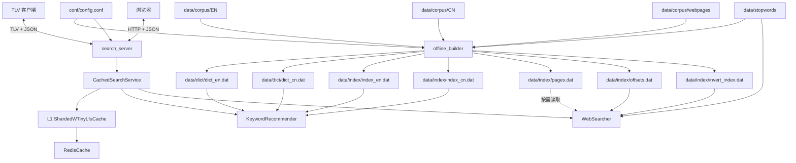

## 2. 目录结构

```text
03_SearchEngine_V3/
├── CMakeLists.txt
├── README.md
├── bin/
│   ├── offline_builder
│   └── search_server
├── conf/
│   └── config.conf
├── data/
│   ├── corpus/
│   ├── stopwords/
│   ├── dict/
│   └── index/
├── docs/
│   ├── 项目第三期开发思路.md
│   ├── 项目第三期缓存技术详解.md
│   ├── 项目第三期HTTP压测报告.md
│   ├── 项目第三期缓存改造流程.md
│   └── 项目第三期开发进度.md
├── include/
│   ├── cache/
│   │   ├── Cache.h
│   │   ├── TinyLfuFrequencySketch.h
│   │   ├── ShardedWTinyLfuCache.h
│   │   ├── ShardedLruCache.h
│   │   ├── RedisCache.h
│   │   ├── TwoLevelCache.h
│   │   └── CachedSearchService.h
│   ├── common/
│   │   ├── Config.h
│   │   ├── DirectoryScanner.h
│   │   └── TextUtils.h
│   ├── offline/
│   │   ├── KeywordProcessor.h
│   │   └── PageProcessor.h
│   └── online/
│       ├── ProtocolCodec.h
│       ├── SearchServer.h
│       ├── WebHttpServer.h
│       ├── KeywordRecommender.h
│       ├── WebSearcher.h
│       ├── PageLibrary.h
│       └── DynamicAbstract.h
├── src/
│   ├── cache/
│   │   ├── TinyLfuFrequencySketch.cc
│   │   ├── ShardedWTinyLfuCache.cc
│   │   ├── ShardedLruCache.cc
│   │   ├── RedisCache.cc
│   │   ├── TwoLevelCache.cc
│   │   └── CachedSearchService.cc
│   ├── common/
│   ├── offline/
│   └── online/
├── tests/
│   ├── README.md
│   ├── tlv_client/
│   │   ├── Makefile
│   │   ├── README.md
│   │   └── tlv_client.cc
│   ├── cache_policy/
│   │   ├── Makefile
│   │   ├── README.md
│   │   ├── cache_policy_test.cc
│   │   ├── cache_policy_benchmark.cc
│   │   └── sample_trace.txt
│   └── http_load/
│       ├── Makefile
│       ├── README.md
│       ├── http_load_test.py
│       └── sample_queries.txt
└── www/
    ├── index.html
    ├── styles.css
    ├── app.js
    └── README.md
```

模块职责：

| 模块 | 作用 |
| --- | --- |
| `common` | 配置读取、目录扫描、UTF-8 和文本处理工具 |
| `offline` | 第一期离线建库，生成在线查询所需数据 |
| `online` | muduo TLV 服务、HTTP 服务、推荐和搜索算法 |
| `cache` | 第三期缓存接口、本地缓存、Redis 缓存、二级缓存和缓存服务层 |
| `tests` | TLV 协议客户端、缓存策略测试/日志回放和 HTTP 端到端压测 |
| `www` | 浏览器搜索页面 |

## 3. 构建与运行

### 3.1 依赖

项目使用 C++17。当前实现依赖：

```text
cmake
g++
tinyxml2
muduo_net
muduo_base
pthread
hiredis
cppjieba
utfcpp
simhash
nlohmann/json
```

依赖用途：

| 依赖 | 用途 |
| --- | --- |
| `tinyxml2` | 解析网页 XML 语料和按需读取出的 `<doc>` 片段 |
| `muduo` | 在线 TCP/TLV 服务和 HTTP 服务 |
| `hiredis` | Redis L2 缓存客户端 |
| `cppjieba` | 中文分词 |
| `utfcpp` | UTF-8 字符拆分和码点判断 |
| `simhash` | 离线网页近似去重 |
| `nlohmann/json` | 请求、响应和文档缓存 JSON 序列化 |

### 3.2 编译

必须从项目根目录运行，因为配置文件中的路径是相对路径。

```bash
cd 课件/07_搜索引擎项目/03_SearchEngine_V3
cmake -S . -B build
cmake --build build
```

构建完成后生成：

```text
bin/offline_builder
bin/search_server
```

CMake 会查找并链接：

```text
tinyxml2
hiredis
muduo_net
muduo_base
pthread
```

如果缺少 `hiredis`、`tinyxml2` 或 `muduo`，CMake 配置阶段会直接报错。

### 3.3 运行离线建库

```bash
./bin/offline_builder
```

执行流程：

1. 读取 `conf/config.conf`。
2. 创建 `data/dict`、`data/index`、`bin`。
3. 调用 `KeywordProcessor::process()` 生成中英文词典和字符索引。
4. 调用 `PageProcessor::process()` 生成网页库、偏移库和倒排索引。

成功结束时输出：

```text
========== Build Finished ==========
Output directories: data/dict, data/index
```

### 3.4 运行在线服务

```bash
./bin/search_server
```

启动流程：

1. 读取 `conf/config.conf`。
2. 加载中英文词典和字符索引。
3. 加载中文停用词、网页偏移库和倒排索引。
4. 记录 `pages.dat` 路径，网页正文后续按需读取。
5. 按配置创建 L1 本地缓存、Redis L2 缓存和 `TwoLevelCache`。
6. 为 `WebSearcher` 设置文档展示信息缓存和动态摘要缓存。
7. 创建 `CachedSearchService`，封装关键词推荐和网页搜索最终结果缓存。
8. 启动 TLV 服务和 HTTP 服务。

默认监听：

```text
0.0.0.0:8888    TLV 协议服务
0.0.0.0:18888   浏览器 HTTP 服务
```

启动成功时会输出：

```text
========== SearchEngine V3 Online Server ==========
[Cache] L1 enabled, capacity=4096, shards=32, ttl=600, empty_ttl=60
[Cache] Redis L2 enabled, host=127.0.0.1, port=6379, db=0
[Online] TLV listen on 0.0.0.0:8888
[Online] Web listen on http://0.0.0.0:18888
```

浏览器访问：

```text
http://127.0.0.1:18888
```

## 4. 配置文件

配置文件路径固定为 `conf/config.conf`，格式是简单的 `key=value`。

### 4.1 离线与在线基础配置

```text
en_corpus_dir=data/corpus/EN
cn_corpus_dir=data/corpus/CN
webpage_corpus_dir=data/corpus/webpages

en_stop_words=data/stopwords/en_stopwords.txt
cn_stop_words=data/stopwords/cn_stopwords.txt

en_dict=data/dict/dict_en.dat
cn_dict=data/dict/dict_cn.dat
en_dict_index=data/index/index_en.dat
cn_dict_index=data/index/index_cn.dat

pages=data/index/pages.dat
offsets=data/index/offsets.dat
invert_index=data/index/invert_index.dat

server_ip=0.0.0.0
server_port=8888
http_port=18888
io_threads=4
http_threads=2
max_message_size=1048576
keyword_topk=10
web_topk=33
abstract_length=200
www_root=www
```

### 4.2 缓存配置

```text
cache_enabled=1
cache_version=search_engine_v3_001

l1_cache_enabled=1
l1_cache_capacity=4096
l1_cache_shards=32
l1_cache_policy=wtinylfu
l1_wtinylfu_window_percent=1
l1_wtinylfu_protected_percent=80
l1_wtinylfu_frequency_sample_multiplier=10
l1_cache_ttl_seconds=600
l1_empty_ttl_seconds=60
cache_ttl_jitter_seconds=30

document_cache_ttl_seconds=600
abstract_cache_ttl_seconds=600
cache_stats_log_interval=100

redis_cache_enabled=1
redis_host=127.0.0.1
redis_port=6379
redis_db=0
redis_connect_timeout_ms=20
redis_command_timeout_ms=20
redis_l1_backfill_ttl_seconds=600
```

缓存配置说明：

| 配置 | 说明 |
| --- | --- |
| `cache_enabled` | 缓存总开关，`0` 表示完全关闭缓存 |
| `cache_version` | 缓存版本，离线数据重建后应更新，避免命中旧数据 |
| `l1_cache_enabled` | 是否启用进程内 L1 本地缓存 |
| `l1_cache_capacity` | L1 缓存总容量，按 key 数量计 |
| `l1_cache_shards` | L1 分片数量，用于降低多线程锁竞争 |
| `l1_cache_policy` | L1 淘汰策略：`wtinylfu`（默认）或 `lru`（回退/对照） |
| `l1_wtinylfu_window_percent` | Window LRU 占分片容量百分比，内部限制到 `[1, 99]` |
| `l1_wtinylfu_protected_percent` | Main Protected 占 Main 容量上限百分比 |
| `l1_wtinylfu_frequency_sample_multiplier` | 触发 Count-Min Sketch 老化和 Doorkeeper 重置的采样窗口倍数 |
| `l1_cache_ttl_seconds` | 普通搜索/推荐结果 TTL，`<= 0` 表示不过期 |
| `l1_empty_ttl_seconds` | 空结果 TTL，用于缓存不存在查询 |
| `cache_ttl_jitter_seconds` | TTL 随机抖动秒数，减少大量 key 同时过期 |
| `document_cache_ttl_seconds` | 文档展示信息缓存 TTL |
| `abstract_cache_ttl_seconds` | 动态摘要片段缓存 TTL |
| `cache_stats_log_interval` | 每处理多少次请求打印一次缓存统计，`<= 0` 表示关闭 |
| `redis_cache_enabled` | 是否启用 Redis L2 缓存 |
| `redis_host` / `redis_port` / `redis_db` | Redis 连接信息 |
| `redis_connect_timeout_ms` | Redis 建连超时 |
| `redis_command_timeout_ms` | Redis 命令读写超时 |
| `redis_l1_backfill_ttl_seconds` | Redis 命中后回填 L1 的 TTL |

`Config` 解析规则：

1. 支持空行。
2. 支持以 `#` 开头的整行注释。
3. 支持 `key = value` 两侧空白。
4. 不支持行尾注释。
5. 使用第一个 `=` 分隔 key 和 value。
6. key 或 value 为空会抛异常。
7. 同名 key 重复出现时，后面的配置覆盖前面的配置。
8. `Config::get()` 查询不存在的 key 会抛异常。

在线服务中，端口、线程数、返回数量、摘要长度、前端目录和缓存配置都有默认值；离线数据路径是必需配置。

## 5. 离线建库

### 5.1 输出文件

关键字推荐数据：

```text
data/dict/dict_en.dat
data/index/index_en.dat
data/dict/dict_cn.dat
data/index/index_cn.dat
```

网页搜索数据：

```text
data/index/pages.dat
data/index/offsets.dat
data/index/invert_index.dat
```

输出文件格式：

| 文件 | 格式 | 说明 |
| --- | --- | --- |
| `dict_en.dat` | `word frequency` | 英文小写单词词频 |
| `index_en.dat` | `character lineNo...` | 英文字母到英文词典行号的映射 |
| `dict_cn.dat` | `word frequency` | 纯汉字中文词语词频 |
| `index_cn.dat` | `character lineNo...` | 单个 UTF-8 汉字到中文词典行号的映射 |
| `pages.dat` | 连续 `<doc>` 记录 | 去重后的网页库 |
| `offsets.dat` | `docId offset length` | 每篇网页在 `pages.dat` 中的字节范围 |
| `invert_index.dat` | `word docId weight ...` | 倒排索引，`weight` 是归一化 TF-IDF |

词典字符索引里的 `lineNo` 从 `1` 开始。在线加载词典时保留 `dict[0]` 为空记录，使 `lineNo` 可以直接作为数组下标使用。

### 5.2 关键词推荐离线处理

英文词典流程：

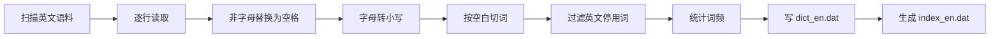

中文词典流程：

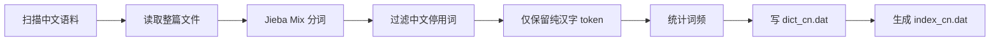

中文索引使用 `TextUtils::split_utf8_characters()` 按 Unicode 码点拆分词语。索引 key 是一个完整 UTF-8 汉字，不能按单字节 `char` 处理。

### 5.3 网页搜索离线处理

`PageProcessor` 负责生成网页库、偏移库和倒排索引。

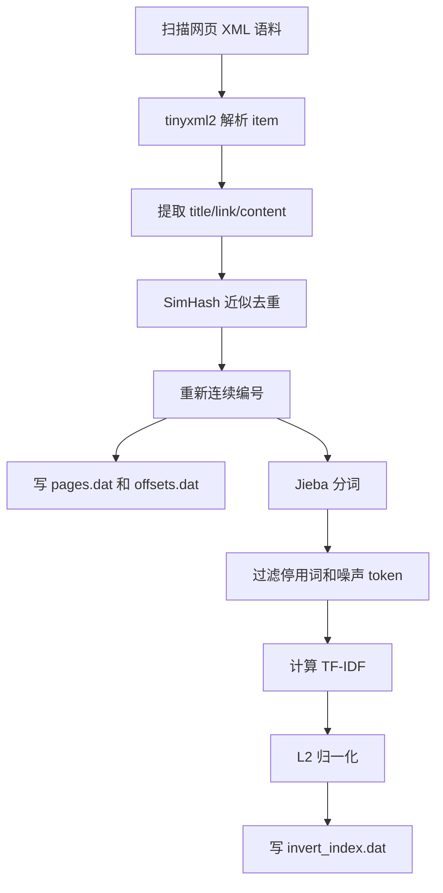

网页提取规则：

1. 递归收集 XML 中所有 `<item>`。
2. 正文优先读取 `<content>`。
3. `<content>` 为空时读取 `<description>`。
4. 两者都为空时丢弃该 item。
5. `<title>` 和 `<link>` 缺失时保留为空字符串。

SimHash 去重规则：

```text
topN = max(5, min(200, content.size() / 120))
汉明距离 <= 3 视为重复
```

倒排索引权重：

```text
TF  = count(word, doc) / docTotalWords(doc)
IDF = log2(documentCount / (documentFrequency(word) + 1))
w   = TF * IDF
```

每篇文档的权重向量做 L2 归一化：

```text
w'_i = w_i / sqrt(sum(w_j * w_j))
```

## 6. 在线服务架构

### 6.1 当前模块关系

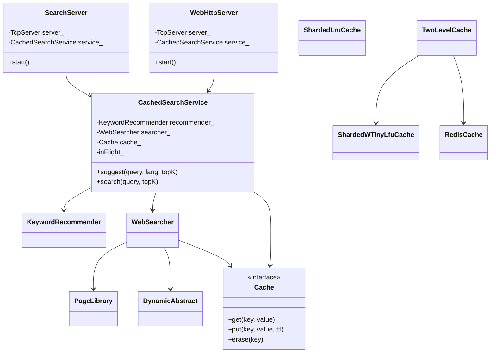

当前在线服务只有一份 `KeywordRecommender`、一份 `WebSearcher` 和一份缓存对象。TLV 和 HTTP 两个网络入口共享同一个 `CachedSearchService`，因此两种访问方式可以命中同一批缓存。

### 6.2 muduo 线程模型

`search_server` 在同一个进程中创建两个 `muduo::net::TcpServer`：

| 服务 | 默认端口 | 作用 |
| --- | --- | --- |
| `SearchServer` | `8888` | TLV 协议接口 |
| `WebHttpServer` | `18888` | 浏览器静态文件和 HTTP JSON API |

并发访问策略：

1. 词典库、字符索引和倒排索引启动后只读，可以被多个 muduo 工作线程共享。
2. 网页正文不全量加载，`PageLibrary::find()` 每次创建局部 `ifstream` 按需读取，避免共享文件流位置。
3. L1 缓存按 key 哈希分片，每个分片有独立互斥锁。
4. Redis L2 使用 hiredis 短连接，每次命令独立连接，避免当前阶段共享连接状态。
5. `CachedSearchService` 使用 singleflight 合并相同 key 的并发回源。

## 7. 缓存设计与实现

### 7.1 缓存对象

当前项目缓存四类派生结果：

| 缓存内容 | 生成位置 | key 主要字段 |
| --- | --- | --- |
| 关键词推荐最终 JSON | `CachedSearchService::suggest()` | version、`suggest`、lang、topK、query |
| 网页搜索最终 JSON | `CachedSearchService::search()` | version、`search`、topK、abstractLength、query |
| 文档展示信息 | `WebSearcher::get_document()` | version、`doc`、docId |
| 动态摘要片段 | `WebSearcher::get_abstract()` | version、`abstract`、docId、abstractLength、keywords |

缓存只保存可以从离线数据重新计算出来的派生数据，因此 Redis 不可用或缓存丢失不会影响搜索正确性。

### 7.2 L1 分片完整 W-TinyLFU

实现文件：

```text
include/cache/TinyLfuFrequencySketch.h
src/cache/TinyLfuFrequencySketch.cc
include/cache/ShardedWTinyLfuCache.h
src/cache/ShardedWTinyLfuCache.cc

# 原 LRU 实现作为配置回退和命中率对照保留
include/cache/ShardedLruCache.h
src/cache/ShardedLruCache.cc
```

核心结构：

```text
ShardedWTinyLfuCache
  -> vector<Shard>
      -> mutex
      -> Window LRU                          接收全部新数据
      -> Main Probation                      保存通过准入的候选
      -> Main Protected                      保护重复命中的热点
      -> unordered_map<key, Location>        O(1) 定位节点及所属分段
      -> TinyLfuFrequencySketch
          -> 4-row Count-Min Sketch          4-bit 饱和计数器
          -> Bloom Doorkeeper                过滤首次访问
          -> Frequency Aging                 周期减半并重置 Doorkeeper
```

访问流程：

1. 对 key 做 `std::hash<std::string>`。
2. 根据哈希值选择分片。
3. 只锁定该分片。
4. 每次 `get()`（包括未命中）记录访问频率。
5. `put()` 的新数据先进入 Window LRU。
6. Window 淘汰候选在 Main 未满时直接进入 Main Probation。
7. Main 已满时，候选频率严格高于 Probation 尾部 victim 才允许替换。
8. Probation 再次命中后晋升 Protected；Protected 超限时将尾部降级回 Probation。
9. 第一次访问只进入 Doorkeeper，第二次起才增加 Count-Min Sketch，减少长尾污染。
10. 频率采样达到阈值后将 4-bit 计数器减半并清空 Doorkeeper。
11. 过期项在访问和写入时惰性清理。

频率估计器的空间在构造时按分片容量固定分配。Count-Min Sketch 使用 4 行计数，每个计数器占 4 bit、最大值为 15；Doorkeeper 使用两个 Bloom bit。无论出现多少种长尾 query，频率估计器都不会按 key 扩容。

TTL 语义：

```text
ttlSeconds > 0   到期后失效
ttlSeconds <= 0  永不过期，只受容量淘汰影响
```

### 7.3 Redis L2

实现文件：

```text
include/cache/RedisCache.h
src/cache/RedisCache.cc
```

当前 `RedisCache` 使用 hiredis 同步客户端：

1. `redisConnectWithTimeout()` 建立连接。
2. `redisSetTimeout()` 设置命令读写超时。
3. `SELECT` 切换 DB。
4. `GET` 读取缓存。
5. `SETEX` 或 `SET` 写入缓存。
6. `DEL` 删除缓存。

当前实现每次命令使用短连接。这样做牺牲了一部分 Redis 性能，但有三个优点：

1. 不需要设计多线程共享连接池。
2. 不会因为某条连接状态异常影响后续所有请求。
3. Redis 只是加速层，短连接加小超时更容易保证主搜索流程可用。

Redis 异常处理：

```text
get 失败 -> 返回 false，按缓存未命中处理
put 失败 -> 静默失败，不影响响应
erase 失败 -> 静默失败
```

### 7.4 二级缓存

实现文件：

```text
include/cache/TwoLevelCache.h
src/cache/TwoLevelCache.cc
```

读取流程：

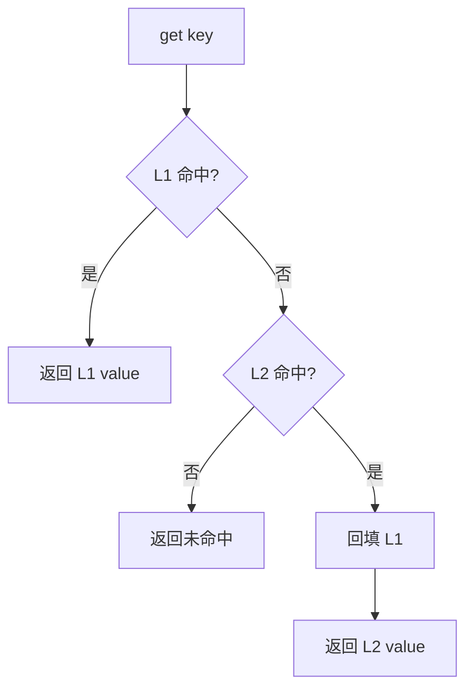

写入流程：

```text
put(key, value, ttl) -> 同时写 L1 和 L2
erase(key) -> 同时删 L1 和 L2
```

当同时启用 L1 和 Redis 时，`online_main.cc` 创建：

```text
TwoLevelCache(l1Cache.get(), redisCache.get(), redis_l1_backfill_ttl_seconds)
```

上层业务只依赖 `Cache*`，不需要感知当前使用一级缓存还是二级缓存。

### 7.5 CachedSearchService

实现文件：

```text
include/cache/CachedSearchService.h
src/cache/CachedSearchService.cc
```

职责：

1. 封装 `suggest(query, lang, topK)`。
2. 封装 `search(query, topK)`。
3. 归一化 query 和 lang。
4. 构造业务结果缓存 key。
5. 查询缓存、回源计算、写入缓存。
6. 使用 singleflight 合并相同 key 的并发回源。
7. 对空结果使用短 TTL。
8. 给 TTL 增加随机抖动。
9. 定期打印缓存统计。

通用流程：

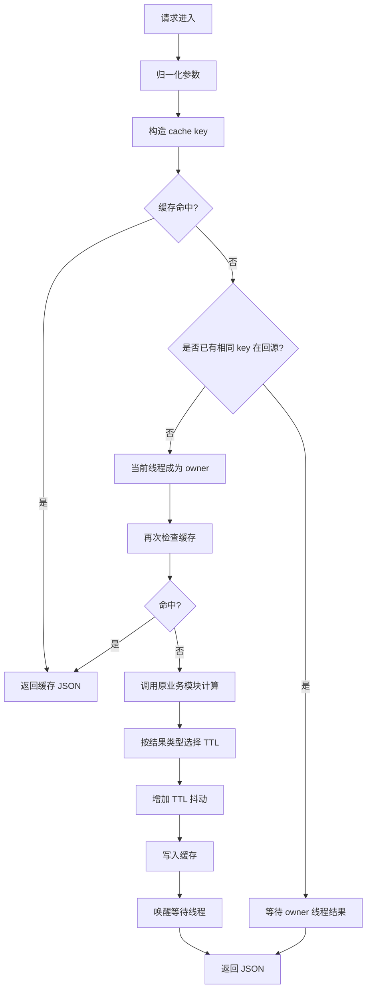

统计日志示例：

```text
[Cache] total=100 hit_rate=73.00% suggest_hit=30 suggest_miss=10 search_hit=43 search_miss=17 backend_compute=27 cache_put=27 empty_put=2 singleflight_wait=5
```

## 8. 在线关键词推荐算法

`KeywordRecommender` 的实现思路是“字符索引召回 + 编辑距离排序”。

查询流程：

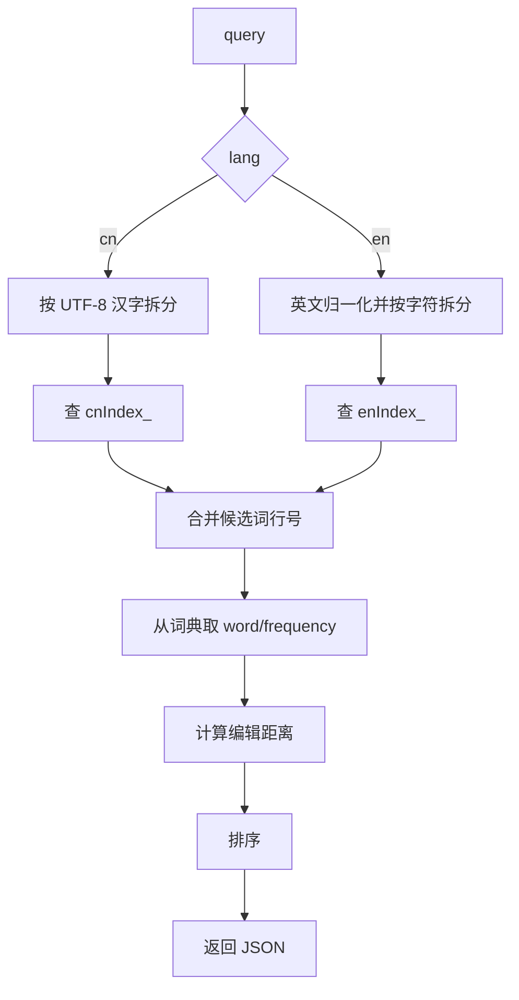

候选词召回：

1. 中文查询使用 `TextUtils::split_utf8_characters()` 拆成完整汉字。
2. 英文查询使用 `TextUtils::normalize_english_line()` 归一化为小写字母。
3. 对每个字符查询字符索引。
4. 合并所有行号并去重。

排序规则：

```text
1. distance 小的优先
2. distance 相同，frequency 大的优先
3. distance 和 frequency 都相同，word 字典序小的优先
```

## 9. 在线网页搜索算法

`WebSearcher` 使用“TF-IDF + 余弦相似度”的向量空间模型。

查询流程：

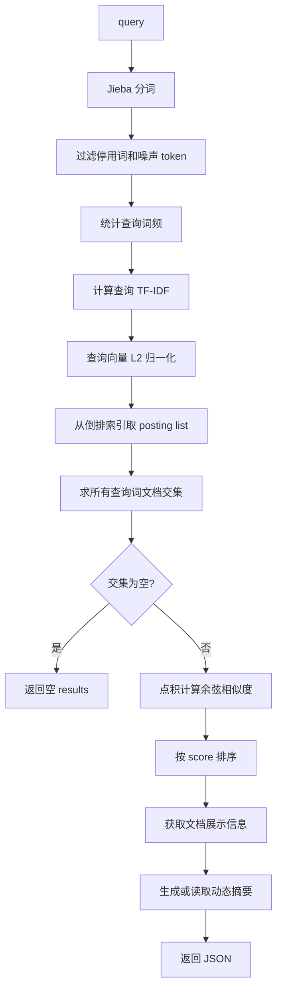

查询词 IDF：

```text
DF = 倒排索引中该词 posting list 的长度
N  = PageLibrary 偏移库中文档数量
IDF = log2(N / (DF + 1))
```

查询向量权重：

```text
TF = 查询词出现次数 / 查询有效词总数
weight = TF * IDF
```

文档召回规则：

1. 每个查询词必须存在于倒排索引。
2. 对所有查询词的 posting list 求文档 id 交集。
3. 如果交集为空，返回空数组。

相似度计算：

离线倒排索引中的文档权重已经归一化，在线查询向量也归一化，所以余弦相似度直接使用点积：

```text
score = sum(queryWeight(word) * docWeight(word))
```

排序规则：

```text
1. score 大的优先
2. score 相同，docId 小的优先
```

## 10. 网页库按需读取

第三期已经把 `PageLibrary` 从“启动时全量加载网页库”改为“启动时只加载偏移库，查询时按需读取网页库”。

当前数据成员：

```cpp
std::string pagesFile_;
std::unordered_map<int, PageOffset> offsets_;
```

启动阶段：

```text
PageLibrary::load(pages, offsets)
  -> 验证 pages.dat 可读
  -> 加载 offsets.dat 到 offsets_
  -> 保存 pages.dat 路径到 pagesFile_
```

查询阶段：

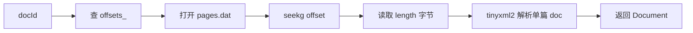

这样做的意义：

1. 启动时不再把所有网页正文加载到内存。
2. 词典库、字符索引和倒排索引仍保留全量内存加载，因为它们是高频查询结构。
3. 热点文档由 `WebSearcher` 的文档缓存保存，避免频繁随机读文件。
4. 每次 `find()` 使用局部 `ifstream`，多个线程不会共享文件读取位置。

## 11. 动态摘要

`DynamicAbstract` 根据网页正文和查询关键词生成摘要。它不是固定截取文章开头，而是优先选择关键词附近的正文窗口。

处理流程：

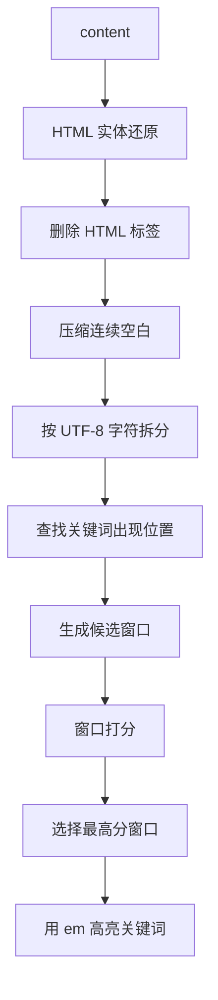

摘要长度来自配置项 `abstract_length`，当前配置为 `200`。

位置权重：

```text
文章开头 0%  - 20%   1.30
文章中间 20% - 80%   1.00
文章结尾 80% - 100%  1.15
```

摘要高亮格式：

```html
<em>关键词</em>
```

动态摘要缓存 key 包含 `docId`、摘要长度和查询关键词序列，因此不同查询不会错误复用摘要。

## 12. TLV 协议

TLV 外层消息格式：

```text
1 byte type + 4 bytes length + length bytes value
```

字段说明：

| 字段 | 类型 | 说明 |
| --- | --- | --- |
| `type` | `uint8_t` | 业务类型 |
| `length` | `uint32_t` | value 字节长度，网络字节序 |
| `value` | JSON 字符串 | 请求或响应内容 |

消息类型：

```text
1    关键词推荐
2    网页搜索
100  错误响应
```

`ProtocolCodec::try_decode()` 解析规则：

1. 可读字节少于 5 时返回 `false`。
2. 读取 `type` 和网络序 `length`。
3. `length > max_message_size` 时抛异常。
4. 可读字节少于 `5 + length` 时返回 `false`。
5. 完整消息到达后才从 `muduo::net::Buffer` 中取走数据。

关键词推荐请求：

```json
{
  "query": "搜索",
  "lang": "cn",
  "topk": 5
}
```

网页搜索请求：

```json
{
  "query": "汽车 召回",
  "topk": 3
}
```

`topk` 在 TLV 请求中可选；未传时使用配置文件中的 `keyword_topk` 或 `web_topk`。

## 13. HTTP 服务和浏览器前端

`WebHttpServer` 监听 `http_port`，默认 `18888`。它在同一个 `search_server` 进程中完成两件事：

1. 返回静态文件：`/`、`/index.html`、`/styles.css`、`/app.js`。
2. 提供 HTTP API：`POST /api/suggest`、`POST /api/search`。

HTTP API 不通过 Python 代理，也不转发到 TLV 端口，而是直接调用当前进程中的 `CachedSearchService`。

浏览器访问：

```text
http://127.0.0.1:18888
```

HTTP API 示例：

```bash
curl -s -X POST http://127.0.0.1:18888/api/suggest \
  -H 'Content-Type: application/json' \
  --data '{"query":"搜索"}'

curl -s -X POST http://127.0.0.1:18888/api/search \
  -H 'Content-Type: application/json' \
  --data '{"query":"汽车 召回"}'
```

HTTP 接口的返回数量由服务端配置控制，浏览器请求不覆盖 `topK`。

## 14. 响应 JSON

关键词推荐响应：

```json
{
  "type": "keyword",
  "query": "搜索",
  "lang": "cn",
  "results": [
    {
      "word": "探索",
      "distance": 1,
      "frequency": 26
    }
  ]
}
```

网页搜索响应：

```json
{
  "type": "web",
  "query": "汽车 召回",
  "results": [
    {
      "id": 55,
      "title": "两车企同日召回进口牧马人及奥迪Q7",
      "link": "http://auto.people.com.cn/n1/2021/0125/c1005-32010571.html",
      "abstract": "...<em>汽车</em>...<em>召回</em>...",
      "score": 0.6984652717
    }
  ]
}
```

错误响应：

```json
{
  "error": "invalid request",
  "message": "query is empty"
}
```

空结果响应仍保持固定结构：

```json
{
  "type": "web",
  "query": "不存在的查询",
  "results": []
}
```

## 15. 测试方式

### 15.1 编译验证

```bash
cmake -S . -B build
cmake --build build
```

预期两个目标都构建成功：

```text
Built target offline_builder
Built target search_server
```

### 15.2 启动 Redis

当前配置中 `redis_cache_enabled=1`。如果本机 Redis 已运行，`search_server` 会使用 Redis 作为 L2 缓存。

如果 Redis 未运行，服务仍会继续工作；Redis 相关操作会按缓存未命中或写入失败处理。为了减少日志和连接失败开销，也可以临时关闭：

```text
redis_cache_enabled=0
```

### 15.3 启动服务

```bash
./bin/search_server
```

启动后默认可访问：

```text
TLV:  127.0.0.1:8888
HTTP: http://127.0.0.1:18888
```

### 15.4 浏览器测试

打开：

```text
http://127.0.0.1:18888
```

页面提供统一搜索框。输入文本时显示推荐词；提交搜索时展示网页结果。

### 15.5 使用 TLV 测试客户端

`tests/tlv_client/` 目录提供 C++ TLV 测试客户端。

编译：

```bash
cd tests/tlv_client
make
```

关键词推荐测试：

```bash
./tlv_client --type keyword --query "搜索" --lang cn --topk 5
```

网页搜索测试：

```bash
./tlv_client --type web --query "汽车 召回" --topk 3
```

直接发送自定义 JSON：

```bash
./tlv_client --type 1 --raw-json '{"query":"搜索","lang":"cn","topk":5}'
```

更详细的参数说明见 `tests/tlv_client/README.md`。缓存算法综合测试位于
`tests/cache_policy/`，HTTP P50/P95/P99 与 QPS 压测位于 `tests/http_load/`；
测试总览见 `tests/README.md`。

## 16. 当前实现边界

当前第三期已经完成第一阶段到第十阶段缓存改造，仍保留以下边界：

1. L1 已实现完整 W-TinyLFU 组件；当前 Count-Min Sketch 使用较易理解的固定 4 行设计，尚未采用 Caffeine 更复杂的 hill climbing 自适应窗口调节。
2. Redis L2 当前使用 hiredis 短连接，没有实现连接池和 pipeline。
3. Redis 只作为加速层，不保证强一致性，也不作为唯一数据源。
4. 网页召回严格要求包含所有查询词，没有做降级召回。
5. 网页搜索使用 TF-IDF 和余弦相似度，没有引入 BM25。
6. 动态摘要做轻量 HTML 清理，不实现完整 HTML 解析器。
7. HTTP 服务只实现浏览器测试需要的能力，不作为通用 Web 框架。

## 17. 关键源码入口

| 功能 | 文件 |
| --- | --- |
| 离线入口 | `src/offline/offline_main.cc` |
| 在线入口 | `src/online/online_main.cc` |
| 配置读取 | `src/common/Config.cc` |
| 关键词离线建库 | `src/offline/KeywordProcessor.cc` |
| 网页离线建库 | `src/offline/PageProcessor.cc` |
| 缓存接口 | `include/cache/Cache.h` |
| TinyLFU 频率估计器 | `src/cache/TinyLfuFrequencySketch.cc` |
| L1 分片 W-TinyLFU | `src/cache/ShardedWTinyLfuCache.cc` |
| L1 分片 LRU | `src/cache/ShardedLruCache.cc` |
| Redis L2 | `src/cache/RedisCache.cc` |
| 二级缓存组合 | `src/cache/TwoLevelCache.cc` |
| 缓存业务服务 | `src/cache/CachedSearchService.cc` |
| TLV 协议 | `src/online/ProtocolCodec.cc` |
| TLV 服务 | `src/online/SearchServer.cc` |
| HTTP 服务 | `src/online/WebHttpServer.cc` |
| 在线关键词推荐 | `src/online/KeywordRecommender.cc` |
| 在线网页搜索 | `src/online/WebSearcher.cc` |
| 网页库按需读取 | `src/online/PageLibrary.cc` |
| 动态摘要 | `src/online/DynamicAbstract.cc` |

## 18. 总结

V3 当前实现已经形成“离线建库 + 在线查询 + 二级缓存”的结构：

```text
offline_builder 负责生成基础数据
search_server 负责加载基础数据并响应 TLV/HTTP 查询
CachedSearchService 负责最终结果缓存、singleflight 和统计
WebSearcher 负责网页搜索、按需读取网页库和细粒度缓存
```

第三期已落地的核心能力：

1. L1 分片完整 W-TinyLFU 本地缓存，并保留分片 LRU 回退策略。
2. hiredis Redis L2 缓存。
3. L1 + L2 二级缓存组合。
4. 关键词推荐和网页搜索最终结果缓存。
5. 文档展示信息和动态摘要片段缓存。
6. singleflight 合并相同 key 的并发回源。
7. 空结果短 TTL 缓存。
8. TTL 随机抖动。
9. 缓存命中率统计日志。
10. 网页库正文按需从文件读取。
11. Window LRU + Main SLRU + Count-Min Sketch + Doorkeeper + Frequency Aging。

十个缓存改造阶段均已完成。后续工程优化可聚焦 Redis 连接池、真实查询流量压测和基于运行指标的窗口比例调优。
