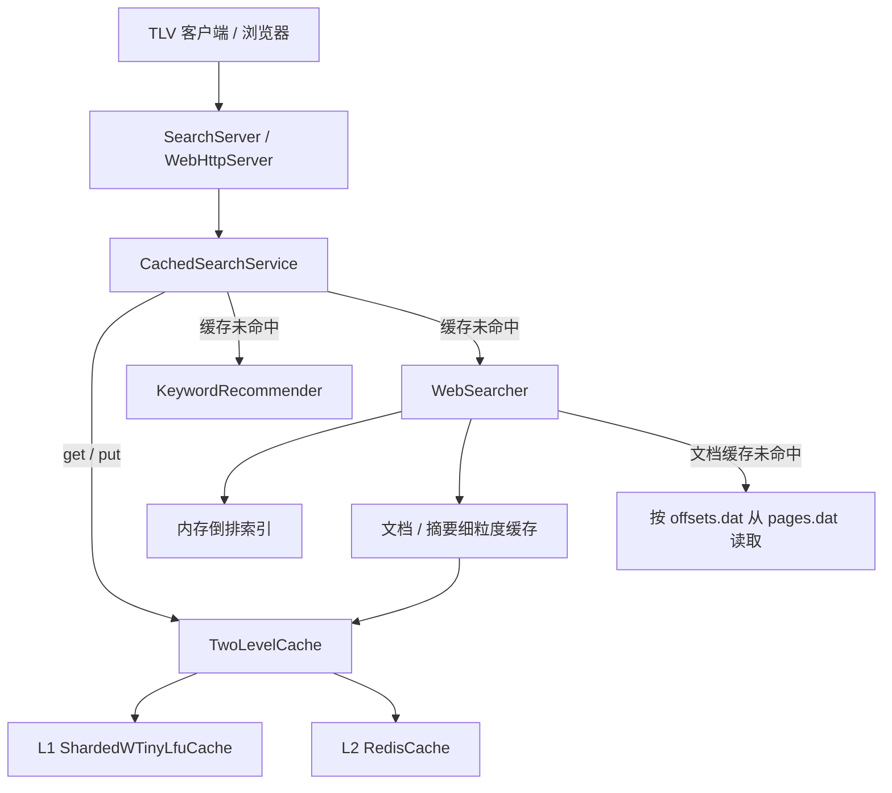
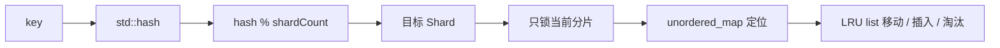
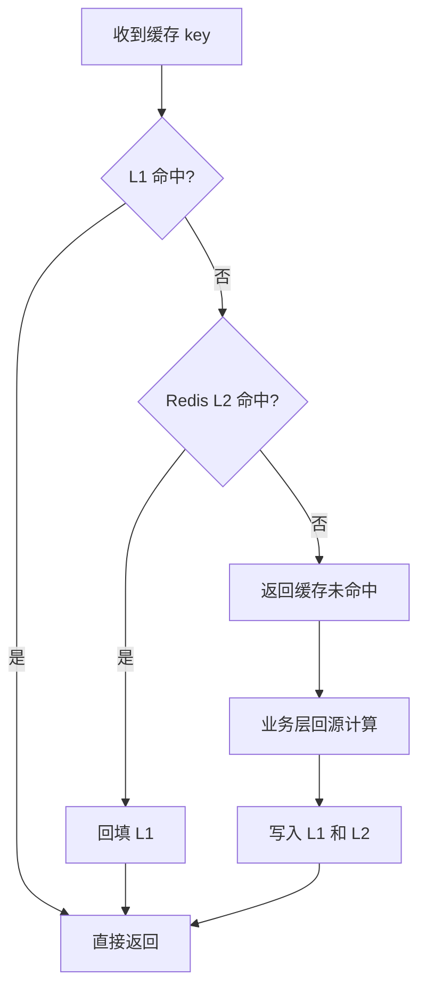
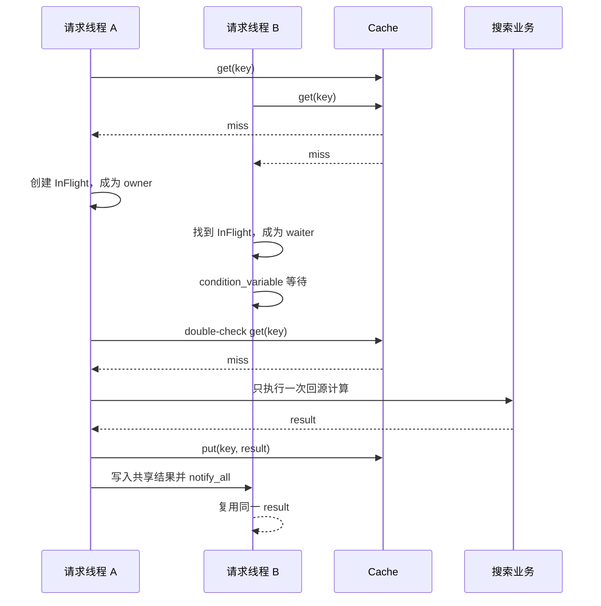
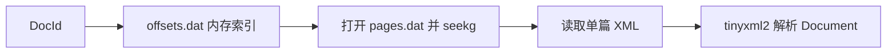
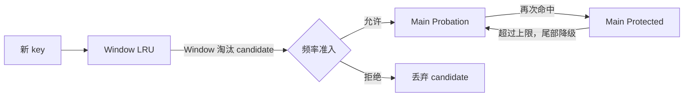
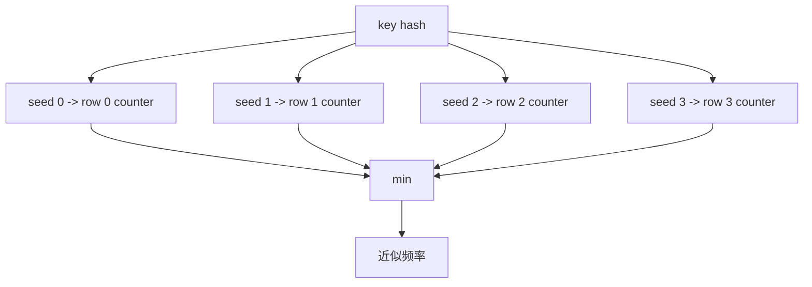
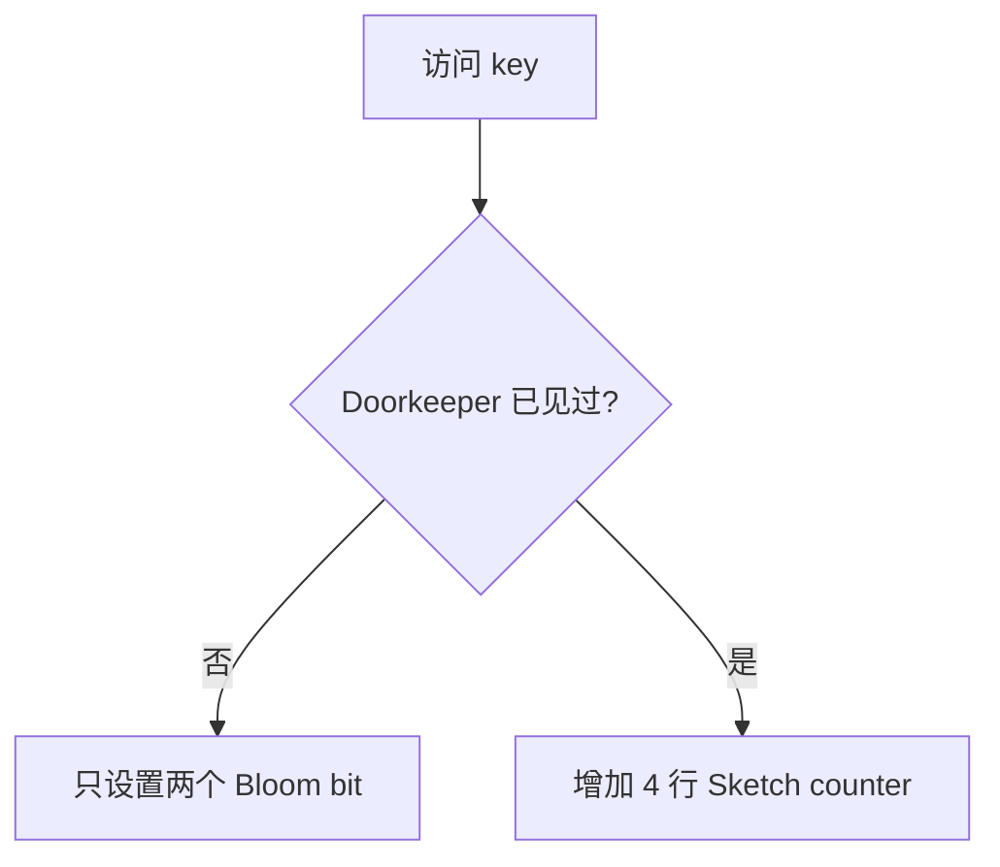
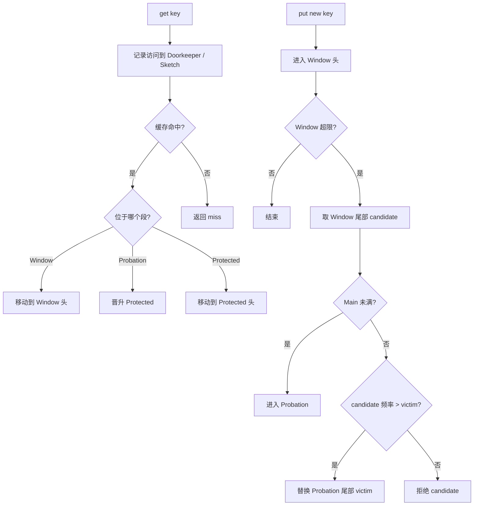

# 搜索引擎第三期缓存技术详解

## 1. 文档目标

本文基于 `03_SearchEngine_V3` 当前实际代码，完整说明缓存功能从无到有、从简单到完整的演进过程：

```text
分片 LRU 一级缓存
  -> Redis 二级缓存
  -> singleflight / 空结果缓存 / TTL 抖动
  -> 简化 W-TinyLFU
  -> 完整 W-TinyLFU
```

重点回答以下问题：

1. 为什么搜索引擎需要缓存，而不只是把词典和索引放在内存中？
2. L1、L2 分别解决什么问题？
3. 如何避免并发缓存未命中导致重复回源？
4. 为什么 LRU 会被一次性搜索词污染？
5. W-TinyLFU 如何同时利用“最近访问”和“访问频率”？
6. `28.71% -> 35.16%` 应当如何客观解读？

本文既可以作为项目设计文档，也可以直接作为技术分享的讲解提纲。

---

## 2. 先区分基础数据与缓存数据

### 2.1 基础数据

在线搜索依赖以下离线构建结果：

| 数据 | 在线加载方式 | 用途 |
| --- | --- | --- |
| 中英文词典 | 全量加载内存 | 关键词推荐候选与词频 |
| 中英文字符索引 | 全量加载内存 | 根据字符快速找到候选词 |
| 倒排索引 | 全量加载内存 | 根据查询词召回文档并计算权重 |
| 网页偏移库 | 全量加载内存 | 定位文档在 `pages.dat` 中的字节范围 |
| 网页正文库 | 按需读取文件 | 获取最终结果所需标题、链接和正文 |

词典、字符索引和倒排索引属于搜索算法的基础数据。它们需要被大量随机访问，加载到内存是为了保证查询计算可用且高效。

### 2.2 缓存数据

缓存保存的是能够从基础数据重新计算出来的派生结果：

| 缓存对象 | value | 避免的工作 |
| --- | --- | --- |
| 关键词推荐结果 | 最终 JSON | 编辑距离计算、候选排序和 JSON 构造 |
| 网页搜索结果 | 最终 JSON | 分词、倒排召回、相似度排序、文档读取、摘要生成 |
| 文档展示信息 | 序列化 `Document` | `pages.dat` 随机读取和 XML 解析 |
| 动态摘要 | 摘要字符串 | 根据查询词重新截取摘要片段 |

二者的本质区别是：

```text
基础数据是计算输入，通常必须存在；
缓存数据是计算结果，可以丢失，未命中时可以重新计算。
```

因此，“索引已经在内存中”不等于“没有必要缓存”。即使索引查找很快，完整搜索仍包含分词、集合求交、排序、文件读取、XML 解析、摘要生成和 JSON 序列化。缓存命中可以绕过整条计算链路。

---

## 3. 最终缓存架构



各层职责如下：

| 层次 | 主要类 | 职责 |
| --- | --- | --- |
| 网络层 | `SearchServer`、`WebHttpServer` | 解析 TLV/HTTP 请求并返回响应 |
| 缓存业务层 | `CachedSearchService` | key 构造、Cache-Aside、singleflight、空结果 TTL、TTL 抖动、统计 |
| 缓存组合层 | `TwoLevelCache` | L1/L2 查询顺序、L2 命中回填、双写和双删 |
| L1 本地缓存 | `ShardedWTinyLfuCache` | 进程内高速缓存、并发控制、TTL、容量淘汰 |
| L2 分布式缓存 | `RedisCache` | 跨进程共享、服务重启后复用热点结果 |
| 原业务层 | `KeywordRecommender`、`WebSearcher` | 真正执行推荐与搜索计算 |

所有缓存实现统一遵循 `Cache` 接口：

```cpp
class Cache {
public:
    virtual bool get(const std::string& key, std::string& value) = 0;
    virtual void put(const std::string& key,
                     const std::string& value,
                     int ttlSeconds) = 0;
    virtual void erase(const std::string& key) = 0;
};
```

统一接口带来两个直接收益：

1. 业务层不需要知道当前使用 LRU、W-TinyLFU、Redis 还是二级组合。
2. 淘汰算法升级时不需要修改网络层、搜索算法或 Redis 实现。

---

## 4. 缓存 key 设计

缓存 key 必须描述“哪些参数变化会导致结果变化”。如果遗漏参数，不同请求可能错误复用同一个结果。

### 4.1 关键词推荐

格式：

```text
v:{version}:suggest:{lang}:{topK}:{queryLength}:{query}
```

包含：

- `cacheVersion`：隔离不同版本的离线数据。
- `lang`：区分中文和英文推荐。
- `topK`：不同返回数量不能共用结果。
- `queryLength + query`：避免简单字符串拼接产生边界歧义。

### 4.2 网页搜索

格式：

```text
v:{version}:search:{topK}:{abstractLength}:{queryLength}:{query}
```

搜索 key 额外包含 `abstractLength`，因为摘要长度会改变最终 JSON。

### 4.3 文档与摘要

```text
v:{version}:doc:{docId}
v:{version}:abstract:{docId}:{abstractLength}:{keywordLength}:{keyword}...
```

文档信息只与 `docId` 和数据版本有关；动态摘要还取决于查询关键词与摘要长度。

查询进入缓存前会先做有限归一化：去除首尾 ASCII 空白，并把连续空白压缩成一个空格。这样 `"汽车 召回"` 和 `"  汽车   召回  "` 可以使用同一个 key。

---

## 5. 第一阶段：分片 LRU 一级缓存

### 5.1 为什么先实现 LRU

LRU 的规则非常直观：

```text
最近访问的数据放在链表头部；
容量不足时淘汰最久没有访问的链表尾部。
```

它适合作为第一版 L1：实现简单、平均访问复杂度为 `O(1)`，并且能快速验证 Cache-Aside 主流程是否正确。

### 5.2 数据结构

每个分片包含：

```text
list<Entry>                                  维护访问顺序
unordered_map<string, list<Entry>::iterator> O(1) 定位节点
mutex                                        保护分片状态
```



`get()` 命中后通过 `std::list::splice()` 将节点移动到头部，不复制节点；`put()` 插入头部；超过容量时删除尾部。

### 5.3 为什么要分片

如果整个缓存只有一把锁，所有 muduo 工作线程的 `get()` 和 `put()` 都会竞争同一个临界区。分片后，不同 key 大概率落在不同锁上：

```text
全局锁：所有请求 -> 1 把锁
分片锁：请求 -> hash -> 32 个分片中的 1 个锁
```

当前默认配置：

```text
l1_cache_capacity=4096
l1_cache_shards=32
```

总容量会尽量平均拆分到各个分片，并保证分片容量总和严格等于配置容量。

### 5.4 TTL

每个 `Entry` 保存绝对过期时间，使用 `std::chrono::steady_clock`，避免系统时间调整影响 TTL。

```text
ttlSeconds > 0   到期失效
ttlSeconds <= 0  永不过期，只受容量淘汰影响
```

过期项采用惰性清理：读取命中过期项时删除；写入前顺带扫描当前分片的过期项。当前实现不额外启动后台清理线程。

### 5.5 LRU 的局限

LRU 只知道“最近是否访问”，不知道“是否经常访问”。如果短时间出现大量只访问一次的 query，它们会依次进入缓存并把稳定热点挤出去，这称为缓存污染或扫描污染。

---

## 6. 第二阶段：接入 Redis，形成二级缓存

### 6.1 L1 与 L2 的职责

| 对比项 | L1 本地缓存 | L2 Redis |
| --- | --- | --- |
| 位置 | 搜索进程内部 | 独立 Redis 服务 |
| 访问延迟 | 最低，无网络往返 | 较高，需要本机 TCP 通信 |
| 共享范围 | 当前进程 | 多进程可共享 |
| 服务重启 | 数据丢失 | Redis 未重启时仍可保留 |
| 容量 | 受搜索进程内存约束 | 可独立配置 |
| 故障影响 | L1 失效时回源 | Redis 失败时降级，不影响搜索正确性 |

二级缓存不是为了“访问两次更快”，而是把两个层次的优势组合起来：

```text
L1 提供最低延迟；
L2 提供跨进程共享与重启后的热点复用。
```

### 6.2 读取流程



`TwoLevelCache::get()` 先查 L1，L1 未命中再查 Redis；Redis 命中后使用 `redis_l1_backfill_ttl_seconds` 回填 L1。`put()` 先写 L1，再写 L2；`erase()` 同时删除两级。

### 6.3 Redis 实现

`RedisCache` 使用 hiredis 同步客户端：

- `redisConnectWithTimeout()`：建立连接。
- `redisSetTimeout()`：限制命令读写时间。
- `GET`：读取。
- `SETEX`：带 TTL 写入。
- `SET`：写入不过期数据。
- `DEL`：删除。
- `SELECT`：选择 Redis DB。

key 和 value 使用 hiredis `%b` 二进制安全参数，并通过 `redisReply::len` 构造字符串，不依赖 C 字符串结尾。

当前每条命令创建短连接。优点是连接不在线程间共享，故障隔离简单；缺点是每次都需要建连。它适合当前课程项目，但高吞吐部署应进一步使用线程绑定连接或连接池。

### 6.4 降级原则

Redis 在本项目中只是加速层，不是数据源：

```text
Redis get 失败   -> 当作未命中，继续回源
Redis put 失败   -> 忽略写失败，当前响应仍正常返回
Redis erase 失败 -> 不阻断业务
```

默认建连和命令超时均为 20ms，避免 Redis 卡顿长时间占用搜索工作线程。

---

## 7. 缓存击穿保护：singleflight

### 7.1 问题

假设一个热点 key 刚刚过期，同时有 100 个请求到达。如果每个线程都发现缓存未命中并独立执行搜索，就会瞬间产生 100 次相同回源计算。

singleflight 的目标是：

```text
同一个 key 同一时刻只允许一个 owner 回源；
其余线程等待并复用 owner 的结果；
不同 key 仍然可以并发计算。
```

### 7.2 当前实现

`CachedSearchService` 维护：

```text
unordered_map<key, shared_ptr<InFlight>> inFlight_
mutex inFlightMutex_
```

每个 `InFlight` 包含自己的 `mutex`、`condition_variable`、结果、完成标记和异常。



owner 获得资格后会再次查询缓存。这次 double-check 用于处理竞态：第一次 miss 与注册 `InFlight` 之间，其他线程可能已经写入了结果。

回源异常通过 `std::exception_ptr` 保存并传递给所有等待线程，避免 waiter 永久阻塞或拿到不完整结果。

---

## 8. 空结果缓存与 TTL 抖动

### 8.1 空结果缓存

不存在结果的 query 也可能被频繁请求。如果完全不缓存空结果，每次请求都会穿透 L1/L2 并执行完整搜索，这属于缓存穿透。

当前代码解析最终 JSON 的 `results` 数组：若数组为空，仍然缓存结果，但使用更短 TTL。

```text
普通结果 TTL：l1_cache_ttl_seconds=600
空结果 TTL：  l1_empty_ttl_seconds=60
```

短 TTL 在两个目标之间折中：

1. 避免相同无效 query 持续回源。
2. 避免空结果长期占据空间，也避免数据更新后长时间返回旧空结果。

### 8.2 TTL 抖动

如果一批 key 在同一时间写入并使用完全相同的 TTL，它们可能在同一秒集中失效，形成缓存雪崩。

当前实际 TTL 为：

```text
actualTTL = baseTTL + random(0, cache_ttl_jitter_seconds)
```

默认抖动范围是 0 到 30 秒。随机数生成器使用 `thread_local`，每个工作线程拥有独立状态，不需要全局随机锁。

`baseTTL <= 0` 表示永不过期，此时不进行抖动。

---

## 9. 文档与动态摘要细粒度缓存

网页正文库已经从“启动时全量加载”改为“根据偏移按需读取”：



这降低了常驻内存，但热点文档可能被重复读取。因此 `WebSearcher` 在最终搜索结果缓存之外，又增加两类缓存：

1. `docId -> Document JSON`：避免重复文件读取和 XML 解析。
2. `docId + keywords + abstractLength -> abstract`：避免重复生成动态摘要。

这是典型的多粒度缓存：最终结果缓存命中时最省工作；最终结果未命中时，文档与摘要缓存仍可减少回源成本。

---

## 10. 第三阶段：从 LRU 升级为简化 W-TinyLFU

### 10.1 为什么不是直接使用 LFU

纯 LFU 会保护长期高频数据，但也存在两个问题：

1. 新热点初始频率低，很难进入缓存。
2. 已经过时的旧热点可能依靠历史高频长期占据空间。

W-TinyLFU 将“近期性”和“频率”组合起来：

```text
Window LRU 负责快速接纳新数据；
Main SLRU 负责保护稳定热点；
Frequency Estimator 负责决定候选是否值得进入 Main。
```

### 10.2 分段结构



规则如下：

1. 所有新值先进入 Window。
2. Window 超过容量时产生 candidate。
3. Main 未满时 candidate 直接进入 Probation。
4. Main 已满时，candidate 与 Probation 尾部 victim 比较频率。
5. 只有 `frequency(candidate) > frequency(victim)` 才替换。
6. 频率相同保留旧 victim，优先抵抗一次性扫描。
7. Probation 命中后晋升 Protected。
8. Protected 超过上限时，最久未访问节点降级回 Probation，而不是直接删除。

### 10.3 简化版本的频率估计

第九阶段首先使用：

```text
unordered_map<key, exactFrequency>
```

每次访问精确加一，达到采样阈值后所有频率减半并清理 0 值。这一版的价值是先验证 Window、SLRU 和准入策略是否正确。

它的缺点也很明确：频率表仍可能随采样周期内不同 query 数量增长，不是严格固定空间。因此它只是向完整 W-TinyLFU 过渡的实现，当前最终代码中已经被下一节的概率型估计器替代。

---

## 11. 第四阶段：完整 W-TinyLFU

完整实现保留 Window、Main SLRU 和 Admission Policy，并将精确频率表替换为：

```text
Count-Min Sketch + Doorkeeper + Frequency Aging
```

实现类为 `TinyLfuFrequencySketch`。

### 11.1 Count-Min Sketch

当前使用 4 行计数器。对同一个 key 进行 4 次不同种子的哈希扰动，每行找到一个计数槽：

```text
estimate(key) = min(row0, row1, row2, row3)
```

哈希冲突只会导致计数被高估，不会低估。取最小值可以降低单行冲突的影响。



每个 counter 使用 4 bit，两个 counter 打包进一个字节，范围为 0 到 15。达到 15 后饱和，不继续增加，避免整数回绕。

每行宽度约为分片容量的 2 倍，并向上取 2 的幂。这样索引可使用位与运算：

```text
column = mixedHash & (width - 1)
```

### 11.2 Doorkeeper

Doorkeeper 是一个 Bloom Filter。每个 key 设置两个 bit，用于判断该 key 在当前采样周期是否已经出现过。



它解决的问题是：搜索流量中有大量只出现一次的长尾 query。如果第一次访问就写 Count-Min Sketch，这些 query 会增加碰撞和噪声。Doorkeeper 让第一次访问只留下一个很轻的 Bloom 证据，第二次访问才进入主计数器。

估计频率为：

```text
min(4 rows) + doorkeeperEvidence
```

因此当前估算值范围为 0 到 16。

Bloom Filter 可能有假阳性，但这里只会提供 `+1` 的弱证据，不会导致频率无限放大。

### 11.3 Frequency Aging

默认每个分片累计：

```text
shardCapacity * l1_wtinylfu_frequency_sample_multiplier
```

次访问后触发老化。默认倍数为 10。

老化操作：

1. 所有 4-bit counter 同时除以 2。
2. 清空 Doorkeeper。
3. 重置本采样周期计数。

两个 4-bit counter 打包在一个字节中，可以通过：

```text
(packed >> 1) & 0x77
```

同时完成两个半字节的除 2，并防止高半字节最低位串入低半字节。

Frequency Aging 使频率描述“近期一段时间的热度”，而不是进程启动以来的永久历史。

### 11.4 固定空间

默认总容量 4096、32 个分片，每个分片容量约 128：

```text
Count-Min Sketch: 512 bytes / shard
Doorkeeper:       128 bytes / shard
合计:             640 bytes / shard
32 分片总计:      20480 bytes
```

这些内存在构造时一次分配。即使服务接收到数百万个不同 query，频率估计器也不会为每个 query 创建节点。

### 11.5 完整访问流程



---

## 12. 并发与可用性设计

当前实现使用三种不同粒度的并发控制：

| 保护对象 | 锁粒度 | 原因 |
| --- | --- | --- |
| L1 Entry、链表、索引、频率估计器 | 每个 Shard 一把锁 | 不同分片并行；同分片保持数据结构一致性 |
| 正在回源的 key 表 | 一把短临界区全局锁 | 只执行查表和插表，不包围搜索计算 |
| 单个回源状态 | 每个 key 独立 mutex + condition variable | waiter 只等待相同 key |

Redis 使用每次命令独立短连接，因此没有多个线程同时操作同一个 `redisContext` 的问题。

可用性原则：

1. 缓存未命中不是错误，必须能够回源。
2. Redis 不可用不能让搜索服务不可用。
3. owner 回源异常必须唤醒 waiter 并传播异常。
4. 离线数据更新后通过 `cache_version` 隔离旧结果。
5. singleflight 只合并同 key，不阻塞不同 query。

---

## 13. 如何客观看待 28.71% 到 35.16%

### 13.1 原始结果

确定性基准配置：

```text
缓存容量：100
分片数量：1
总请求数：6200
稳定热点：20 个
扫描流量：每轮 200 个永不重复 query，共 20 轮
```

结果：

```text
LRU hits:        1780 / 6200 = 28.71%
W-TinyLFU hits:  2180 / 6200 = 35.16%
绝对提升:                         6.45 个百分点
```

还可以换三个角度计算：

```text
命中次数增加：400 次
命中数相对增长：400 / 1780 = 22.47%
回源次数下降：400 / 4420 = 9.05%
```

“相对增长 22.47%”和“提升 6.45 个百分点”不是同一个概念。对外表达时应优先报告两个原始命中率和百分点差值，避免只说“提升 22.47%”造成误解。

### 13.2 在这条测试中是什么水平

这条流量共有 4020 个不同 key：

```text
20 个热点首次访问 + 4000 个只访问一次的扫描 key = 4020 次强制未命中
```

所以任何容量有限且没有预加载的缓存，理论最多只能命中：

```text
6200 - 4020 = 2180 次
2180 / 6200 = 35.16%
```

当前 W-TinyLFU 恰好命中 2180 次，等于这条合成流量的理论上限。也就是说：

> 在“稳定热点被大量一次性 query 冲刷”这一专门测试目标上，当前结果是优秀的，说明 W-TinyLFU 成功保留了所有可复用热点。

LRU 少命中 400 次，正好对应 20 轮扫描后每轮 20 个热点的第一次重新访问。它们被扫描流量淘汰，之后同轮剩余重复访问才重新命中。

### 13.3 为什么不能直接推广到真实业务

该基准没有测量：

- 真实搜索日志中的 Zipf 分布和热点变化速度。
- 多分片下容量分布不均的影响。
- TTL 到期和 Redis L2 命中。
- 多线程锁竞争。
- LRU 与 W-TinyLFU 单次操作的 CPU 开销。
- P50/P95/P99 延迟和实际 QPS。
- 不同缓存容量、Window 比例和采样倍数。

因此准确结论应当是：

```text
该基准证明完整 W-TinyLFU 的扫描抗污染机制有效；
不能仅凭该基准断言真实业务命中率一定提高 6.45 个百分点。
```

绝对命中率 `35.16%` 看起来不高，是因为测试故意让约 64.84% 的请求成为不可复用的一次性 key。在这个前提下，35.16% 已经是上限，不能脱离请求组成单独评价。

### 13.4 当前新增的综合验证

当前 `tests/cache_policy/cache_policy_benchmark.cc` 已增加以下流量模型：

| 场景 | 目的 |
| --- | --- |
| 扫描污染 | 验证一次性 query 是否冲掉稳定热点 |
| Zipf 1.1 | 模拟头部热点与长尾并存 |
| 均匀随机 | 观察无明显热点时的收益与算法开销 |
| 热点迁移 | 验证旧热点衰减和新热点接纳速度 |
| 突发长尾 | 模拟热点流量中持续混入一次性 query |
| 循环工作集 | 验证工作集大于/小于缓存容量时的行为 |

每种场景会比较多个容量，并输出命中率、P50/P95/P99、缓存操作 QPS、准入、拒绝和老化次数。

扩充测试也验证了 W-TinyLFU 并非所有情况下都更优。在一次 5000 请求短基准中，热点迁移场景、容量 100 时：

```text
LRU hit rate:        87.38%
W-TinyLFU hit rate:  81.40%
```

原因是 W-TinyLFU 会保护旧热点，新热点需要积累频率后才能替换 victim；LRU 对热点快速整体迁移可能适应更快。均匀随机场景中两者命中率接近，但 W-TinyLFU 需要额外维护 Window、SLRU、Sketch 和 Doorkeeper，单次操作成本通常更高。

因此更全面的结论是：

```text
W-TinyLFU 强项是稳定热点 + 长尾/扫描流量；
LRU 在结构简单、热点快速迁移或缺少可复用热点时可能更合适。
```

基准还支持 `--trace FILE` 按原始顺序回放脱敏查询日志。进一步的容量矩阵建议如下：

| 变量 | 建议值 |
| --- | --- |
| 缓存策略 | LRU、W-TinyLFU |
| 容量 | 1K、4K、16K、64K |
| 分片数 | 1、8、32 |
| Window 比例 | 1%、5%、10%、20% |
| 流量 | 原顺序重放、突发热点、扫描注入、热点切换 |

记录：

- 总命中率、L1/L2 分层命中率。
- 回源计算次数。
- candidate admission/rejection。
- Frequency Aging 次数。
- P50/P95/P99 延迟。
- QPS、CPU 和内存。

算法基准中的延迟只包含本地缓存操作。`tests/http_load/http_load_test.py` 会并发请求真实 HTTP 服务，输出端到端 P50/P95/P99、QPS、错误数和状态码分布。只有真实日志下的命中率、端到端延迟和资源使用同时改善，才能得出生产性能结论。

---

## 14. 配置说明

```ini
cache_enabled=1
cache_version=search_engine_v3_001

l1_cache_enabled=1
l1_cache_capacity=4096
l1_cache_shards=32
l1_cache_policy=wtinylfu
l1_wtinylfu_window_percent=1
l1_wtinylfu_protected_percent=80
l1_wtinylfu_frequency_sample_multiplier=10
l1_cache_ttl_seconds=600
l1_empty_ttl_seconds=60
cache_ttl_jitter_seconds=30

document_cache_ttl_seconds=600
abstract_cache_ttl_seconds=600
cache_stats_log_interval=100

redis_cache_enabled=1
redis_host=127.0.0.1
redis_port=6379
redis_db=0
redis_connect_timeout_ms=20
redis_command_timeout_ms=20
redis_l1_backfill_ttl_seconds=600
```

重要调整原则：

1. 离线数据重建后修改 `cache_version`。
2. `l1_cache_policy=lru` 可作为回退与对照。
3. 分片数不是越多越好；分片容量过小会降低淘汰策略的发挥空间。
4. Window 太小可能不利于新热点，太大则更接近普通 LRU。
5. TTL 应结合数据更新频率和内存预算设置。

---

## 15. 测试、统计与验收

### 15.1 自动测试

```bash
cd tests/cache_policy
make test
make benchmark
```

`cache_policy_test` 覆盖：

- Doorkeeper 第一次访问行为。
- Count-Min Sketch 第二次访问计数。
- 4-bit counter 饱和。
- Frequency Aging。
- 频率估计器内存不增长。
- 扫描流量热点保护。
- TTL 与 `erase()`。
- 8 线程并发读写删除。

`cache_policy_benchmark` 使用相同 trace 分别重放 LRU 和 W-TinyLFU。它只在容量 100 的确定性扫描场景保留性能回归断言；其他场景如实报告结果，不预设 W-TinyLFU 必须获胜。

真实日志回放示例：

```bash
./cache_policy_benchmark \
  --trace sample_trace.txt \
  --capacities 1024,4096,16384 \
  --shards 32 \
  --repeats 3
```

HTTP 端到端压测：

```bash
cd ../http_load
python3 http_load_test.py \
  --query-file sample_queries.txt \
  --requests 5000 \
  --concurrency 32 \
  --warmup 200
```

一次真实 LRU/W-TinyLFU、Redis 开关、并发矩阵和 singleflight 压测结果见 `docs/项目第三期HTTP压测报告.md`。

### 15.2 运行日志

`CachedSearchService` 周期输出：

```text
[Cache] total=...
hit_rate=...
suggest_hit=...
suggest_miss=...
search_hit=...
search_miss=...
backend_compute=...
cache_put=...
empty_put=...
singleflight_wait=...
```

命中率不能单独判断缓存效果。应结合 `backend_compute` 和 `singleflight_wait`：即使命中率不高，singleflight 仍可能显著减少热点过期时的并发回源。

---

## 16. 演进过程中的设计取舍

| 选择 | 当前方案 | 原因与代价 |
| --- | --- | --- |
| L1 并发 | 分片互斥锁 | 简单可靠；同分片仍串行 |
| L2 客户端 | hiredis 短连接 | 无共享连接状态；每次建连有额外开销 |
| 一致性 | Cache-Aside + 版本 key | 缓存只保存可重建结果；不追求强一致 |
| 过期清理 | 惰性清理 | 无后台线程；过期项可能暂时占空间 |
| 准入比较 | candidate 必须严格高于 victim | 抵抗扫描；频率相同时偏向保留旧值 |
| 频率估计 | 4 行、4-bit Count-Min Sketch | 固定小内存；存在概率碰撞和饱和 |
| 首次访问过滤 | 双哈希 Bloom Doorkeeper | 固定空间；允许少量假阳性 |
| 热度时效 | 周期减半 | 实现清晰；不是连续时间衰减 |

当前实现没有照搬 Caffeine 的全部工程优化，例如自适应 Window hill climbing、写缓冲和异步维护队列。这里的“完整 W-TinyLFU”是指项目改造流程定义的核心组件已经齐全，而不是声称与 Caffeine 实现完全等价。

---

## 17. 源码导航

| 功能 | 文件 / 方法 |
| --- | --- |
| 统一接口 | `include/cache/Cache.h` |
| 原分片 LRU | `ShardedLruCache::get/put/erase` |
| 完整 W-TinyLFU | `ShardedWTinyLfuCache` |
| 频率估计器 | `TinyLfuFrequencySketch` |
| candidate 准入 | `ShardedWTinyLfuCache::admit_to_main_locked` |
| SLRU 晋升/降级 | `ShardedWTinyLfuCache::touch_locked` |
| Redis L2 | `RedisCache` |
| L1/L2 组合 | `TwoLevelCache` |
| Cache-Aside 与 singleflight | `CachedSearchService::get_or_compute` |
| key 构造 | `build_suggest_key`、`build_search_key` |
| 空结果和抖动 | `ttl_for_result`、`jittered_ttl` |
| 文档和摘要缓存 | `WebSearcher::get_document/get_abstract` |
| 网页库按需读取 | `PageLibrary::find` |
| 策略测试 | `tests/cache_policy/cache_policy_test.cc` |
| 多场景/日志回放基准 | `tests/cache_policy/cache_policy_benchmark.cc` |
| HTTP 端到端压测 | `tests/http_load/http_load_test.py` |

---

## 18. 技术分享建议讲法

如果需要在 10 到 15 分钟内介绍，可以按以下顺序：

1. 先说明基础数据在内存不等于计算结果已缓存。
2. 用最终架构图解释 `CachedSearchService -> TwoLevelCache -> L1/L2`。
3. 用 LRU 链表说明第一版如何做到 `O(1)` 与分片并发。
4. 用 L1/L2 流程图说明 Redis 命中回填和故障降级。
5. 用 singleflight 时序图解释热点过期时只回源一次。
6. 说明空结果缓存解决穿透，TTL 抖动缓解雪崩。
7. 提出 LRU 的扫描污染问题，引出 Window + SLRU + Admission。
8. 先讲简化版精确频率表，再讲为什么必须换成固定空间 Sketch。
9. 用 Doorkeeper 流程解释为什么第一次访问不进入主计数器。
10. 最后展示基准，并强调“合成流量达到理论上限，但不能替代真实日志压测”。

一句话总结整个演进：

> 先用统一接口和分片 LRU 建立可运行的 L1，再用 Redis 扩展共享范围，用 singleflight、空结果 TTL 和抖动处理并发失效风险，最后通过 W-TinyLFU 的窗口、分段保护和固定空间频率准入解决长尾搜索词对热点缓存的污染。
